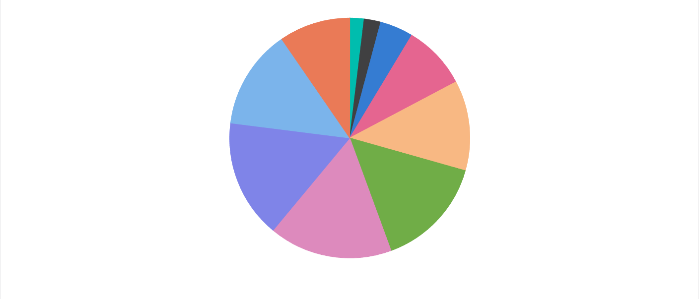

# Getting Started with React Accumulation Chart Component

This section describes the steps to create a simple Accumulation Chart.

A quick video overview of the React Accumulation Charts setup is available:



## Prerequisites

Before getting started, ensure that your development environment meets the [system requirements for Syncfusion® React UI components](https://ej2.syncfusion.com/react/documentation/system-requirement)

## Before You Begin

This guide uses the React application structure generated by Vite with the TypeScript template.

The main files used in this guide are:

* `src/App.tsx` — Defines the root React component.
* `src/main.tsx` — Application entry point.
* `index.html` — Root HTML file.

> **Note:** In a Vite React TypeScript application, the root component is commonly generated as `src/App.tsx`. If your application uses JavaScript, the equivalent file is typically `src/App.jsx`.

> **Note:** This guide uses the TypeScript template for better type checking with Accumulation Chart models.

## Installation and configuration

> **Note:** As an alternative, you can create a React application using [`create-react-app`](https://github.com/facebook/create-react-app) For detailed instructions, refer to this [documentation](https://ej2.syncfusion.com/react/documentation/getting-started/create-app).

### Step 1: Set up the React environment

Use [Vite](https://vitejs.dev/) to create and manage React applications. Vite provides a fast development environment and optimized builds for modern React applications. Syncfusion® React documentation also recommends Vite for setting up React applications.

Start by opening a terminal on your system **(Command Prompt, PowerShell, or Terminal)**. You may work from the default C: drive location or create a new folder and open the terminal in it.

### Step 2: Create a React application

Create a new React application using the below command.

```bash
npm create vite@latest my-chart-app -- --template react-ts
```

If Vite prompts you to install dependencies and start the project immediately, choose **No**. The Syncfusion package is installed in a later step.

Navigate to the project folder:

```bash
cd my-chart-app
```

Install the application dependencies:

```bash
npm install
```

> **Note:** If you prefer JavaScript instead of TypeScript, create the application using `npm create vite@latest my-chart-app -- --template react`.

### Step 3: Install the Syncfusion® React Chart package

All Syncfusion Essential® JS 2 packages are available in the [npmjs.com](https://www.npmjs.com/~syncfusionorg) registry.

Install the React Chart package using the following command:

```bash
npm install @syncfusion/ej2-react-charts --save
```

> Installing `@syncfusion/ej2-react-charts` automatically installs the required dependency packages. The –save will instruct NPM to include the Chart package inside of the **dependencies** section of the package.json.

The steps up to this point can be completed using the initially opened terminal or command prompt. For adding Chart components, open the project in the IDE installed on your device.

### Step 4: Add Accumulation Chart to the project

Add the Accumulation Chart component to `src/App.tsx` using the following code.



import { AccumulationChartComponent } from '@syncfusion/ej2-react-charts';
function App() {
    return (<AccumulationChartComponent />);
}
export default App;



> **Note:** This will render an empty accumulation chart area by running `npm run dev` in terminal ([Refer Step 7](#step-7-run-the-application)). Proceed to the next steps to add data, series, and necessary module injections to visualize your data.

### Step 5: Module injection

Accumulation Chart features are delivered as separate modules and must be explicitly injected. Here, the PieSeries module is used to render basic pie chart.

* `PieSeries` - Inject this module in to `services` to use pie series.

Import the above-mentioned module from the chart package and inject that into the `services` section of the Accumulation Chart component as follows.



import { AccumulationChartComponent, PieSeries, Inject } from '@syncfusion/ej2-react-charts';
function App() {
    return (
        <AccumulationChartComponent>
            <Inject services={[PieSeries]} />
        </AccumulationChartComponent>
    );
}
export default App;



**Note:** At this stage, No pie series is rendered because the Accumulation Chart component has not yet been configured with a data source.

### Step 6: Populate Accumulation Chart with data

The pie chart data should be provided as a JSON array in the following format. You can define the data in the same `src/App.tsx` file or place it in a separate file (for example, `src/datasource.ts`) and import it into `App.tsx`.



const data = [
    { x: 'Jan', y: 3, text: 'Jan: 3' }, { x: 'Feb', y: 3.5, text: 'Feb: 3.5' },
    { x: 'Mar', y: 7, text: 'Mar: 7' }, { x: 'Apr', y: 13.5, text: 'Apr: 13.5' },
    { x: 'May', y: 19, text: 'May: 19' }, { x: 'Jun', y: 23.5, text: 'Jun: 23.5' },
    { x: 'Jul', y: 26, text: 'Jul: 26' }, { x: 'Aug', y: 25, text: 'Aug: 25' },
    { x: 'Sep', y: 21, text: 'Sep: 21' }, { x: 'Oct', y: 15, text: 'Oct: 15' }
  ];



After defining the required data set, bind the data to the Chart component in the `AccumulationSeriesDirective` tag. The following code snippet demonstrates the complete configuration required to render a basic pie chart.



import { AccumulationChartComponent, AccumulationSeriesCollectionDirective, AccumulationSeriesDirective, Inject, PieSeries } from '@syncfusion/ej2-react-charts';

function App() {
  const data = [
    { x: 'Jan', y: 3, text: 'Jan: 3' }, { x: 'Feb', y: 3.5, text: 'Feb: 3.5' },
    { x: 'Mar', y: 7, text: 'Mar: 7' }, { x: 'Apr', y: 13.5, text: 'Apr: 13.5' },
    { x: 'May', y: 19, text: 'May: 19' }, { x: 'Jun', y: 23.5, text: 'Jun: 23.5' },
    { x: 'Jul', y: 26, text: 'Jul: 26' }, { x: 'Aug', y: 25, text: 'Aug: 25' },
    { x: 'Sep', y: 21, text: 'Sep: 21' }, { x: 'Oct', y: 15, text: 'Oct: 15' }
  ];

  return <AccumulationChartComponent id="charts">
    <Inject services={[PieSeries]} />
    <AccumulationSeriesCollectionDirective>
      <AccumulationSeriesDirective dataSource={data} xName='x' yName='y' radius='90%' type='Pie' />
    </AccumulationSeriesCollectionDirective>
  </AccumulationChartComponent>;
}
export default App;



### Step 7: Run the application

Run the application using the following command:

```bash
npm run dev
```
Open the generated local URL (for example, `localhost:5173/`) from terminal in the browser. The application displays the basic pie chart as shown below:

