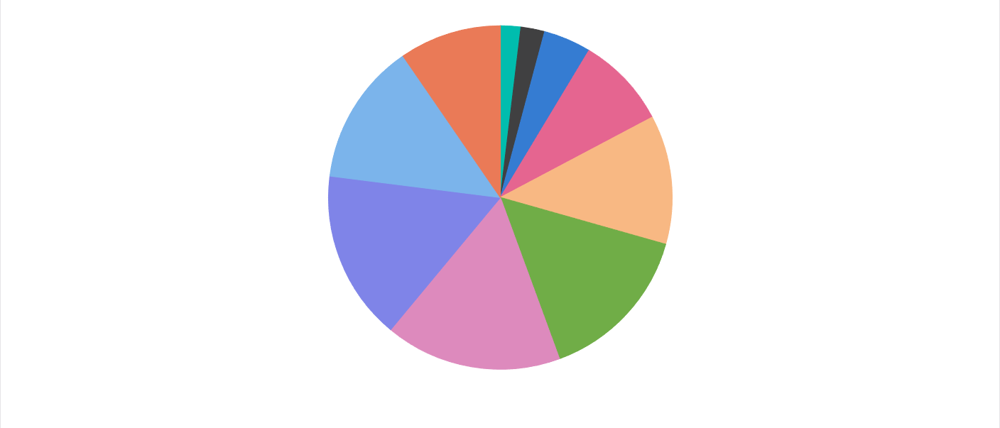

# Getting Started with React Accumulation Chart

This section describes the steps to create a simple Accumulation Chart component.

A quick video overview of the React Accumulation Charts setup is available:



## Prerequisites

Before getting started, ensure that your development environment meets the [system requirements for Syncfusion® React UI components](https://ej2.syncfusion.com/react/documentation/system-requirement). That page documents the supported React, Node.js, and npm versions, and includes the React-version compatibility table for Syncfusion React components.

## Set up a development environment

To set up a React application quickly, use `create-vite-app`, which provides a faster development environment, smaller bundle sizes, and optimized builds compared to traditional tools like `create-react-app`. For detailed steps, refer to the Vite [installation instructions](https://vitejs.dev/guide). Vite sets up the environment using JavaScript and optimizes applications for production.

> As an alternative, you can create a React application using [`create-react-app`](https://github.com/facebook/create-react-app). For detailed instructions, refer to this [documentation](https://ej2.syncfusion.com/react/documentation/getting-started/create-app).

To create a new React application, run one of the following commands based on your preferred language:

**React with JavaScript**

```
npm create vite@latest my-app -- --template react
```

**React with TypeScript**

```
npm create vite@latest my-app -- --template react-ts
```

During the setup process, the CLI will prompt you for a few configuration options. Select the following:

- **Which linter to use?** → **ESLint**
- **Install with npm and start now?** → **Yes**

Selecting **Yes** automatically installs the project dependencies and starts the development server.

After verifying that the application starts successfully, terminate the development server in the terminal and proceed to the next step.

Then, navigate to the project directory:

```
cd my-app
```

## Install the Syncfusion® React Accumulation Chart package

All Syncfusion Essential® JS 2 packages are published to the [npm registry](https://www.npmjs.com/~syncfusionorg).

Install the React Accumulation package using the following command:

```bash
npm install @syncfusion/ej2-react-charts
```

## Add the Accumulation Chart component to the project

Add the Accumulation Chart component to `src/App.tsx` using the following code.



import { AccumulationChartComponent } from '@syncfusion/ej2-react-charts';
function App() {
  return (<AccumulationChartComponent />);
}
export default App;



> Running `npm run dev` at this point renders an empty Accumulation Chart area. Continue with the next steps to inject modules, add data, and configure a series so the chart can render the data.

## Inject Required Modules

Accumulation Chart features are delivered as separate modules and must be explicitly injected. The `Inject` component accepts a `services` array that registers the modules required by the Accumulation Chart component. Injecting only the modules you need helps reduce the application bundle size.

In this example, the `PieSeries` module is injected to render a basic pie chart.

* `PieSeries` - Inject this module into the `services` array to enable pie series rendering.

Import the required module from the Chart package and register it through the `Inject` component as shown below.



import { AccumulationChartComponent, PieSeries, Inject } from '@syncfusion/ej2-react-charts';

function App() {
  return (
    <AccumulationChartComponent id="charts">
      <Inject services={[PieSeries]} />
    </AccumulationChartComponent>
  );
}

export default App;



> At this stage, no pie series is rendered because the Accumulation Chart component has not yet been configured with a data source.

## Populate the Accumulation Chart with data

Define the data in `src/App.tsx` and bind it to the Accumulation Chart. 












## Run the application

Run the application using the following command:

```bash
npm run dev
```

Open the generated local URL (for example, `http://localhost:5173/`) in the browser. The application displays the basic pie chart as shown below:



## See also

* [React Accumulation Charts Component feature tour](https://www.syncfusion.com/react-components/react-charts).
* [Pie, Doughnut, Pyramid, and Funnel chart types](https://ej2.syncfusion.com/react/documentation/accumulation-chart/pie-dough-nut).
* [Accumulation Chart data label](https://ej2.syncfusion.com/react/documentation/accumulation-chart/data-label).
* [Accumulation Chart legend](https://ej2.syncfusion.com/react/documentation/accumulation-chart/legend).
* [Accumulation Chart tooltip](https://ej2.syncfusion.com/react/documentation/accumulation-chart/tool-tip).
* [Accumulation Chart API reference](https://ej2.syncfusion.com/react/documentation/api/accumulation-chart/index-default)