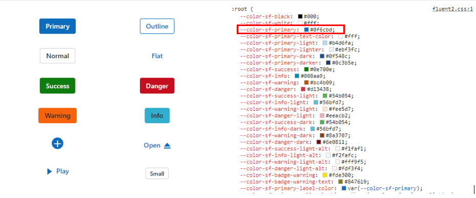
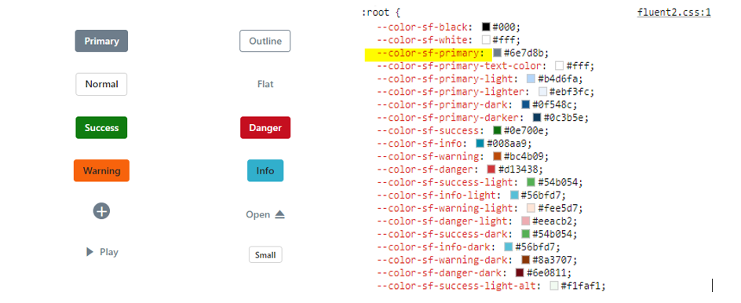
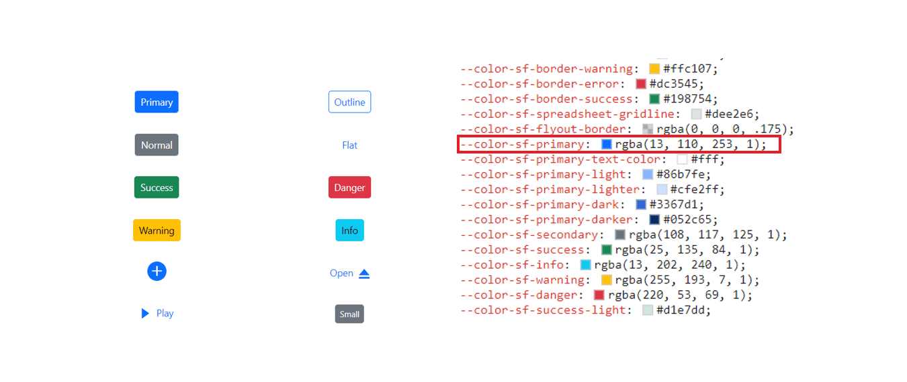
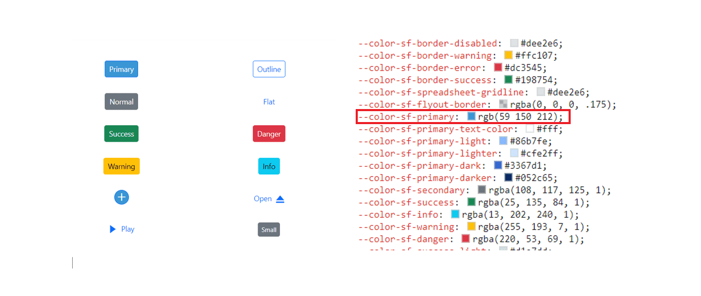
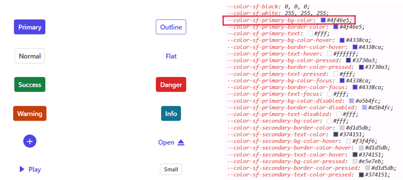
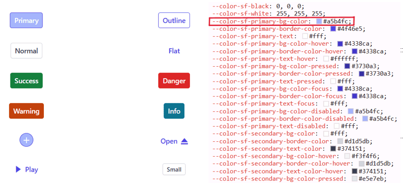
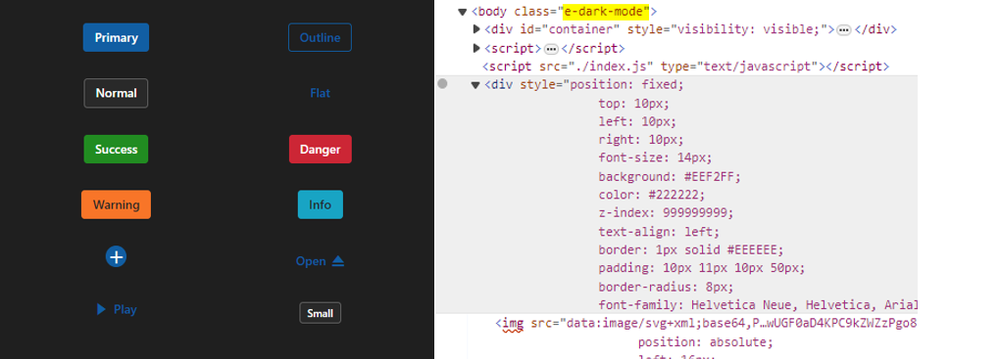
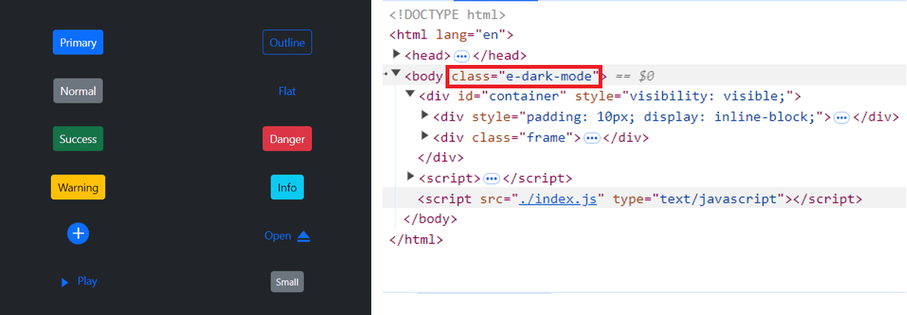
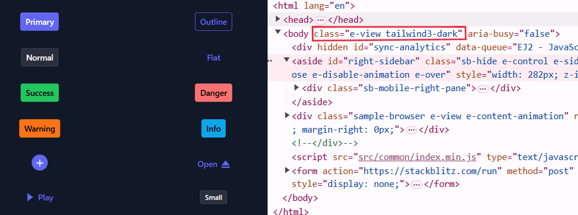

# About CSS variables in themes

[CSS variables](https://developer.mozilla.org/en-US/docs/Web/CSS/Using_CSS_custom_properties), also known as custom properties, allow authors to define reusable values in CSS files. Variable names start with two hyphens (`--`) followed by an identifier and can store values such as colors, lengths, or fonts. Reference these variables using the `var()` function across stylesheets.

Syncfusion provides modern, highly customizable themes that leverage CSS variables for consistent and visually appealing styling across all components. The supported themes are:

* Material 3 Theme
* Fluent 2 Theme
* Bootstrap 5.3 Theme
* Tailwind 3.4 Theme

## CSS themes — Syncfusion&reg; React components

[Material 3](https://m3.material.io/), [Fluent 2](https://fluent2.microsoft.design/get-started/whatisnew), [Bootstrap 5.3](https://getbootstrap.com/docs/5.3/getting-started/introduction/), and [Tailwind 3.4](https://tailwindcss.com/docs/installation/using-vite) themes are supported across all React controls. Each includes `light` and `dark` variants and uses CSS variables to enable straightforward color customization in CSS. This design simplifies toggling between light and dark schemes to accommodate user preferences and application needs.

> Note: Material 3 defines color variables using `rgb()` values (comma-separated). Using hex values may produce inconsistent results. For example, the primary color uses `--color-sf-primary: 98, 0, 238;` instead of a hex format like `#6200ee`.

### Utilizing CSS variables in modern themes

Modern themes simplify color customization through CSS variables. Each theme defines its own variable set; consult the specific theme documentation to ensure consistent styling when overriding values.

Below are examples of how CSS variables are defined in each theme:
















### How to get these themes?

Syncfusion themes are available via npm packages or CDN links. Use matching versions across packages and CDN for compatibility.

| Source   | Theme              | Light CDN / Package                                                                 | Dark CDN / Package                                                                    |
|----------|--------------------|-------------------------------------------------------------------------------------|---------------------------------------------------------------------------------------|
| Package  | Material 3         | [@syncfusion/ej2-material3-theme](https://www.npmjs.com/package/@syncfusion/ej2-material3-theme) | [@syncfusion/ej2-material3-dark-theme](https://www.npmjs.com/package/@syncfusion/ej2-material3-dark-theme) |
|          | Fluent 2           | [@syncfusion/ej2-fluent2-theme](https://www.npmjs.com/package/@syncfusion/ej2-fluent2-theme)     | [@syncfusion/ej2-fluent2-dark-theme](https://www.npmjs.com/package/@syncfusion/ej2-fluent2-dark-theme)   |
|          | Bootstrap 5.3      | [@syncfusion/ej2-bootstrap5.3-theme](https://www.npmjs.com/package/@syncfusion/ej2-bootstrap5.3-theme) | [@syncfusion/ej2-bootstrap5.3-dark-theme](https://www.npmjs.com/package/@syncfusion/ej2-bootstrap5.3-dark-theme) |
|          | Tailwind 3.4       | [@syncfusion/ej2-tailwind3-theme](https://www.npmjs.com/package/@syncfusion/ej2-tailwind3-theme)     | [@syncfusion/ej2-tailwind3-dark-theme](https://www.npmjs.com/package/@syncfusion/ej2-tailwind3-dark-theme)   |
| CDN      | Material 3         | [https://cdn.syncfusion.com/ej2/32.1.19/material3.css](https://cdn.syncfusion.com/ej2/32.1.19/material3.css) | [https://cdn.syncfusion.com/ej2/32.1.19/material3-dark.css](https://cdn.syncfusion.com/ej2/32.1.19/material3-dark.css) |
|          | Fluent 2           | [https://cdn.syncfusion.com/ej2/32.1.19/fluent2.css](https://cdn.syncfusion.com/ej2/32.1.19/fluent2.css)         | [https://cdn.syncfusion.com/ej2/32.1.19/fluent2-dark.css](https://cdn.syncfusion.com/ej2/32.1.19/fluent2-dark.css)     |
|          | Bootstrap 5.3      | [https://cdn.syncfusion.com/ej2/32.1.19/bootstrap5.3.css](https://cdn.syncfusion.com/ej2/32.1.19/bootstrap5.3.css)   | [https://cdn.syncfusion.com/ej2/32.1.19/bootstrap5.3-dark.css](https://cdn.syncfusion.com/ej2/32.1.19/bootstrap5.3-dark.css) |
|          | Tailwind 3.4       | [https://cdn.syncfusion.com/ej2/32.1.19/tailwind3.css](https://cdn.syncfusion.com/ej2/32.1.19/tailwind3.css)       | [https://cdn.syncfusion.com/ej2/32.1.19/tailwind3-dark.css](https://cdn.syncfusion.com/ej2/32.1.19/tailwind3-dark.css)   |

### Color customization in themes

CSS variables support dynamic color changes, including runtime modifications via JavaScript, enabling interactive or context-aware styling.

#### Customization using CSS

Example for **Material 3** customization using a CSS class:















**Default Material 3 primary value**

**Customized Material 3 primary value**

Example for **Fluent 2** customization using a CSS class:















**Default Fluent 2 primary value**

**Customized Fluent 2 primary value**

Example for Bootstrap 5.3 customization using a CSS class:















**Default Bootstrap 5.3 primary value**

**Customized Bootstrap 5.3 primary value**

Example for Tailwind 3.4 customization using a CSS class:















**Default Tailwind 3.4 primary value**

**Customized Tailwind 3.4 primary value**

With CSS variable support, color customization for Syncfusion React components becomes straightforward and flexible.

### Switching light and dark mode with CSS variables

Modern themes enable easy toggling between light and dark modes by applying a single CSS class. Each theme's CSS file includes separate selectors for light and dark variants.












### Mode switching in Fluent 2 theme

Fluent 2 supports light and dark variants through dedicated class selectors.












### Mode switching in Bootstrap 5.3 theme

Bootstrap 5.3 provides class selectors for switching between light and dark variants at runtime.












### Mode switching in Tailwind 3.4 theme

Tailwind 3.4 offers class selectors for light and dark modes, as demonstrated in the preview.












### How to switch dark mode?

To enable dark mode in Material 3, Fluent 2, Bootstrap 5.3, or Tailwind 3.4 themes, add the `e-dark-mode` class to the `<body>` element. This triggers the dark variant across components.

**Material 3** dark mode

**Fluent 2** dark mode

**Bootstrap 5.3** dark mode

**Tailwind 3.4** dark mode

### ThemeStudio application

ThemeStudio supports full customization for Material 3 and Fluent 2 themes, including variable-level adjustments for comprehensive personalization.

Access Syncfusion ThemeStudio here: [Theme Studio](https://ej2.syncfusion.com/themestudio/?theme=material3)