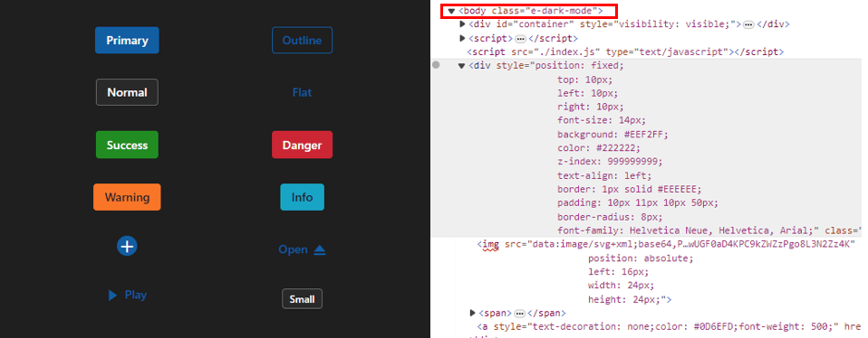

# About CSS variables in themes

[CSS variables](https://developer.mozilla.org/en-US/docs/Web/CSS/Using_CSS_custom_properties), also known as custom properties, enable authors to define reusable values in CSS files. CSS variable names begin with two hyphens (`--`) followed by an identifier and can hold values such as colors, lengths, or fonts. Use the `var()` function to reference a variable’s value throughout your stylesheets.

Syncfusion&reg; provides modern, highly customizable themes that utilize CSS variables. These themes ensure a consistent and visually appealing appearance across all Syncfusion&reg; components. The currently available themes are:

* Material 3 Theme
* Fluent 2 Theme
* Bootstrap 5.3 Theme
* Tailwind 3.4 Theme

## CSS themes - Syncfusion&reg; React components

[Material 3](https://m3.material.io/), [Fluent 2](https://fluent2.microsoft.design/get-started/whatisnew), [Bootstrap 5.3](https://getbootstrap.com/docs/5.3/getting-started/introduction/), and [Tailwind 3.4](https://tailwindcss.com/docs/installation/using-vite) themes are supported across all EJ2 controls. Each of these themes includes both `light` and `dark` variants. They utilize CSS variables to simplify color customization directly in CSS. This approach enables easy switching between light and dark color schemes, enhancing flexibility for various user preferences and application requirements.

> Note: The Material 3 theme uses CSS variables with `rgb()` values for color. Using hex values here may cause unexpected results. In previous themes, the primary color variable was defined as `$primary: #6200ee;`. In Material 3, it is defined as `--color-sf-primary: 98, 0, 238;`.

### Utilizing CSS variables in modern themes

Modern themes streamline color customization via CSS variables. Each theme specifies its own set of variables, so refer to the relevant theme's documentation when making adjustments. This maintains consistent styling and efficient theme management across your application.

Below are examples showing how CSS variables are defined in each theme:
















### How to get these themes?

To access themes provided by Syncfusion, you have two primary options,

* Package
* CDN links

|    |  Light  |  Dark  |
|-----------|---------|--------|
|Package  | [Material 3 Light](https://www.npmjs.com/package/@syncfusion/ej2-material3-theme) | [Material 3 Dark](https://www.npmjs.com/package/@syncfusion/ej2-material3-dark-theme) |
|  | [Fluent 2 Light](https://www.npmjs.com/package/@syncfusion/ej2-fluent2-theme) | [Fluent 2 Dark](https://www.npmjs.com/package/@syncfusion/ej2-fluent2-dark-theme) |
|  | [Bootstrap 5.3 Light](https://www.npmjs.com/package/@syncfusion/ej2-bootstrap5.3-theme) | [Bootstrap 5.3 Dark](https://www.npmjs.com/package/@syncfusion/ej2-bootstrap5.3-dark-theme) |
|  | [Tailwind 3.4 Light](https://www.npmjs.com/package/@syncfusion/ej2-tailwind3-theme) | [Tailwind 3.4 Dark](https://www.npmjs.com/package/@syncfusion/ej2-tailwind3-dark-theme) |
| CDN  | [Material 3 Light](https://cdn.syncfusion.com/ej2/27.1.48/material3.css)  |  [Material 3 Dark](https://cdn.syncfusion.com/ej2/27.1.48/material3-dark.css)  |
|  |  [Fluent 2 Light](https://cdn.syncfusion.com/ej2/27.1.48/fluent2.css)  |  [Fluent 2 Dark](https://cdn.syncfusion.com/ej2/27.1.48/fluent2-dark.css)  |
|  |  [Bootstrap 5.3 Light](https://cdn.syncfusion.com/ej2/27.1.48/bootstrap5.3.css)  |  [Bootstrap 5.3 Dark](https://cdn.syncfusion.com/ej2/27.1.48/bootstrap5.3-dark.css)  |
|  | [Tailwind 3.4 Light](https://cdn.syncfusion.com/ej2/28.1.33/tailwind3.css) | [Tailwind 3.4 Dark](https://cdn.syncfusion.com/ej2/28.1.33/tailwind3-dark.css) |

### Color customization in themes

CSS variables let you dynamically change color values, including at runtime via JavaScript. This allows for interactive or adaptive color adjustments based on user actions or application state.

#### Customization using CSS

Here you can find the example for `Material 3` customization using CSS class.















**Default Material 3 primary value**

**Customized Material 3 primary value**

Example for `Fluent 2` customization using CSS class.















**Default fluent2 primary value**

**Customized fluent 2 primary value**

Example for `Bootstrap 5.3` customization using CSS class.















**Default Bootstrap 5.3 primary value**

**Customized Bootstrap 5.3 primary value**

Example for `Tailwind 3.4` customization using CSS class.















**Default Tailwind 3.4 primary value**

**Customized Tailwind 3.4 primary value**

With this CSS variable support, you can effortlessly customize the color variable values for Syncfusion&reg; React Components.

### Switching Light and Dark mode with CSS variables

Modern themes make it simple to toggle between light and dark modes by adjusting a single CSS class. Each theme's CSS file contains separate class selectors for light and dark modes, enabling seamless switching as needed within your application.












### Mode switching in Fluent 2 theme

Fluent 2 also supports both light and dark variants. The theme's CSS contains class selectors for switching between these modes, as demonstrated in the preview below.












### Mode switching in Bootstrap 5.3 theme

Bootstrap 5.3 themes also offer separate class selectors for its light and dark variants, which can be switched at runtime.












### Mode switching in Tailwind 3.4 theme

Tailwind 3.4 provides class selectors for both light and dark modes. Switch between them as shown in the following preview.












### How to switch dark mode?

To activate dark mode, just append the `e-dark-mode` class to the body section of your application for both `Material 3`, `Fluent 2`, `Bootstrap 5.3` and `Tailwind 3.4` themes. Once applied, the theme seamlessly switches to dark mode. Please refer to the example image below for visual guidance.

`Material 3` dark mode

`Fluent 2` dark mode

`Bootstrap 5.3` dark mode

`Tailwind 3.4` dark mode

### ThemeStudio Application

The ThemeStudio application now includes seamless integration with the Material 3 and Fluent 2 themes, offering a comprehensive solution for customization requirements. This enhancement enables users to effortlessly customize and personalize their themes.

Access the Syncfusion&reg; ThemeStudio application, featuring our themes, via the following link: [Link to Syncfusion&reg; ThemeStudio](https://ej2.syncfusion.com/themestudio/?theme=material3)
