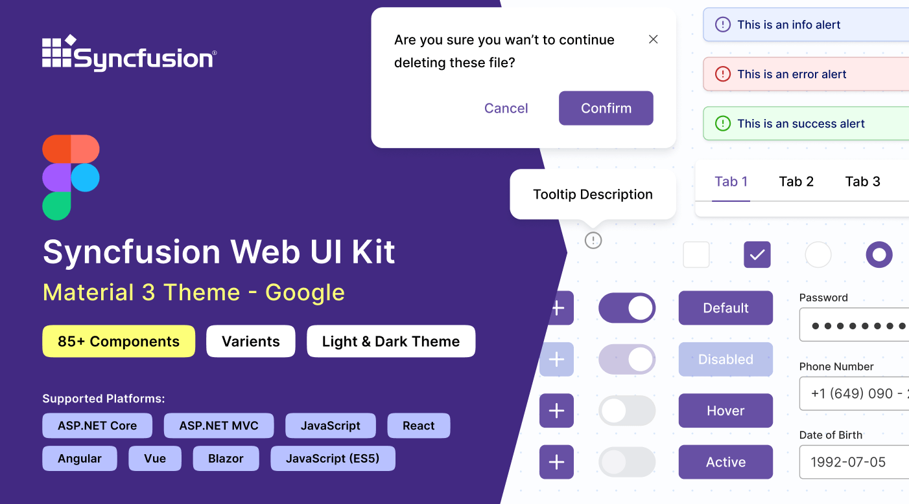
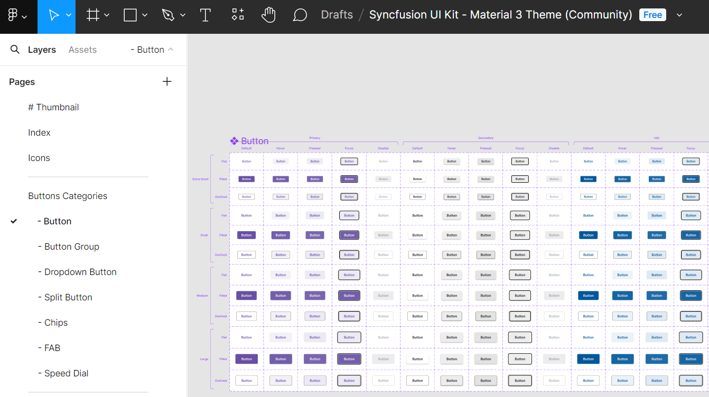
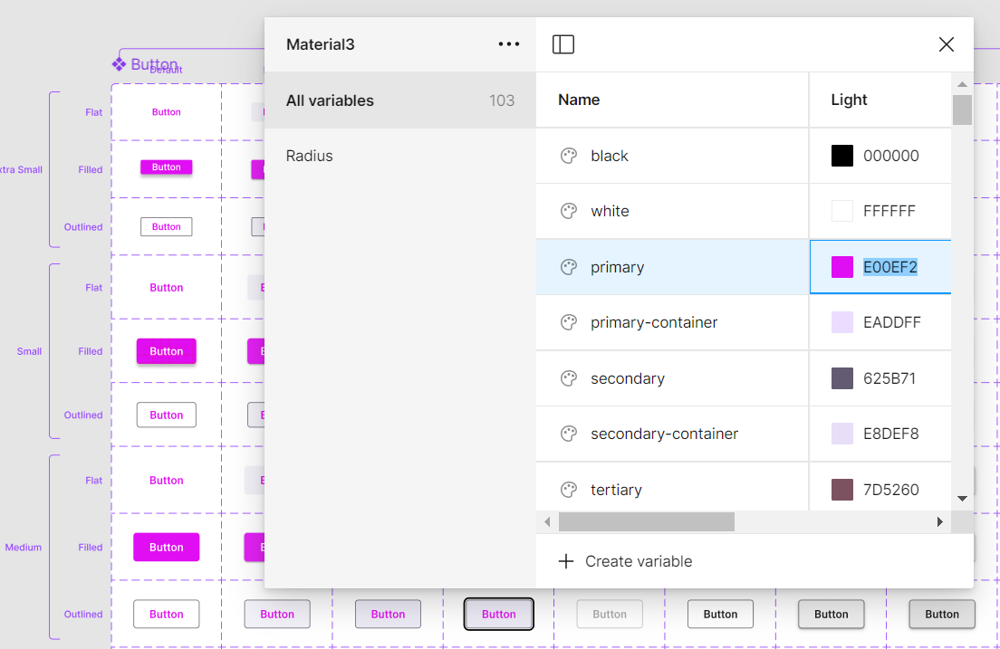
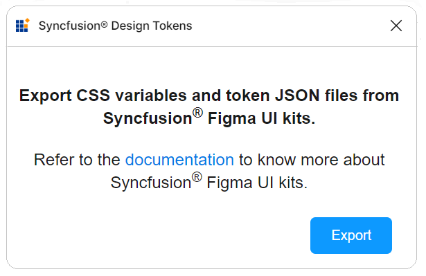

# Figma UI Kits for Syncfusion&reg; React Components

Syncfusion&reg; provides [Figma UI kits](https://www.figma.com/@syncfusion) to enable efficient collaboration between designers and developers. The Figma UI kits are available in four themes: [Material 3](https://www.figma.com/community/file/1454123774600129202/syncfusion-ui-kit-material-3-theme), [Fluent](https://www.figma.com/community/file/1385969120047188707/syncfusion-ui-kit-fluent-theme), [Tailwind](https://www.figma.com/community/file/1385969065626384098/syncfusion-ui-kit-tailwind-theme), and [Bootstrap 5](https://www.figma.com/community/file/1385968977953858272/syncfusion-ui-kit-bootstrap-5-theme). These kits align with the themes implemented in Syncfusion&reg; React components.

Each kit includes reusable design components featuring multiple states and variants, along with precise measurements, detailed figures, and icons that faithfully represent the corresponding Syncfusion&reg; React components.

## Advantages of UI kits

The Syncfusion&reg; Figma UI kits deliver these primary benefits:

- Comprehensive documentation of Syncfusion&reg; React components, including a control list with available states and variants for quick reference.
- Design components structured according to the [atomic design methodology](https://atomicdesign.bradfrost.com/chapter-2/), supporting simple and efficient customization.
- Developers can match Syncfusion&reg; React components exactly to project specifications, ensuring consistent design implementation.
- Standardized components and themes across the UI kit promote visual uniformity throughout projects.

## Downloading the UI kits

Syncfusion&reg; Figma UI kits are accessible through the [Figma community](https://www.figma.com/@syncfusion). Theme-specific kits include:

- [Material 3](https://www.figma.com/community/file/1454123774600129202/syncfusion-ui-kit-material-3-theme)  
- [Fluent](https://www.figma.com/community/file/1385969120047188707/syncfusion-ui-kit-fluent-theme)  
- [Tailwind](https://www.figma.com/community/file/1385969065626384098/syncfusion-ui-kit-tailwind-theme)  
- [Bootstrap 5](https://www.figma.com/community/file/1385968977953858272/syncfusion-ui-kit-bootstrap-5-theme)

## Structure of the UI kits

Syncfusion’s Figma UI kit is structured for improved navigation and ease of use:

- **Thumbnail**: Cover page for the UI kit.  
- **Index**: Comprehensive list of control names for fast navigation.  
- **Icons**: Dedicated collection of icons used across the designs.  
- **UI Components**: Main section displaying controls with figures, measurements, variants, and states.

## Customizing the UI kits

The Figma UI kits allow customization to align with specific branding or design requirements. By leveraging the [atomic design methodology](https://atomicdesign.bradfrost.com/chapter-2/), modifications automatically apply across associated components and variants.

To customize the primary button color in the Material 3 theme:

1. Visit the [UI kits](#downloading-the-ui-kits) section and select your preferred theme, such as Material 3.
2. Open the theme in the Figma web application by clicking **Open in Figma**.
3. For the desktop application, click **Import** in the top-right corner, select the downloaded Syncfusion&reg; `.fig` file, and click **Open**.
4. Locate the button you wish to customize in your layout.
5. In the right panel of Figma, find the color variable options (for example, a primary button color might be labeled `$primary-bg-color` and linked to the primary color variable).
6. Deselect the button to reveal the **Local variables** section in the Figma interface. This panel displays the design tokens for color variables. Click **Local variables**.
7. In the variables popup, locate the primary color token in the list and use the color picker or palette to select a new value (for example, pink).
8. The primary button style updates instantly across all related instances and variants in the design.

Beyond button colors, additional customizations are possible for fonts, spacing, shadows, and other properties. Adjust these design tokens as needed to create a tailored design system.

## Downloading the customized styles

Use the **Syncfusion Design Tokens** Figma plugin  to export customized styles as design tokens and CSS variables. This converts Figma variables into Syncfusion-compatible formats for seamless application integration.

### Exporting design tokens

To export customized styles from the Figma UI Kit:

- Open a Syncfusion Figma UI Kit: https://www.figma.com/@syncfusion  
- In Figma, navigate to **Plugins & widgets** and search for **Syncfusion Design Tokens**.  
- Run the plugin and click **Export** to create a ZIP file containing the design tokens.  
- Save and extract the ZIP file to access the exported contents.

### Utilizing design tokens

The exported ZIP file typically contains:

  - `css-variables.css`: This file provides CSS variables for both light and dark themes, generated directly from your customized Figma design. Import it into your application alongside the component styles to apply your custom designs. For detailed integration steps, refer to the [CSS variables](./css-variables) documentation.
  - `<theme-name>-tokens.json`: This file (e.g., material3-tokens.json) contains style variables and values in JSON format. It is compatible with [Theme Studio](./theme-studio) and can be [imported](./theme-studio#import-previously-changed-settings-into-the-theme-studio) (as a supported tokens file or equivalent settings format) into [Theme Studio](./theme-studio) for additional refinements. After further adjustments in [Theme Studio](./theme-studio), [download](./theme-studio#download-the-customized-theme) the updated theme package and integrate it into your application to realize your custom theme.

This process maintains strong fidelity from Figma designs through to the implemented application.

## Upgrading the UI kits

To upgrade a UI kit, download the latest version from the Figma community. Recommended practices include:

- Monitor updates or new releases of UI kits published by Syncfusion.
- Back up current projects before upgrading to avoid potential data loss or compatibility concerns.
- Share feedback with Syncfusion&reg; about the upgraded UI kits, including any challenges faced or suggested improvements.

## See also

* [Available themes](https://ej2.syncfusion.com/documentation/appearance/theme)  
* [Customizing themes with Theme Studio](https://ej2.syncfusion.com/documentation/appearance/theme-studio#customizing-theme-color-from-theme-studio)