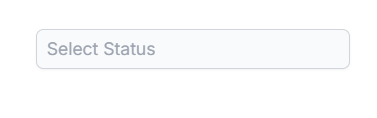

# Disabled Items in React AutoComplete

The AutoComplete provides options for individual items to be either in an enabled or disabled state for specific scenarios. The disabled state of each list item is controlled by the `fields.disabled` data field, which must map to a column containing boolean values (`true` to disable, `false` to keep the item enabled). Once an item is disabled, it cannot be selected as a value of the component. To configure the disabled item column, use the `fields.disabled` property.

In the following sample, list items are disabled based on a boolean field using the `fields.disabled` property.

`[Class Component]`










 

`[Functional Component]`










 

## Disabling the overall component

To disable the overall AutoComplete component, set the [`enabled`](https://ej2.syncfusion.com/react/documentation/api/auto-complete#enabled) property to `false` (or the [`disabled`](https://ej2.syncfusion.com/react/documentation/api/auto-complete#disabled) property to `true`). Note that this `enabled`/`disabled` property controls the whole component, whereas `fields.disabled` controls only individual list items.

## Disabling an item at runtime

The [`disableItem`](https://ej2.syncfusion.com/react/documentation/api/auto-complete#disableitem) method handles dynamic changes in the disable state of a specific item. Only one item can be disabled per call. To disable multiple items, call this method iteratively over the items list or array. The disabled state will be updated in the [`dataSource`](https://ej2.syncfusion.com/react/documentation/api/auto-complete#datasource) when the item is disabled using this method. If a selected item is disabled dynamically, its selection is automatically cleared.

**Method signature:** `disableItem(item: HTMLLIElement | string | number | boolean | object): void`

The `item` argument accepts any of the following:

| Argument type | Description |
|------|------|
| <code>HTMLLIElement</code> | The HTML `li` element of the item to be disabled. |
| <code>string</code> | The string value of the item to be disabled. |
| <code>number</code> | The number value of the item to be disabled. |
| <code>boolean</code> | The boolean value of the item to be disabled. |
| <code>object</code> | The object value of the item to be disabled. |
| <code>number</code> (index) | The index of the item to be disabled. |