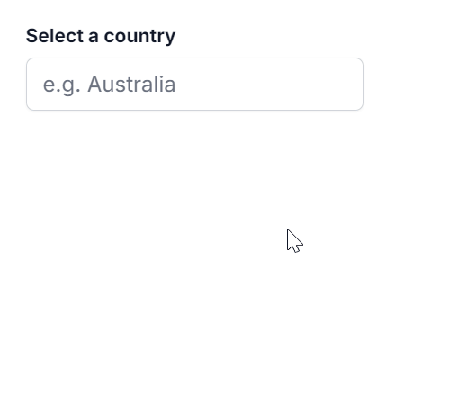

# Resizing in React AutoComplete component

You can dynamically adjust the size of the popup in the AutoComplete component by using the [AllowResize](https://ej2.syncfusion.com/react/documentation/api/auto-complete#allowresize) property. When enabled, users can resize the popup, improving visibility and control, with the resized dimensions being retained across sessions for a consistent user experience.

`[Class-component]`










`[Functional-component]`










