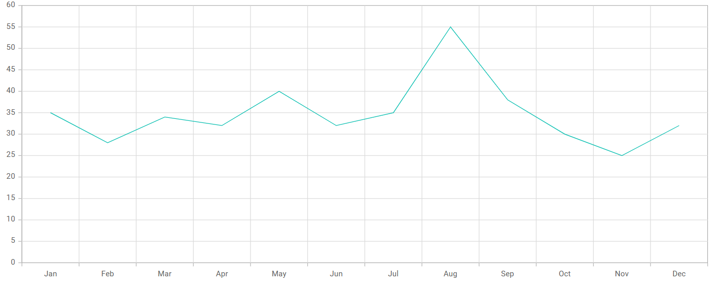

# Getting Started with the React Chart Component

This section describes the steps to create a simple Chart component.

> **Ready to streamline your Syncfusion<sup style="font-size:70%">&reg;</sup> React development?** Discover the full potential of Syncfusion<sup style="font-size:70%">&reg;</sup> React components with Syncfusion<sup style="font-size:70%">&reg;</sup> AI Coding Assistant. Effortlessly integrate, configure, and enhance your projects with intelligent, context-aware code suggestions, streamlined setups, and real-time insights—all seamlessly integrated into your preferred AI-powered IDEs like VS Code, Cursor, Syncfusion<sup style="font-size:70%">&reg;</sup> CodeStudio and more. [Explore Syncfusion<sup style="font-size:70%">&reg;</sup> AI Coding Assistant](https://ej2.syncfusion.com/react/documentation/ai-coding-assistant/overview)

A quick video overview of the React Charts setup is available:



## Prerequisites

Before getting started, ensure that your development environment meets the [system requirements for Syncfusion® React UI components](https://ej2.syncfusion.com/react/documentation/system-requirement). That page documents the supported React, Node.js, and npm versions, and includes the React-version compatibility table for Syncfusion React components.


## Before You Begin

This guide uses the React application structure generated by Vite with the TypeScript template. The following files are part of that scaffold and work together as follows:

* `src/App.tsx` — Defines the root React component that hosts the Chart component. This is the only file edited in this guide.
* `src/main.tsx` — Application entry point that renders `App` into the `#root` element defined in `index.html`.
* `index.html` — Root HTML file that contains the `#root` container element used to mount the React application.

> **Note:** In a Vite React TypeScript application, the root component is commonly generated as `src/App.tsx`. If your application uses JavaScript, the equivalent file is typically `src/App.jsx`.

> **Note:** This guide uses the TypeScript template for better type checking with Chart models.

## Installation and configuration

> **Note:** As an alternative, you can create a React application using [`create-react-app`](https://github.com/facebook/create-react-app). For detailed instructions, refer to this [documentation](https://ej2.syncfusion.com/react/documentation/getting-started/create-app).

### Step 1: Create a React application with Vite

Use [Vite](https://vitejs.dev/) to create and manage React applications. Vite provides a fast development environment and optimized builds for modern React applications. Syncfusion® React documentation also recommends Vite for setting up React applications.

Start by opening a terminal on your system **(Command Prompt, PowerShell, or Terminal)**. You may work from the default C: drive location or create a new folder and open the terminal in it.

### Step 2: Create a React application

Create a new React application using the below command.

```bash
npm create vite@latest my-chart-app -- --template react-ts
```

If Vite prompts you to install dependencies and start the project immediately, choose **No**. The Syncfusion package is installed in a later step.

Navigate to the project folder:

```bash
cd my-chart-app
```

Install the application dependencies:

```bash
npm install
```

> **Note:** If you prefer JavaScript instead of TypeScript, create the application using `npm create vite@latest my-chart-app -- --template react`.

### Step 3: Install the Syncfusion® React Chart package

All Syncfusion Essential® JS 2 packages are published to the [npm registry](https://www.npmjs.com/~syncfusionorg).

Install the React Chart package using the following command:

```bash
npm install @syncfusion/ej2-react-charts
```

> Installing `@syncfusion/ej2-react-charts` automatically pulls in the required peer dependencies (for example, `@syncfusion/ej2-base` and `@syncfusion/ej2-charts`).

After the install completes, run `npm install` once more if the package is not yet listed in `package.json`. Then open the project in your IDE to continue with the next step.

### Step 4: Add the Chart component to the project

Add the Chart component to `src/App.tsx` using the following code.



import { ChartComponent } from '@syncfusion/ej2-react-charts';
function App() {
  return (<ChartComponent />);
}
export default App;



> **Note:** Running `npm run dev` ([Step 7](#step-7-run-the-application)) at this point renders an empty chart area. Continue with the next steps to inject modules, add data, and configure a series so the chart can render the data.

### Step 5: Inject required modules

Chart features are delivered as separate modules and must be explicitly injected. The `Inject` component takes a `services` array that registers the modules the Chart component is allowed to use; injecting only the modules you need keeps the bundle small. Here, the `LineSeries` and `Category` modules are used to render monthly sales data:

* `LineSeries` — Inject this module into `services` to render a line series.
* `Category` — Inject this module into `services` to enable the category axis.

Import the modules from the Chart package and register them through the `Inject` component as follows.



import { ChartComponent, LineSeries, Category, Inject } from '@syncfusion/ej2-react-charts';
function App() {
    return <ChartComponent>
    <Inject services={[LineSeries, Category]}/>
  </ChartComponent>;
}
export default App;



**Note:** At this stage, no series are rendered because the Chart component has not yet been configured with a data source.

### Step 6: Populate the Chart with data

Chart data should be provided as a JSON array in the following format. You can define the data in the same `src/App.tsx` file or place it in a separate file (for example, `src/datasource.ts`) and import it into `App.tsx`.



export const data: Object[] = [
    { month: 'Jan', sales: 35 }, { month: 'Feb', sales: 28 },
    { month: 'Mar', sales: 34 }, { month: 'Apr', sales: 32 },
    { month: 'May', sales: 40 }, { month: 'Jun', sales: 32 },
    { month: 'Jul', sales: 35 }, { month: 'Aug', sales: 55 },
    { month: 'Sep', sales: 38 }, { month: 'Oct', sales: 30 },
    { month: 'Nov', sales: 25 }, { month: 'Dec', sales: 32 }
];



After defining the required data set, bind the data to the Chart component in the `SeriesDirective` tag. The following code snippet demonstrates the complete configuration required to render a basic chart.



import {  ChartComponent, Inject, SeriesCollectionDirective, SeriesDirective, Category, LineSeries } from '@syncfusion/ej2-react-charts';

const data: Object[] = [
    { month: 'Jan', sales: 35 }, { month: 'Feb', sales: 28 },
    { month: 'Mar', sales: 34 }, { month: 'Apr', sales: 32 },
    { month: 'May', sales: 40 }, { month: 'Jun', sales: 32 },
    { month: 'Jul', sales: 35 }, { month: 'Aug', sales: 55 },
    { month: 'Sep', sales: 38 }, { month: 'Oct', sales: 30 },
    { month: 'Nov', sales: 25 }, { month: 'Dec', sales: 32 }
];
const xAxisCategory = { valueType: 'Category' };

function App() {
  return <ChartComponent id="charts" primaryXAxis={xAxisCategory}>
    <Inject services={[LineSeries, Category]} />
    <SeriesCollectionDirective>
      <SeriesDirective dataSource={data} xName='month' yName='sales' name='Sales' type='Line'/>
    </SeriesCollectionDirective>
  </ChartComponent>
}
export default App;



### Step 7: Run the application

Run the application using the following command:

```bash
npm run dev
```
Open the generated local URL (for example, `localhost:5173/`) from terminal in the browser. The application displays the chart as shown below:

