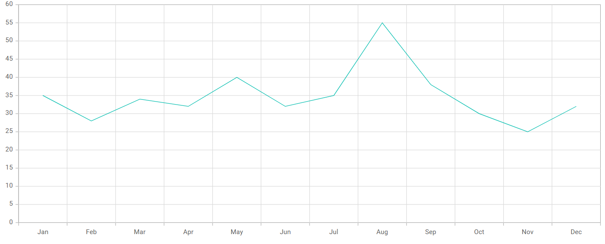

# Getting Started with React Chart in Next.js

This section provides a step-by-step guide for setting up a Next.js application and integrating the [React Charts](https://www.syncfusion.com/react-components/react-charts) component.

## Prerequisites

Before getting started with the Next.js application, ensure the following prerequisites are met:

* [Node.js 18.17](https://nodejs.org/en) or later (required by Next.js 14/15).
* [Next.js](https://nextjs.org) 14 or 15.
* React 18 or 19.
* `@syncfusion/ej2-react-charts` 30.x or later (compatible with React 18/19).

## Step 1: Create a Next.js application

This guide uses the Next.js App Router. To create a new `Next.js` application, use one of the commands that are specific to either NPM or Yarn.




npx create-next-app@latest




yarn create next-app




Using one of the above commands will lead you to set up additional configurations for the project as below:

1. Define the project name: Users can specify the name of the project directly. Let's specify the name of the project as `ej2-nextjs-chart`. When prompted, also select **TypeScript: Yes** so that the project uses the App Router with a `src/app/page.tsx` file.




√ What is your project named? » ej2-nextjs-chart




2. Select the required packages.




√ Would you like to use the recommended Next.js defaults? » Yes, use recommended defaults




By selecting the recommended Next.js defaults, all essential Next.js packages (App Router, TypeScript, ESLint, and Tailwind CSS) will be installed.

3. Once the project is created, navigate to the project directory using the following command:




cd ej2-nextjs-chart




The application is ready to run with default settings. Now, let's add Syncfusion&reg; components to the project.

## Step 2: Install Syncfusion&reg; React packages

Syncfusion&reg; React component packages are available at [npmjs.com](https://www.npmjs.com/search?q=ej2-react). To use Syncfusion&reg; React components in the project, install the corresponding npm package.

Here, the [React Chart component](https://www.syncfusion.com/react-components/react-charts) is used in the project. To install the React Chart component, use the following command:




npm install @syncfusion/ej2-react-charts




yarn add @syncfusion/ej2-react-charts




## Step 3: Add the Chart component

Replace the contents of `src/app/page.tsx` with the following code. The example below uses typed data and renders the chart as columns.

> To register a Syncfusion license, call `registerLicense('YOUR_LICENSE_KEY')` from `@syncfusion/ej2-base` at app startup. To apply a theme, import a stylesheet such as `@syncfusion/ej2-react-charts/styles/material.css`. Both are optional during local development but required for production builds.



'use client';
import {
  Category,
  ChartComponent,
  ColumnSeries,
  Inject,
  SeriesCollectionDirective,
  SeriesDirective,
} from '@syncfusion/ej2-react-charts';

export default function Home() {
  const data = [
    { month: 'Jan', sales: 35 }, { month: 'Feb', sales: 28 },
    { month: 'Mar', sales: 34 }, { month: 'Apr', sales: 32 },
    { month: 'May', sales: 40 }, { month: 'Jun', sales: 32 },
    { month: 'Jul', sales: 35 }, { month: 'Aug', sales: 55 },
    { month: 'Sep', sales: 38 }, { month: 'Oct', sales: 30 },
    { month: 'Nov', sales: 25 }, { month: 'Dec', sales: 32 },
  ];
  // `as const` narrows the string literal to 'Category', matching Syncfusion's `ValueType` union type.
  const primaryXAxis = { valueType: 'Category' } as const;

  return (
    <ChartComponent id="charts" primaryXAxis={primaryXAxis}>
      <Inject services={[ColumnSeries, Category]} />
      <SeriesCollectionDirective>
        <SeriesDirective
          dataSource={data}
          xName="month"
          yName="sales"
          name="Sales"
          type="Column"
        />
      </SeriesCollectionDirective>
    </ChartComponent>
  );
}



## Step 4: Run the application

To run the application, use the following command:




npm run dev




yarn run dev




Open the URL printed in the terminal (for example, `http://localhost:3000`) in a browser. If port 3000 is already in use, Next.js falls back to the next available port (for example, `http://localhost:3001`). The application displays the chart as shown in the following image:

To learn more about the functionality of the Chart component, refer to the [React Chart documentation](https://ej2.syncfusion.com/react/documentation/chart/getting-started).

> [View the Next.js Chart sample in the GitHub repository](https://github.com/SyncfusionExamples/syncfusion-react-chart-component-in-nextjs).

## Troubleshooting

- **Chart does not render (blank page)**
  - Confirm `src/app/page.tsx` begins with `'use client';`.
  - Confirm `registerLicense('YOUR_LICENSE_KEY')` is called with a valid key from the [Syncfusion License Dashboard](https://www.syncfusion.com/account/downloads). A missing or invalid key still renders, but logs a console warning.
  - Verify that a theme stylesheet (for example, `@syncfusion/ej2-react-charts/styles/material.css`) is imported.

- **`Module not found: Can't resolve '@syncfusion/ej2-react-charts'`**
  - Run `npm install @syncfusion/ej2-react-charts` (or `yarn add @syncfusion/ej2-react-charts`) in the project root.

- **Hydration mismatch / `use client` error**
  - Chart uses browser-only APIs and must be rendered in a Client Component. Ensure the file that exports the component begins with `'use client';` and that the component is not imported into a Server Component.

- **Port 3000 is already in use**
  - Next.js automatically falls back to the next available port (3001, 3002, and so on). Use the URL printed in the terminal output.