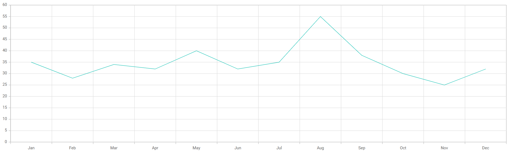

# Getting Started with React Chart in Preact

This article provides a step-by-step guide for setting up a [Preact](https://preactjs.com) project and integrating the [React Charts](https://www.syncfusion.com/react-components/react-charts) component.

[Preact](https://preactjs.com) is a fast and lightweight JavaScript library for building user interfaces, often used as an alternative to React. It uses the same modern API as React but with a much smaller bundle size, which makes it a good choice for projects where file size and load times are critical.

## Prerequisites

Refer to the [system requirements for Syncfusion React UI components](../system-requirement) for additional details.

## Step 1: Set up the Preact project

To create a new Preact project, run one of the following commands:




npm create preact@latest




yarn create preact




Using one of the above commands will lead you to set up additional configurations for the project, as below:

1\. Define the project name: We can specify the name of the project directly. Let's specify the name of the project as `my-project` for this article.

```bash
T  Preact - Fast 3kB alternative to React with the same modern API
|
*  Project directory:
|  my-project
—      
```

2\. Choose `JavaScript` as the framework variant to build this Preact project using JavaScript and React.

```bash
T  Preact - Fast 3kB alternative to React with the same modern API
|
*  Project language:
|  > JavaScript
|    TypeScript
—
```

3\. Then configure the project as below for this article.

```bash
T  Preact - Fast 3kB alternative to React with the same modern API
|
*  Use router?
|    Yes / > No
—
|
*  Prerender app (SSG)?
|    Yes / > No
—
|
*  Use ESLint?
|    Yes / > No
—
```

4\. Upon completing the aforementioned steps to create `my-project`, run the following command to jump into the project directory:

```bash
cd my-project
```

Now that `my-project` is ready to run with default settings, let's add Syncfusion<sup style="font-size:70%">&reg;</sup> components to the project.

## Step 2: Add the Syncfusion<sup style="font-size:70%">&reg;</sup> React packages

Syncfusion React component packages are available at [npmjs.com](https://www.npmjs.com/search?q=ej2-react). Install the React Chart package from the project folder:




npm install @syncfusion/ej2-react-charts




yarn add @syncfusion/ej2-react-charts




## Step 3: Add the Chart component

Replace the contents of `src/index.jsx` with the following code. The example imports the Chart component, mounts it to `#app`, and renders a line series on a category axis. The `LineSeries` and `Category` modules must be injected via the `Inject` component for the chart to render correctly.




import { render } from 'preact';
import {
  Category,
  ChartComponent,
  Inject,
  LineSeries,
  SeriesCollectionDirective,
  SeriesDirective,
} from '@syncfusion/ej2-react-charts';

export function App() {
  const data = [
    { month: 'Jan', sales: 35 }, { month: 'Feb', sales: 28 },
    { month: 'Mar', sales: 34 }, { month: 'Apr', sales: 32 },
    { month: 'May', sales: 40 }, { month: 'Jun', sales: 32 },
    { month: 'Jul', sales: 35 }, { month: 'Aug', sales: 55 },
    { month: 'Sep', sales: 38 }, { month: 'Oct', sales: 30 },
    { month: 'Nov', sales: 25 }, { month: 'Dec', sales: 32 },
  ];
  const primaryXAxis = { valueType: 'Category' };

  return (
    <ChartComponent id="charts" primaryXAxis={primaryXAxis}>
      <Inject services={[LineSeries, Category]} />
      <SeriesCollectionDirective>
        <SeriesDirective
          dataSource={data}
          xName="month"
          yName="sales"
          name="Sales"
          type="Line"
        />
      </SeriesCollectionDirective>
    </ChartComponent>
  );
}

render(<App />, document.getElementById('app'));




> **Note:** Preact uses [`preact/compat`](https://preactjs.com/guide/v10/getting-started/#aliasing-react-to-preact) to alias `react` and `react-dom`. The Preact Vite template wires this up automatically, so no manual aliasing is required.

## Step 4: Run the project

Run the project with the following command:




npm run dev




yarn run dev




Open the URL printed in the terminal (for example, `http://localhost:5173/`, or `http://localhost:5174/` if 5173 is in use) in your browser. The application displays the chart as shown below:



## Troubleshooting

- **Chart does not render (blank page)**
  - Confirm that `src/index.jsx` ends with `render(<App />, document.getElementById('app'))` and that `index.html` contains `<div id="app"></div>`.

- **`Could not find module 'react'` or hydration warnings**
  - The Preact Vite template aliases `react` and `react-dom` to `preact/compat`. If you removed the alias, restore it in `vite.config.js`:

    ```js
    import { defineConfig } from 'vite';
    import preact from '@preact/preset-vite';

    export default defineConfig({
      plugins: [preact()],
    });
    ```

- **`LineSeries is not a registered service` or empty chart**
  - Verify that `LineSeries` and `Category` are listed in the `services` array of the `Inject` component, and that `<SeriesDirective type="Line" />` is set.

## See also

* [Getting Started with the Syncfusion React UI Component](../getting-started/quick-start)
