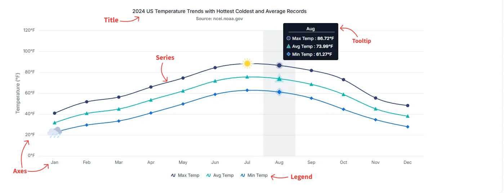

# Understanding React Chart

The [React Charts](https://www.syncfusion.com/react-components/react-charts) component visualizes data in a wide range of chart formats. Each chart is composed of essential building blocks — title, series, axes, legend, tooltip, data label, and annotations — that work together to provide clear, interactive, and meaningful insights. Understanding these blocks is the first step in configuring and customizing a chart for your data.

The following image highlights the primary elements of a chart:

## Series

A series represents a group of data points plotted on the chart. Charts can include one or more series, and each series can use a different chart type — for example, line, column, area, or any other supported visualization.  
For more details, see the [Chart types](https://ej2.syncfusion. com/react/documentation/chart/chart-series) section.

## Axes

Axes structure and organize chart data. Standard Cartesian charts include an x-axis for independent variables and a y-axis for dependent variables. Three-dimensional charts add a z-axis to represent depth. Polar and radar charts instead use a radial axis to measure distance from the center and an angular axis to define direction. These axes translate complex datasets into a readable graphical format.  
For more details, see the [Axis customization](https://ej2.syncfusion.com/react/documentation/chart/axis-customization) section.

## Title

The chart title conveys the overall purpose or subject of the visualization. It typically appears at the top of the chart and can be customized in terms of alignment, style, and formatting.  
For more details, see the [Title and Subtitle](https://ej2.syncfusion.com/react/documentation/chart/title-subtitle) section.

## Legend

The legend identifies each series in the chart, making it easier for users to understand dataset distinctions. It also supports toggling the visibility of individual series to facilitate interactive data exploration.  
For more details, see the [Series](https://ej2.syncfusion.com/react/documentation/chart/chart-types/line) section.

## Tooltip

Tooltips display helpful information when users hover over a data point or series. They offer interactive and contextual insights — for example, exact values or additional metadata — and can be customized to match the design or analytical needs of the application.  
For more details, see the [Tooltip](https://ej2.syncfusion.com/react/documentation/chart/tool-tip) section.

## Data label

Data labels place a small text annotation directly on each data point, showing the underlying value, category, or a custom template. They make the chart easier to read at a glance when exact values matter more than visual scanning.  
For more details, see the [Data label](https://ej2.syncfusion.com/react/documentation/chart/data-labels) section.

## Annotations

Annotations overlay arbitrary HTML or SVG content on the chart — for example, footers, watermarks, reference lines, or callouts. They are useful when you need to draw the user's attention to a specific area of the chart that the other building blocks cannot express.  
For more details, see the [Chart annotations](https://ej2.syncfusion.com/react/documentation/chart/chart-annotations) section.

## Next steps

To put the building blocks into practice, start with the [Getting started](https://ej2.syncfusion.com/react/documentation/chart/getting-started) guide, which walks through installing the package, registering the chart component, and rendering your first series. From there, explore the [Chart types](https://ej2.syncfusion.com/react/documentation/chart/chart-types/line) page to choose the visualization that fits your data.

## See also

* [Getting started](https://ej2.syncfusion.com/react/documentation/chart/getting-started)
* [Chart series](https://ej2.syncfusion.com/react/documentation/chart/chart-types/line)
* [Axis customization](https://ej2.syncfusion.com/react/documentation/chart/axis-customization)
* [Title and Subtitle](https://ej2.syncfusion.com/react/documentation/chart/title-subtitle)
* [Legend](https://ej2.syncfusion.com/react/documentation/chart/legend)
* [Tooltip](https://ej2.syncfusion.com/react/documentation/chart/tool-tip)
* [Data label](https://ej2.syncfusion.com/react/documentation/chart/data-labels)
* [Chart annotations](https://ej2.syncfusion.com/react/documentation/chart/chart-annotations)
