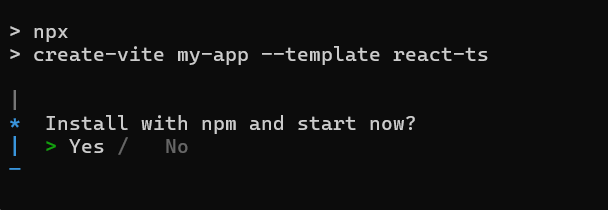

# Getting started with React Chat UI component

This section explains how to create a simple **Chat UI** component and configure its essential functionalities in React.

## Create a React Application

Run the following commands to set up a React application:

```bash
npm create vite@latest my-app -- --template react-ts
```

This command will prompt you to install the required packages and start the application. Select the options as shown below.



As Syncfusion packages are not installed yet, currently, the `No` option will be selected. Then, navigate to the project directory and install the dependencies using the following commands:

```
cd my-app
npm install
```

> **Note:** To set up a React application with Nextjs or Remix, refer to this [documentation](https://ej2.syncfusion.com/react/documentation/getting-started/quick-start) for more details.

## Adding Syncfusion<sup style="font-size:70%">&reg;</sup> packages

All the available Essential<sup style="font-size:70%">&reg;</sup> JS 2 packages are published in [`npmjs.com`](https://www.npmjs.com/~syncfusionorg) public registry. You can choose the component that you want to install.

To install Chat UI component, use the following command

```bash
npm install @syncfusion/ej2-react-interactive-chat --save
```

## Adding CSS reference

Import the Chat UI component required CSS references as follows in `src/App.css`.

```css

/* import the Chat UI dependency styles */

@import "../node_modules/@syncfusion/ej2-base/styles/tailwind3.css";
@import "../node_modules/@syncfusion/ej2-inputs/styles/tailwind3.css";
@import "../node_modules/@syncfusion/ej2-buttons/styles/tailwind3.css";
@import "../node_modules/@syncfusion/ej2-popups/styles/tailwind3.css";
@import "../node_modules/@syncfusion/ej2-navigations/styles/tailwind3.css";
@import '../node_modules/@syncfusion/ej2-dropdowns/styles/tailwind3.css';
@import "../node_modules/@syncfusion/ej2-react-interactive-chat/styles/tailwind3.css";

```

## Adding Chat UI component

Now, you can start adding Chat UI component in the application. For getting started, add the Chat UI component by using `<ChatUIComponent>` tag directive in `src/App.tsx` file using following code. Now place the below Chat UI code in the `src/App.tsx`.

```ts
import { ChatUIComponent } from '@syncfusion/ej2-react-interactive-chat';
import * as React from 'react';
import * as ReactDOM from "react-dom";

function App() {
    return (
        // specifies the tag for render the Chat UI component
        <ChatUIComponent ></ChatUIComponent>
    );
}

ReactDOM.render(<App />, document.getElementById('chat-ui'));
```

## Configure user

Enhance your Chat UI by configuring users. The [user](../api/chat-ui#user) property configures the current user for the chat interface.












## Run the application

After completing the basic configuration, run the following command to display the Chat UI component in your default browser:

```
npm start
```











