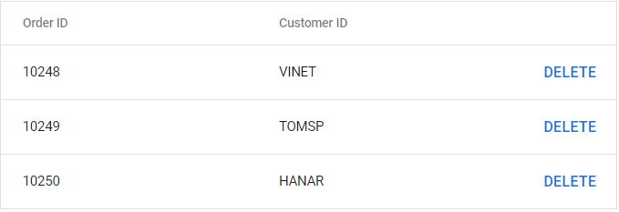

# Integration of Material-UI Components

[Material-UI](https://mui.com/) is a popular library for building user interfaces in React applications. It provides a comprehensive set of customizable components that follow Material Design principles, including buttons, forms, navigation bars, modals, and cards, with built-in responsive behaviors that enable efficient and consistent UI development.

The Syncfusion<sup style="font-size:70%">&reg;</sup> Material theme aligns with Material-UI guidelines to ensure a consistent appearance when using both Syncfusion<sup style="font-size:70%">&reg;</sup> and Material-UI components together. Integrating Material-UI components within Syncfusion<sup style="font-size:70%">&reg;</sup> components allows developers to leverage the strengths of both libraries—combining Syncfusion's<sup style="font-size:70%">&reg;</sup> powerful data visualization and grid capabilities with Material-UI's flexible UI components. This guide demonstrates how to integrate Material-UI components within the Syncfusion<sup style="font-size:70%">&reg;</sup> Grid component using column templates.

## Set up the React project

1. Create a new React project or use an existing one. Refer to the Syncfusion<sup style="font-size:70%">&reg;</sup> Grid component's [Getting Started](../grid/getting-started) documentation for detailed setup instructions.

2. Install the required Material-UI dependencies:

```bash
npm install @mui/material @emotion/react @emotion/styled --save
```

## Use Material-UI components in Grid column templates

Material-UI components can be rendered inside the Syncfusion<sup style="font-size:70%">&reg;</sup> Grid using column templates. The `template` property of `ColumnDirective` accepts a function that returns JSX, allowing Material-UI components to be seamlessly integrated as custom cell renderers. This approach works with various Material-UI components such as buttons, text fields, select dropdowns, chips, and more.

The following example demonstrates how to use a Material-UI Button component within a Grid column template. The button allows users to delete rows from the grid, with the delete action managed through React state.




import * as React from 'react';
import { useState } from 'react';
import { GridComponent, ColumnsDirective, ColumnDirective } from '@syncfusion/ej2-react-grids';
import { Button } from '@mui/material';
import '@syncfusion/ej2-react-grids/styles/material.css';

const dataSource = [
  {
    OrderID: 10248, CustomerID: 'VINET'
  },
  {
    OrderID: 10249, CustomerID: 'TOMSP'
  },
  {
    OrderID: 10250, CustomerID: 'HANAR'
  }
];

function App() {

  const [data, setData] = useState(dataSource);

  function materialTemplate(props) {
    return (
      <div>
        <Button id={props.OrderID} onClick={(e) => {
          // Filter out the row with matching OrderID when delete button is clicked
          setData((prev) => prev.filter((obj) => {
            return obj.OrderID.toString() !== e.target.id;
          }));
        }}>Delete</Button>
      </div>
    );
  }

  return (
    <GridComponent dataSource={data} width='600px' allowKeyboard={false} >
      <ColumnsDirective>
        <ColumnDirective field='OrderID' headerText='Order ID' />
        <ColumnDirective field='CustomerID' headerText='Customer ID' />
        <ColumnDirective template={materialTemplate} width='100px' />
      </ColumnsDirective>
    </GridComponent>
  );
}
export default App;




## Run the project

To run the project and view the integration, use the following command:

```bash
npm start
```

The output displays a Grid with Material-UI buttons in the third column, maintaining visual consistency with the Syncfusion<sup style="font-size:70%">&reg;</sup> Material theme:



## Integration considerations

When integrating Material-UI components with Syncfusion<sup style="font-size:70%">&reg;</sup> Grid, consider the following:

- **Theme consistency**: Both libraries use the Material theme, ensuring visual harmony. The Syncfusion<sup style="font-size:70%">&reg;</sup> Material theme is designed to align with Material-UI styling principles.
- **Performance**: For large datasets, consider the rendering performance impact of complex Material-UI components in every cell. Use virtualization features when appropriate.
- **Styling approach**: Material-UI uses CSS-in-JS through Emotion, while Syncfusion<sup style="font-size:70%">&reg;</sup> uses traditional CSS stylesheets. Both approaches coexist without conflicts in most scenarios.

This integration pattern can be applied to other Syncfusion<sup style="font-size:70%">&reg;</sup> components that support templates, including detail row templates, header templates, and other customizable component areas.