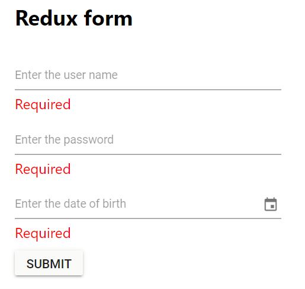

# Integration of Syncfusion<sup style="font-size:70%">&reg;</sup> React Components in Redux Form

[Redux Form](https://redux-form.com/) is a library for managing form state in React applications. It integrates with the Redux state management library ([Redux Store](https://redux.js.org/api/store)) and provides a straightforward way to handle form inputs, validation, submission, and synchronization with Redux.

This guide provides a step-by-step process for creating a Redux form, integrating Syncfusion<sup style="font-size:70%">&reg;</sup> components, and implementing form validation.

## Create a Redux Form

To create a simple login form using Redux Form, follow these steps:

1. Create a new [React](https://reactjs.org/docs/create-a-new-react-app.html) project.

2. Install the necessary Redux dependencies. Run the following command:

```bash
npm install --save redux react-redux redux-form
```

In this command:

* [Redux](https://redux.js.org/) is a state container that stores application data.
* [React Redux](https://react-redux.js.org/) provides bindings to use Redux with React components.
* [Redux Form](https://redux-form.com/7.0.1/docs/gettingstarted.md/) manages form state in React.

3. Create a basic form component structure by creating a new file called **LoginForm.js** and defining the form component:




import { reduxForm } from "redux-form";
 
let LoginForm = (props) => {
    return (
        <form />
    );
};




4. Include the form component in the React project by adding the following code to **App.js**:




import './App.css';
import LoginForm from "./LoginForm";
 
function App() {
  return (
    <div className="App">
      <div className="login-form">
        <h2>Redux form</h2>
        <LoginForm />
      </div>
    </div>
  );
}
export default App;




## Setting up the Redux Store

Set up a Redux store in the **index.js** file to store the form state and provide the store to the application using the `Provider` component.




import React from 'react';
import ReactDOM from 'react-dom/client';
import { Provider } from 'react-redux';
import { createStore, combineReducers } from 'redux';
import { reducer as formReducer } from 'redux-form';
import App from './App';
 
const appReducer = combineReducers({ form: formReducer });
const store = createStore(appReducer);
const root = ReactDOM.createRoot(document.getElementById('root'));
root.render(<Provider store={store}><App /></Provider>);




## Connect the Form with Redux Form

Update **LoginForm.js** to connect the form component with Redux Form by exporting it using the `reduxForm` higher-order component. This integration enables Redux Form to manage the form's state within the Redux store:




import { reduxForm } from "redux-form";
 
let LoginForm = (props) => {
    return (
        <form />
    );
};

export default LoginForm = reduxForm({
    form: "login"
})(LoginForm);




## Add Syncfusion<sup style="font-size:70%">&reg;</sup> React Components

To incorporate Syncfusion<sup style="font-size:70%">&reg;</sup> React components (DatePicker, TextBox, Button) into the login form, follow these steps:

1. Install the required Syncfusion packages:

```bash
npm install @syncfusion/ej2-react-calendars @syncfusion/ej2-react-inputs @syncfusion/ej2-react-buttons --save
```

2. Import the Syncfusion theme stylesheet in **App.js** to ensure proper component styling:




import './App.css';
import '@syncfusion/ej2-base/styles/tailwind3.css';
import '@syncfusion/ej2-react-inputs/styles/tailwind3.css';
import '@syncfusion/ej2-react-calendars/styles/tailwind3.css';
import '@syncfusion/ej2-react-buttons/styles/tailwind3.css';
import LoginForm from "./LoginForm";




3. Integrate the Syncfusion components within the login form using the `Field` component provided by Redux Form. The `Field` component connects each form input to the Redux store, enabling state management and validation. Update **LoginForm.js** with the following code:




import { reduxForm, Field } from "redux-form";
import { DatePickerComponent } from '@syncfusion/ej2-react-calendars';
import { TextBoxComponent } from "@syncfusion/ej2-react-inputs";
import { ButtonComponent } from "@syncfusion/ej2-react-buttons";
 
const textBox = ({ placeholder }) => {
    return <TextBoxComponent placeholder={placeholder} floatLabelType="Auto" />
};
const datePicker = ({ placeholder }) => {
    return <DatePickerComponent placeholder={placeholder} floatLabelType="Auto" />
};
let LoginForm = () => {
    return (
        <form>
            <Field name="username" component={textBox} placeholder="Enter the user name" />
            <Field name="password" component={textBox} placeholder="Enter the password" />
            <Field name="dob" component={datePicker} placeholder="Enter the date of birth" />
            <ButtonComponent type="submit">Submit</ButtonComponent>
        </form>
    );
};
 
export default LoginForm = reduxForm({
    form: "login"
})(LoginForm);




4. Define a handler function to handle form submission and display the form data in **App.js**:




function App() {
  const handleLogin = values => {
    console.log(`User name: ${values.username}`);
    console.log(`Password: ${values.password}`);
    console.log(`DOB: ${values.dob}`);
  }
  return (
    <div className="App">
      <div className="login-form">
        <h2>Redux form</h2>
        <LoginForm onSubmit={handleLogin} />
      </div>
    </div>
  );
}
export default App;




5. Update the `LoginForm` component in **LoginForm.js** to handle form submission using the `handleSubmit` function provided by Redux Form:




let LoginForm = (props) => {
    const { handleSubmit } = props;
    return (
        <form onSubmit={handleSubmit}>
            <Field name="username" component={textBox} placeholder="Enter the user name" />
            <Field name="password" component={textBox} placeholder="Enter the password" />
            <Field name="dob" component={datePicker} placeholder="Enter the date of birth" />
            <ButtonComponent type="submit">Submit</ButtonComponent>
        </form>
    );
};




## Implementing Form Validation with Redux Form

Redux Form provides integrated support for validation. Define a `validate` function to check input values and return error messages if validation fails. Form fields are validated upon form submission. Add the validation logic to **LoginForm.js**:




const validate = values => {
    const errors = {};
    if (!values.username) {
        errors.username = 'Required';
    }
    if (!values.password) {
        errors.password = 'Required';
    }
    if (!values.dob) {
        errors.dob = 'Required';
    }
    return errors;
}

export default LoginForm = reduxForm({
    form: "login",
    validate
})(LoginForm);




## Displaying Validation Errors

Upon form submission, the form fields will be validated and corresponding error messages will be displayed below the respective input fields. Update the `textBox` and `datePicker` functions in **LoginForm.js** to display validation errors. The `input` prop contains Redux Form's field state and change handlers, while the `meta` prop provides validation state including `touched` (whether the field has been focused) and `error` (the validation error message):




const textBox = ({ placeholder, input, meta: { touched, error } }) => {
    return <div>
        <TextBoxComponent placeholder={placeholder} floatLabelType="Auto" {...input}
            onChange={(e) => {
                input.onChange(e.target.value);
            }}
        />
        {touched && error && <span className="error">{error}</span>}
    </div>
};
const datePicker = ({ placeholder, input, meta: { touched, error } }) => {
    return <div>
      <DatePickerComponent placeholder={placeholder} floatLabelType="Auto" {...input}
         onChange={(e) => {
            input.onChange(e.target.value);
         }}
      />
      {touched && error && <span className="error">{error}</span>}
    </div>
};




## Run the Project

To run the project, use the following command:

```bash
npm start
```

Refer to the following output image.



> Refer to the [GitHub repository](https://github.com/SyncfusionExamples/Creating-a-Redux-Form-with-Syncfusion-components-in-React) for a runnable demo.