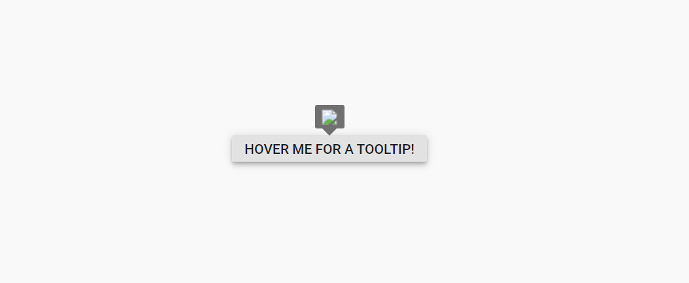
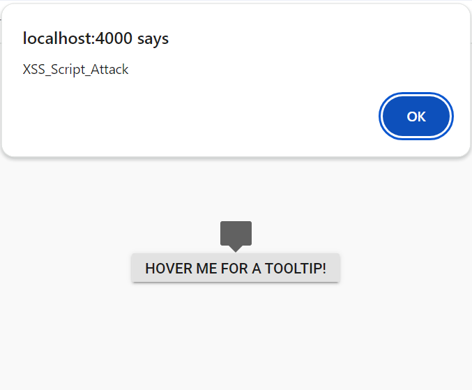

# Syncfusion<sup style="font-size:70%">&reg;</sup> React components - Security

Security is critical in web applications. Best practices include using HTTPS, validating and sanitizing user input, and enforcing strong authentication such as multi-factor authentication.

Syncfusion<sup style="font-size:70%">&reg;</sup> React components incorporate these security considerations to support secure, production-ready applications.

## Security Vulnerabilities

Web application security vulnerabilities are weaknesses in design, implementation, or configuration that may be exploited to compromise data integrity, confidentiality, or availability. Syncfusion<sup style="font-size:70%">&reg;</sup> React components are designed to help mitigate common vulnerabilities, including:

* [Cross-Site Scripting (XSS)](https://developer.mozilla.org/en-US/docs/Glossary/Cross-site_scripting) – XSS occurs when user-supplied input is rendered without proper validation or encoding. Malicious scripts can be executed in the user's browser, leading to session hijacking, redirection to malicious sites, or unauthorized actions.
* [Cross-Site Request Forgery (CSRF)](https://developer.mozilla.org/en-US/docs/Glossary/CSRF) – CSRF tricks authenticated users into executing unintended actions on a web application. This exploits the trust the site has in the user's browser by sending unauthorized requests without the user's knowledge.
* Injection Attacks – These involve injecting malicious code (such as SQL injection, XML injection, or command injection) through input fields or parameters. Proper input validation and parameterized queries are essential to prevent unauthorized execution of commands or access to sensitive data.

## Security Considerations

Incorporating security measures from the outset of development is vital for protecting applications. Syncfusion<sup style="font-size:70%">&reg;</sup> employs a rigorous approach to security in its React components. The following considerations provide an overview of key security measures:

* [Content Security Policy](#content-security-policy)
* [HTML Sanitizer](#html-sanitizer)
* [Browser Storage](#browser-storage)

### Content Security Policy

[Content Security Policy](https://developer.mozilla.org/en-US/docs/Web/HTTP/CSP) (CSP) is a security feature that detects and mitigates Cross-Site Scripting (XSS) and data injection attacks. It reports errors and warnings when inline styles, inline scripts, `eval`, or `new Function` are used in unauthorized ways.

To implement CSP, include a `<meta>` tag with specified CSP directives. Syncfusion<sup style="font-size:70%">&reg;</sup> React components generally adhere to strict CSP directives, though specific features may require certain allowances.

#### CSP Directives

The following directives are relevant when using Syncfusion<sup style="font-size:70%">&reg;</sup> React components:

|    Directives    |    Description    |    Examples    |
|------------------|-------------------|----------------|
|  `style-src`  | Defines allowed sources for stylesheets. | `style-src 'self' https://cdn.syncfusion.com/ https://fonts.googleapis.com/ 'unsafe-inline';`|
|  `font-src`  | Defines allowed sources for fonts. | `font-src 'self' https://fonts.googleapis.com/ https://fonts.gstatic.com/ data: cdn.syncfusion.com;` |
|  `img-src`  | Specifies allowed sources for images. | `img-src 'self' data:;` |

> Note: Using a web worker within the Spreadsheet component for exporting requires the following directive:
> `worker-src 'self' 'unsafe-inline' * blob:;`

#### CSP Sources

The following sources define permitted origins for resources:

|  Source  |  Description  | Examples  |
|----------|---------------|-----------|
|  `self`  |  Refers to the origin from which the protected document is served (same protocol, host, and port).  |  `style-src 'self'`  |
|  `data`  | Allows resources via the data scheme (e.g., Base64-encoded images).  |  `img-src 'self' data:`  |
|  `unsafe-inline`  | Permits inline resources, such as inline `<style>` or `<script>` elements.  |  `style-src 'self' 'unsafe-inline'`  |

For more details on configuring CSP with Syncfusion components, refer to the [Content Security Policy troubleshooting guide](https://ej2.syncfusion.com/react/documentation/troubleshoot/content-security-policy).

### HTML Sanitizer

An HTML sanitizer removes potentially malicious code from HTML strings to prevent XSS attacks. It parses HTML and strips dangerous elements like `<script>` tags, inline event handlers (e.g., `onclick`, `onmouseover`), and javascript URIs.

Some Syncfusion<sup style="font-size:70%">&reg;</sup> components expose an [`enableHtmlSanitizer`](https://ej2.syncfusion.com/react/documentation/api/button/#enablehtmlsanitizer/) property that automatically sanitizes HTML strings before rendering; confirm availability in the specific component's API reference. Enabling this property filters user-submitted content that may contain XSS threats.

When `enableHtmlSanitizer` is enabled, the HTML string is processed to remove unsafe content, helping to prevent XSS in component templates or content.

You can also manually sanitize input values using the Syncfusion<sup style="font-size:70%">&reg;</sup> `SanitizeHtmlHelper`:

```js
import { SanitizeHtmlHelper } from '@syncfusion/ej2-base';

let html = '<script>alert("XSS");</script>';
let sanitizedHtml = SanitizeHtmlHelper.sanitize(html);
```

The following example demonstrates sanitizing template content in a React component:

```tsx
import { DialogComponent } from '@syncfusion/ej2-react-popups';
import * as React from 'react';
import { SanitizeHtmlHelper } from '@syncfusion/ej2-base';

function App() {
  return (
    <div className="App" id="dialog-target">
      <DialogComponent
        width="250px"
        // Manually sanitizing the header content
        header={SanitizeHtmlHelper.sanitize('<div id="dlg-template" title="Nancy" class="e-icon-settings"> Nancy <div onmousemove="alert(\'XSS\')">Hover me (XSS trigger removed)</div></div>')}
        target="#dialog-target"
        showCloseIcon={true}
        enableHtmlSanitizer={true} // Enables sanitization for the dialog content
      >
        This is a dialog with a sanitized header.
      </DialogComponent>
    </div>
  );
}
export default App;
```



 


 





**Result with `enableHtmlSanitizer={true}`:**
The malicious code is removed, and the content is rendered safely.



**Result with `enableHtmlSanitizer={false}`:**
The malicious code is executed (e.g., script runs, alerts appear).



### Browser Storage

Browser storage allows web applications to store data locally on a user's device. Syncfusion<sup style="font-size:70%">&reg;</sup> React components utilize **Local Storage** for specific features.

#### Local Storage

[Local Storage](https://developer.mozilla.org/en-US/docs/Web/API/Web_Storage_API) stores key-value pairs in a web browser with no expiration time. Syncfusion<sup style="font-size:70%">&reg;</sup> React components use local storage only when the persistence feature is explicitly enabled (e.g., `enablePersistence={true}`). This is typically used to retain component state (like Grid column sorting or filter settings) across page reloads.