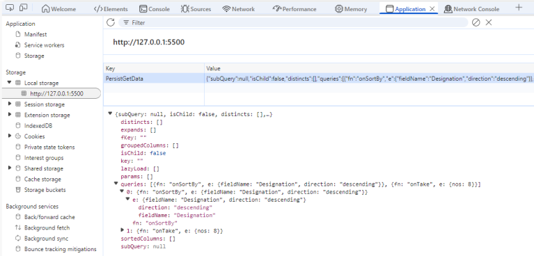
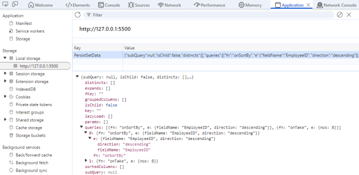
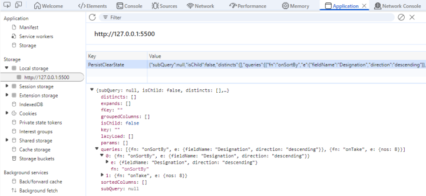
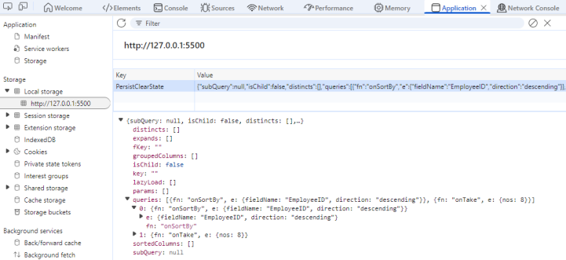
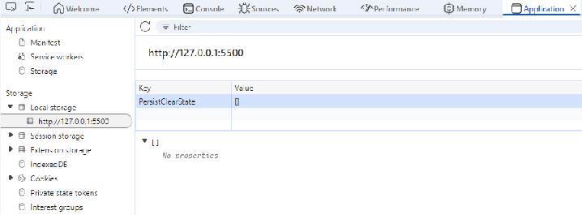

# State Persistence in React DataManager

State persistence in the Syncfusion React DataManager stores every data operation state—sorting, filtering, paging, and grouping—inside the browser's `localStorage`. After a reload or route transition, the stored state is replayed automatically so the DataManager `Query` configuration stays aligned with the last interaction. Enable the feature by setting `enablePersistence={true}` and assigning a unique `id` to each DataManager instance.

**Benefits of enabling state persistence:**

* State persistence delivers a seamless experience with no loss of state across reloads or navigations.
* Reapplies the last known query state as soon as the component initializes.
* Keeps dashboards or multipage apps consistent without manual wiring.

Consider a sales analytics dashboard that persists a descending sort on "Revenue" plus filters on the "Region" column. When the React view remounts, the DataManager restores the saved query automatically, so the Grid or any bound component renders exactly as the user left it.

The first sample demonstrates how to enable persistence in a React component and display the fetched data. An initial paging query (`skip(5).take(8)`) runs once, and the paging state is cached and replayed across reloads.














 






## Preventing a query from persistence

By default, the React DataManager persists every query that mutates the result set (sorting, searching, filtering, grouping, selection, and paging). When a view only needs a subset of those states, configure the `ignoreOnPersist` property with the query keys that must be skipped. This lets you keep paging and filtering while ignoring selection or search input.

The following query types can be excluded through `ignoreOnPersist`. Provide the property with an array of the desired keys:

**Supported query keys:**

| Operation            | Query Key        |
|----------------------|------------------|
| Sorting              | `onSortBy`       |
| Searching            | `onSearch`       |
| Filtering            | `onWhere`        |
| Grouping             | `Grouping`       |

* `ignoreOnPersist` accepts a `string[]`, so you can list as many query keys as the scenario requires.
* The sample below excludes both `onSortBy` and `onSearch`, so every reload reapplies the persisted filters or paging but never restores the previous sort order or search value.














 






## Get or set persisted data

The Syncfusion React DataManager exposes built-in helpers to read or mutate the state stored in `localStorage`. Use them whenever you need to inspect the saved configuration, seed a default state, or hydrate another component with the same persisted query.

* `getPersistedData(id)` returns the serialized query state for the specified DataManager `id`, including persisted operations such as filtering, sorting, search text, and paging details.
* `setPersistData(originalEvent, id, query)` overwrites the stored state with a custom `Query` object. Pass **null** for `originalEvent` when the change is not triggered by a UI event.

In the following example, `getPersistedData` retrieves and logs the sorting state for the DataManager with the id "JohnDoe", where the data was sorted by the "Designation" field in "descending" order.














 






The `setPersistData` method inserts or replaces the stored query for a DataManager. When the call is not triggered from an event, pass **null** as the first argument, then supply the target `id` and `Query` instance that describes the operations to persist.

In this example, the existing persisted query sorted by "Designation" is replaced with a new query that applies a "descending" sort on "EmployeeID".














 






The `setPersistData` method updates the persisted query state of the DataManager with the specified `query`.

## Restoring the initial state of data manager

For state persistence overview, refer to the introduction section. Scenarios such as application resets, user preference changes, or logout flows require clearing the stored state so every user starts from a known baseline.

The `clearPersistence()` method removes the entry associated with its `id`. The next render uses the default query configuration defined in the component.

The following sample demonstrates how to clear the persisted state in the DataManager using the `clearPersistence` method:














 






In this sample, the DataManager is initially configured to sort the data by the "Designation" field in descending order. This query is executed on load, and the resulting state is automatically stored in the browser's `localStorage` due to the `enablePersistence` setting.

When the Apply Query button is clicked, a new query is applied. The table updates by sorting on the "EmployeeID" field and stores the latest query state in `localStorage`.

When the Clear Persistence button is clicked, the `clearPersistence()` method removes the stored query state from `localStorage`. This restores the DataManager to its original state, so any previously applied queries such as sorting are no longer retained after a page reload.

## Use case: e-commerce wishlist that remembers state

The accompanying e-commerce demo wires a single persistent DataManager to both `GridComponent` and `ChartComponent`. The Grid lists the full catalog, while the Chart visualizes review data that is sourced from the same query results. Every sort, filter, or paging action taken in either component is tracked by the shared DataManager, so refreshing the browser reapplies the exact combination of operations.

In this scenario, sorting and filtering are persisted, but search text is deliberately excluded by adding `onSearch` to `ignoreOnPersist`. Users keep their curated wishlists and view states without storing potentially noisy keyword input.

**Step 1:** Choose a username from the dropdown list. The selected value becomes the DataManager `id`, so each user receives an isolated entry inside window.localStorage.

**Step 2:** Interact with the Grid by selecting products, adding them to a wishlist via toolbar actions, filtering by category, or toggling between price-based sort buttons. These operations are saved per user. The Chart instantly reflects any persisted filters and sorts because it shares the DataManager instance.

**Step 3:** Use the Logout button to simulate leaving the application.

**Step 4:** After logging back in (or refreshing), pick the same username. The Grid and Chart reload the wishlist and persisted query so the interface resumes exactly where the user stopped. Use the Clear Wishlist button when you want to remove the stored preferences for that profile.

[Explore the full React sample](https://github.com/SyncfusionExamples/EJ2-DataManager-peristence-cart-sample) for implementation details.