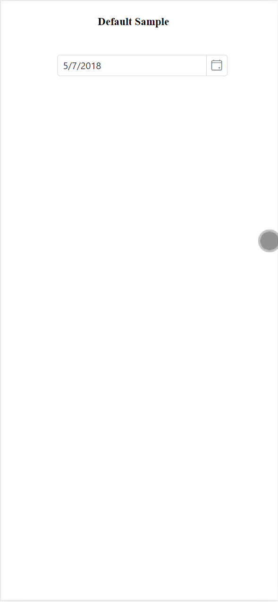

# Style appearance in React Datepicker component

The following content provides the exact CSS structure that can be used to modify the control's appearance based on the user preference.

## Customizing the appearance of DatePicker wrapper element

Use the following CSS selectors to customize the appearance of the wrapper element. Apply these styles with appropriate specificity to override default component styles.

```css
/* To specify height and font size */
.e-input-group input.e-input, .e-input-group.e-control-wrapper input.e-input {
        height: 40px;
        font-size: 20px;
}
```

## Customizing the DatePicker icon element

Use the following CSS to customize the DatePicker icon appearance:

```css
/* To specify background color and font size */
.e-input-group .e-input-group-icon:last-child, .e-input-group.e-control-wrapper .e-input-group-icon:last-child {
        font-size: 12px;
        background-color: darkgray;
}
```

## Customizing the Calendar popup of the DatePicker

Please check the below section, to customize the style and appearance of the Calendar component.

[Customizing Calendar's style and appearance](../calendar/style-appearance)

## Full screen mode support in mobiles and tablets

The DatePicker's full-screen mode feature enhances visibility and usability on mobile and tablet devices by expanding the calendar popup to occupy the full screen in both landscape and portrait orientations. To enable full-screen mode, set the [fullScreenMode](https://ej2.syncfusion.com/react/documentation/api/datepicker/#fullScreenMode) property to `true`. The calendar will then automatically expand to full-screen on mobile devices, providing a more immersive date selection experience.

```typescript
import { DatePickerComponent } from '@syncfusion/ej2-react-calendars';
import * as React from 'react';
import * as ReactDOM from 'react-dom';

export default class App extends React.Component<{}, {}> {

    private mobileMode:boolean = true;

    public render() {
        return <DatePickerComponent id="datepicker"  fullScreenMode={this.mobileMode} placeholder='Enter date' />
    }
};

ReactDOM.render(<App />, document.getElementById('element'));
```

