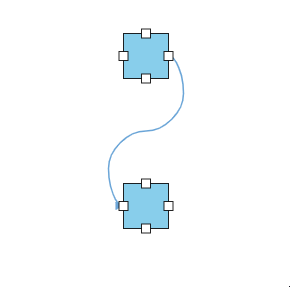
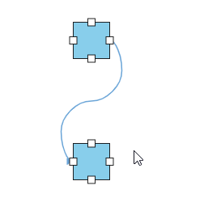
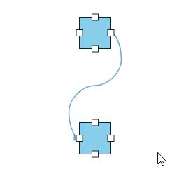
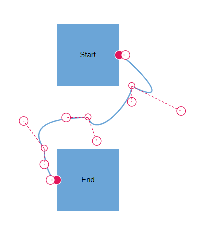
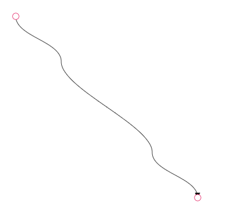
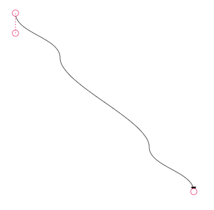
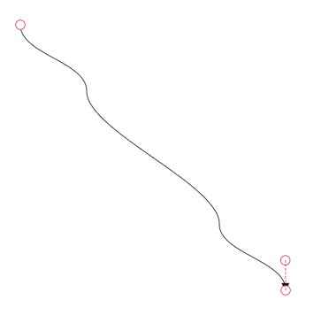
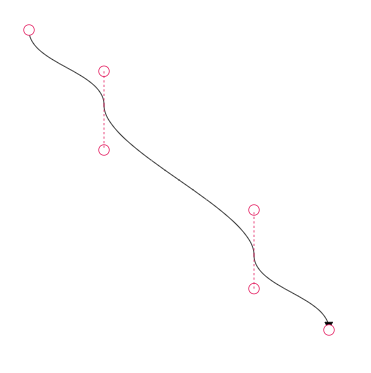
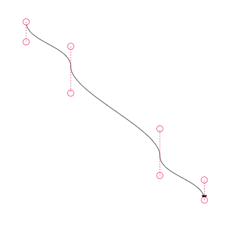

# Bezier Control Points Interaction

Bezier control points determine the curvature and shape of bezier connector segments in React Diagram components. These interactive handles allow users to modify connector paths dynamically while maintaining visual consistency across multiple segments.

## Configure Bezier Segment Smoothness

When working with multiple bezier segments, maintain visual consistency by configuring the `smoothness` behavior of control points using the [`bezierSettings`](https://ej2.syncfusion.com/react/documentation/api/diagram/bezierSettingsModel/) property of the connector. The `smoothness` property controls how adjacent control points respond when one is modified.

| BezierSmoothness value | Description | Output |
|-------- | -------- | -------- |
| SymmetricDistance| Both control points of adjacent segments will be at the same distance when any one of them is editing. |  |
| SymmetricAngle | Both control points of adjacent segments will be at the same angle when any one of them is editing. |  |
| Default | Both control points of adjacent segments will be at the same angle and same distance when any one of them is editing. |  |
| None | Segment’s control points are interacted independently from each other. |  |










 

## How to Show or Hide the Bezier Segment’s Control Points

Configure which control points are visible during interaction using the [`controlPointsVisibility`](https://ej2.syncfusion.com/react/documentation/api/diagram/controlPointsVisibility/) property within [`bezierSettings`](https://ej2.syncfusion.com/react/documentation/api/diagram/bezierSettingsModel/). This property provides granular control over control point display for different connector segments.

| ControlPointsVisibility value | Description | Output |
|-------- | -------- | -------- |
| None |It allows you to hide all control points of the bezier connector. |  |
| Source | It allows you to show control points of the source segment and hides all other control points in a bezier connector. |  |
| Target | It allows you to show control points of the target segment and hides all other control points in a bezier connector. |  |
| Intermediate | It allows you to show control points of the intermediate segments and hides all other control points in a bezier connector.|  |
| All | It allows you to show all the control points of the bezier connector, including the source, target, and intermediate segments’ control points. |  |
