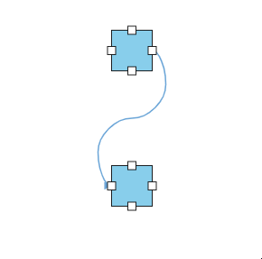
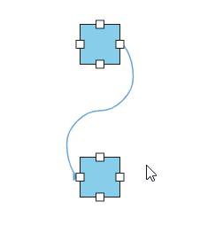
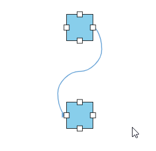
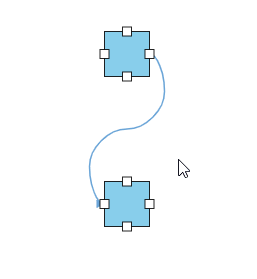
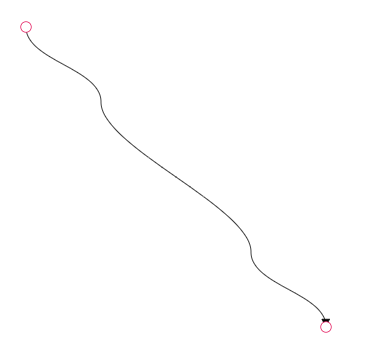
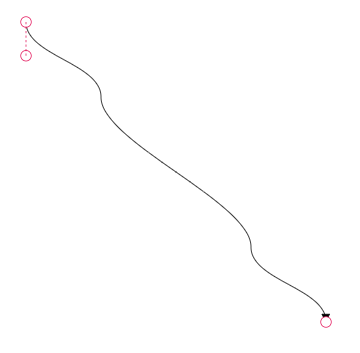
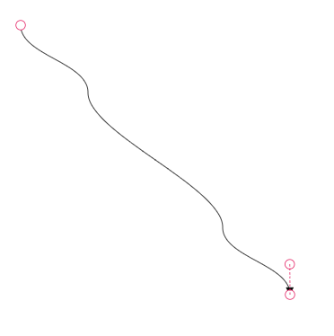
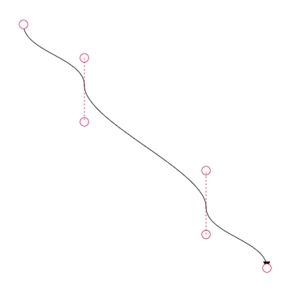
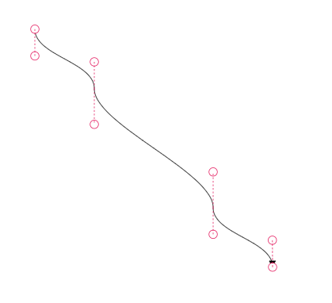

# Bezier Control Points Interaction in React Diagram

> Before working with bezier control points, install `@syncfusion/ej2-react-diagrams`, inject the `ConnectorEditing` module into the Diagram, and enable the `DragSegmentThumb` connector constraint. See [Getting Started](./getting-started) and [Module Injection](./module-injection) for setup details.

Bezier control points determine the curvature and shape of bezier connector segments in React Diagram components. These interactive handles allow users to modify connector paths dynamically while maintaining visual consistency across multiple segments. This document covers configuring segment smoothness using `bezierSettings.smoothness` and toggling control-point visibility using `bezierSettings.controlPointsVisibility`.

N> If the bezier control points are not interactive at runtime, ensure the `ConnectorEditing` module is injected into the Diagram and the `DragSegmentThumb` connector constraint is enabled.

## Configure Bezier Segment Smoothness

When working with multiple bezier segments, maintain visual consistency by configuring the `smoothness` behavior of control points using the [`bezierSettings`](https://helpej2.syncfusion.com/react/documentation/api/diagram/bezierSettingsModel) property of the connector. The default `smoothness` value is `BezierSmoothness.Default`. The `smoothness` property controls how adjacent control points respond when one is modified. To allow users to drag the control points, enable the `DragSegmentThumb` connector constraint in addition to the default constraints.

| BezierSmoothness value | Description | Output |
|-------- | -------- | -------- |
| SymmetricDistance| Both control points of adjacent segments will be at the same distance when any one of them is edited. |  |
| SymmetricAngle | Both control points of adjacent segments will be at the same angle when any one of them is edited. |  |
| Default | Combines both angle and distance symmetry: both control points of adjacent segments stay at the same angle and same distance when any one of them is edited. |  |
| None | Segment’s control points are interacted independently from each other. |  |










 

## How to Show or Hide the Bezier Segment’s Control Points

Configure which control points are visible during interaction using the [`controlPointsVisibility`](https://helpej2.syncfusion.com/react/documentation/api/diagram/controlPointsVisibility) property within [`bezierSettings`](https://helpej2.syncfusion.com/react/documentation/api/diagram/bezierSettingsModel). This property supports combining flags (for example, `ControlPointsVisibility.Source | ControlPointsVisibility.Target` to show only the source and target control points) and provides granular control over control point display for different connector segments.

| ControlPointsVisibility value | Description | Output |
|-------- | -------- | -------- |
| None | Hides all control points of the bezier connector. |  |
| Source | Shows control points of the source segment and hides all other control points in a bezier connector. |  |
| Target | Shows control points of the target segment and hides all other control points in a bezier connector. |  |
| Intermediate | Shows control points of the intermediate segments and hides all other control points in a bezier connector. |  |
| All | Shows all the control points of the bezier connector, including the source, target, and intermediate segments’ control points. |  |

The following code example shows how to configure `controlPointsVisibility` to show only the source and target control points:










 

## See also

* [Connectors](./connectors)
* [Bezier connectors](./connector-bezier)
* [Connector segments](./connector-segments)
