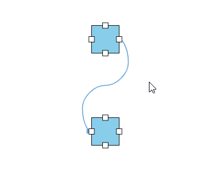
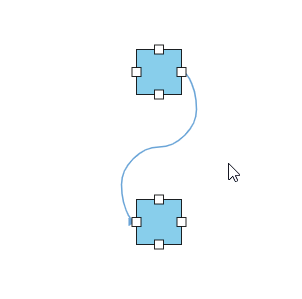

# Bezier Connector Settings

## How to edit bezier segments based on bezier connector settings

The intermediate point of two adjacent bezier segments can be edited interactively based on the [`segmentEditOrientation`](../api/diagram/bezierSegmentEditOrientation/) property of [`bezierSettings`](../api/diagram/bezierSettingsModel/).

| SegmentEditOrientation value | Description | Output |
|-------- | -------- | -------- |
| Bidirectional |It allows the intermediate points to be dragged in either vertical or horizontal directions. |  |
| Freeform | It allows the intermediate points to be dragged in any direction. |  |

The following code illustrates how to interact with Bezier efficiently by using the [`smoothness`](../api/diagram/bezierSmoothness/) and `segmentEditOrientation` properties of the `bezierSettings`.










 
