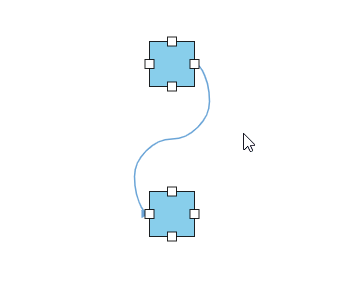

# Bezier Segment Edit Orientation in React Diagram

> Before working with Bezier segment editing, install `@syncfusion/ej2-react-diagrams`, inject the `ConnectorEditing` module into the Diagram, and enable the `DragSegmentThumb` connector constraint. See [Getting Started](./getting-started), [Module Injection](./module-injection), and [Bezier Control Points](./bezier-controlPoint) for setup and context.

Bezier connectors in diagrams provide smooth, curved connections between nodes with customizable control points. The segment edit orientation feature allows interactive modification of Bezier connector segments to achieve the desired visual flow and connection paths.

N> If the Bezier segment intermediate points are not editable at runtime, ensure the `ConnectorEditing` module is injected into the Diagram and the `DragSegmentThumb` connector constraint is enabled.

## Interactive Editing of Bezier Segments

The intermediate control points between adjacent Bezier segments can be edited interactively during runtime based on the [`segmentEditOrientation`](https://helpej2.syncfusion.com/react/documentation/api/diagram/bezierSegmentEditOrientation) property within the [`bezierSettings`](https://helpej2.syncfusion.com/react/documentation/api/diagram/bezierSettingsModel) configuration. When `segmentEditOrientation` is not specified, the connector uses the default orientation. This property determines the directional constraints applied when users drag the intermediate points to reshape the connector. To allow users to drag the intermediate points, enable the `DragSegmentThumb` connector constraint in addition to the default constraints.

### Segment Edit Orientation Options

The following table describes the available orientation modes and their interactive behavior:

| SegmentEditOrientation value | Description | Output |
|-------- | -------- | -------- |
| Bidirectional | It allows the intermediate points to be dragged in either vertical or horizontal directions. |  |
| FreeForm | It allows the intermediate points to be dragged in any direction. |  |

The following code demonstrates how to configure Bezier connectors with interactive segment editing using both the [`smoothness`](https://helpej2.syncfusion.com/react/documentation/api/diagram/bezierSmoothness) property for curve refinement and the `segmentEditOrientation` property for interaction control:










 

## See also

* [Bezier Control Point](./bezier-controlPoint)
* [Bezier connectors](./connector-bezier)
* [Connectors](./connectors)
