# BPMN Activity in React Diagram Component

## Overview

BPMN (Business Process Model and Notation) activities represent work performed within a business process. An [`activity`](https://ej2.syncfusion.com/react/documentation/api/diagram/bpmnActivity#BpmnActivity)appears as a rounded rectangle and serves as the fundamental unit of work in process modeling.

Activities fall into two main categories:

* **Task**: A single unit of work that cannot be broken down into smaller components within the process model.
* **Subprocess**: A compound activity that contains other activities and can be expanded to show additional detail.

To create a BPMN activity, set the shape property to **activity**. Specify the activity type using the activity property of the node. The default activity type is **task**.










 

### Tasks

The [`task`](https://ej2.syncfusion.com/react/documentation/api/diagram/bpmnTask#BpmnTask) property of the [`bpmn activity`](https://ej2.syncfusion.com/react/documentation/api/diagram/bpmnactivitymodel/)defines specific task types such as user tasks, service tasks, or message tasks. The default task type is **none**. Different task types indicate the nature of work being performed and who or what performs it.










 

The various types of BPMN tasks are tabulated as follows.

| Shape | Image |
| -------- | -------- |
| Service |  |
| Send | 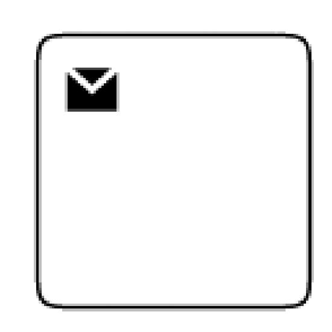 |
| Receive | 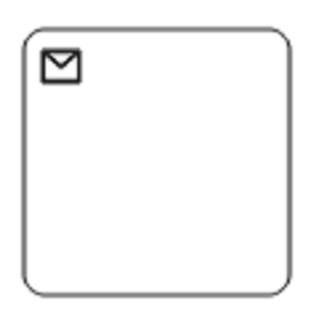 |
| Instantiating Receive | 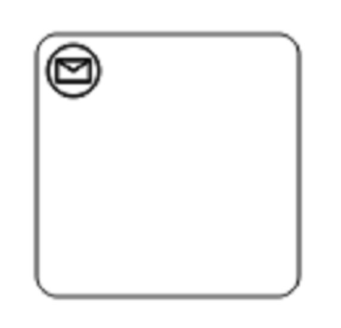 |
| Manual | |
| Business Rule |  |
| User | 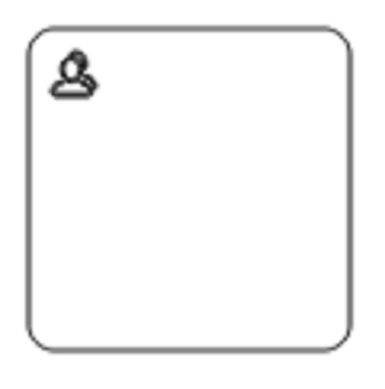 |
| Script | 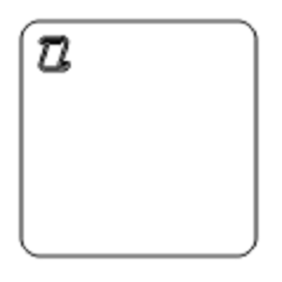 |

### Subprocesses

Subprocesses represent activities that contain other processes or activities within them. They provide a way to organize complex processes hierarchically and can be expanded or collapsed to show or hide internal details.

#### Collapsed Subprocess

A [`Collapsed Sub-Process`](https://ej2.syncfusion.com/react/documentation/api/diagram/bpmnSubProcessModel/#collapsed)appears as a single activity but contains additional process details that remain hidden. This approach helps maintain process diagram clarity while preserving detailed information.










 

#### Loop

[`Loop`](https://ej2.syncfusion.com/react/documentation/api/diagram/bpmnTask#loop) characteristics indicate that an activity repeats until a specified condition is met. The loop property of bpmn activity defines the repetition behavior. The default value is **none**.










 

The following table shows the available loop types for both tasks and subprocesses:

| Loops | Task | Subprocess |
| -------- | -------- | --------|
| Standard | 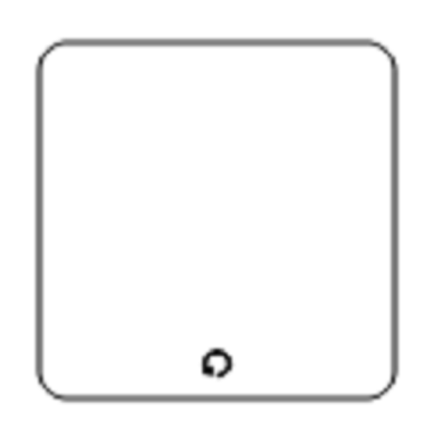  |  |
| SequenceMultiInstance | 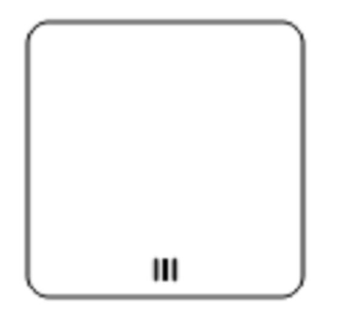 |  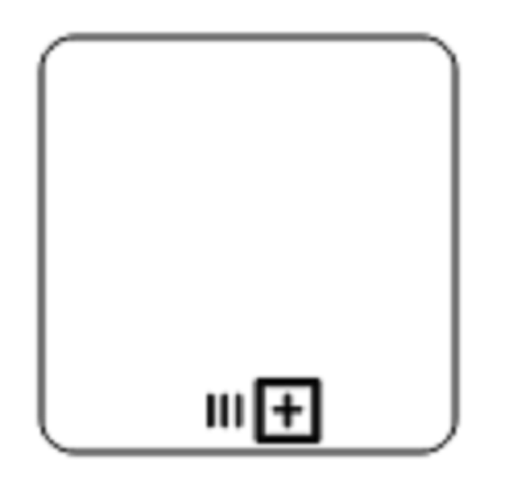|
| ParallelMultiInstance | 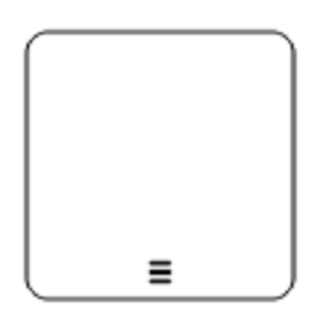 | 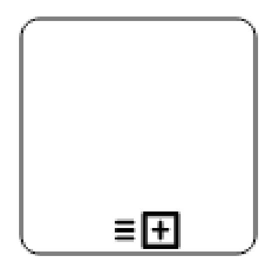 |

#### Compensation

[`Compensation`](https://ej2.syncfusion.com/react/documentation/api/diagram/bpmnTask#compensation) indicates that an activity can undo or compensate for work performed by another activity. This becomes relevant when a process fails after partial completion and requires cleanup activities. Enable compensation using the compensation property of the bpmn activity. The default value is **false**.









 

#### Call

A [`call`](https://ej2.syncfusion.com/react/documentation/api/diagram/bpmnTask#call) activity references a global process or subprocess that exists outside the current process definition. This promotes reusable across multiple processes. Enable call activity behavior using the call property of the task. The default value is **false**.










 

N> The call property applies only to task-type activities.

#### Adhoc

  An [`adhoc`](https://ej2.syncfusion.com/react/documentation/api/diagram/bpmnSubProcess#adhoc)subprocess contains activities that performers can execute in any order or skip entirely, provided the overall objective is achieved. Enable ad hoc behavior using the adhoc property of the subprocess. The default value is **false**.










 

#### Boundary Types

The [`boundary`](https://ej2.syncfusion.com/react/documentation/api/diagram/bpmnSubProcess#boundary) property defines the visual boundary style of a subprocess, indicating different subprocess characteristics. The default value is **default**.









 

The following table shows the available boundary types:

| Boundary | Image |
| -------- | -------- |
| Call | 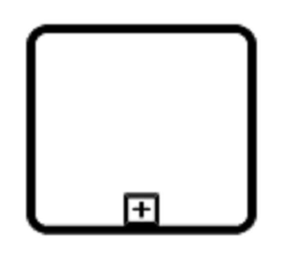 |
| Event | 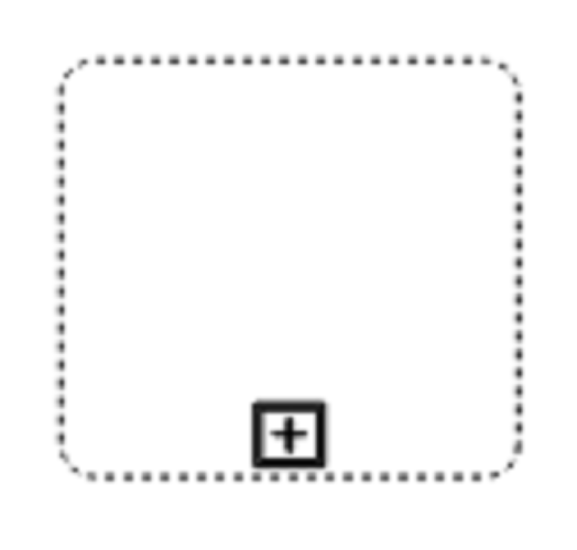 |
| Default | 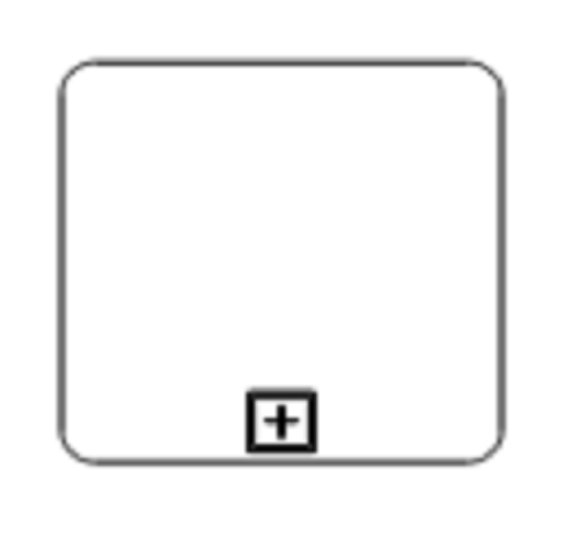 |

#### SubProcess Types

BPMN defines two specialized subprocess types for specific business scenarios:

    * Event subprocess
    * Transaction

##### Event Subprocess

An event subprocess executes when triggered by a specific event rather than following the normal process flow. Event subprocesses reside within other subprocesses but remain outside the main sequence flow until activated.

Configure an event subprocess using the the [`event`](https://ej2.syncfusion.com/react/documentation/api/diagram/bpmnEvent##BpmnEvent) and [`trigger`](https://ej2.syncfusion.com/react/documentation/api/diagram/bpmnEvent#trigger) property of the subprocess. The [`type`](https://ej2.syncfusion.com/react/documentation/api/diagram/bpmnSubProcess#type)property determines whether the subprocess is an event subprocess or transaction subprocess.









 

##### Transaction Subprocess

* [`transaction`](https://ej2.syncfusion.com/react/documentation/api/diagram/bpmnSubProcess#transaction) is a set of activities that logically belong together, in which all contained activities must complete their parts of the transaction; otherwise the process is undone. The execution result of a transaction is one of Successful Completion, Unsuccessful Completion (Cancel), and Hazard (Exception). The `events` property allows representation of these results as events attached to the subprocess. Configure event properties as follows:

* **Event type**: Defines the triggering event type for the subprocess.
* **Event name**: Identifies the event during runtime.
* **Offset**: Sets the event shape position relative to the parent (as a fraction/ratio).
* **Trigger**: Specifies the event trigger type.
* **Ports and labels**: Define additional interaction points and descriptive text.










 