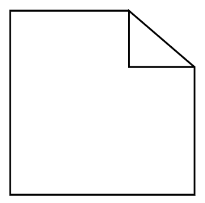
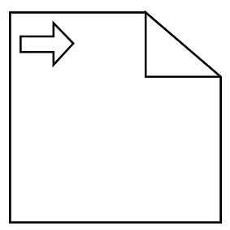
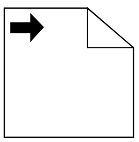

# BPMN Data Object in React Diagram

## Overview

A BPMN data object represents information that flows through a business process. Data objects can represent data placed into the process, data resulting from the process, data that needs to be collected, or data that must be stored. In business process modeling, data objects help visualize how information moves through different process activities.

## Creating Data Objects
To create a BPMN data object in the React Diagram component, set the shape type as [`data object`](https://ej2.syncfusion.com/react/documentation/api/diagram/bpmnDataObject). The [`type`](https://ej2.syncfusion.com/react/documentation/api/diagram/bpmnDataObject#type) property determines whether the data object represents input data, output data, or a collection of data items.

### Basic Data Object Configuration

The following example demonstrates how to create a basic BPMN data object:












## Data Object Types

BPMN data objects support three distinct types, each serving different purposes in process modeling:

| Data Object Type | Image |
| -------- | -------- |
| Collection Data Object |  |
| Data Input |  |
| Data Output |  |

### Collection Data Object
Represents multiple instances of data items. Use this type when the process handles collections of information such as lists, arrays, or multiple documents.

### Data Input
Represents data that enters the process from external sources. This type indicates information required by the process to execute successfully.

### Data Output
Represents data generated or modified by the process. This type shows information produced as a result of process execution.