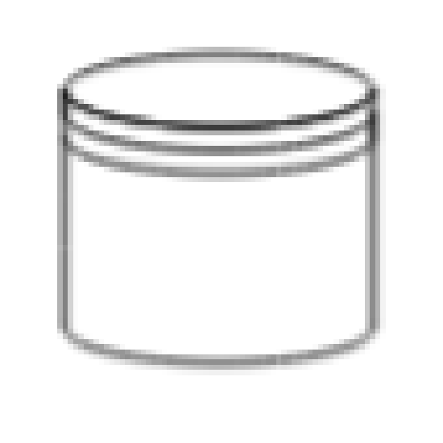

# BPMN Data Source in React Diagram

## Overview

BPMN data sources represent information that is required for or produced by business process activities. Data sources are essential elements in business process modeling that indicate where data comes from, how it flows through the process, and where it is stored or accessed.

## Creating a Data Source

To create a BPMN data source shape in the React Diagram component, set the shape type as **BPMN** and specify the shape property as **DataSource**. Data sources are typically used to represent databases, files, or other data repositories that business processes interact with.

The following code example demonstrates how to create a basic BPMN data source shape:












## See also

* [BPMN Activities](./bpmn-activities)
* [BPMN Events](./bpmn-events)
* [BPMN Data Object](./bpmn-dataObject)