# BPMN Events in React Diagram

## Overview

An [`event`](https://ej2.syncfusion.com/react/documentation/api/diagram/bpmnEvent) is a common BPMN process model element that is notated with a circle. Events can occur at the beginning, middle, or end of a process flow.

The types of events are as follows:

* **Start**: Indicates where a process begins.
* **Intermediate**: Occurs during the course of a process flow.
* **NonInterruptingStart**: A start event that does not interrupt the current activity.
* **NonInterruptingIntermediate**: An intermediate event that does not interrupt the current activity.
* **ThrowingIntermediate**: An intermediate event that is thrown to trigger a corresponding catch event.
* **End**: Marks where a process terminates.
        
The `event` property of the node allows you to define the type of the event. The default value of the event property is **Start**. The following code example illustrates how to create a BPMN event.












## BPMN Event Trigger

Event triggers are notated as icons inside the circle and represent the specific circumstances that cause the event to occur. The [`trigger`](https://ej2.syncfusion.com/react/documentation/api/diagram/bpmnEvent#trigger) property of the node allows you to set the type of trigger. By default, it is set as **none**. The following table illustrates the types of event triggers available for each event type.

| Triggers | Start | Non-Interrupting Start | Intermediate | Non-Interrupting Intermediate | Throwing Intermediate | End |
| -------- | -------- | -------- | -------- | -------- | -------- | -------- |
| None | 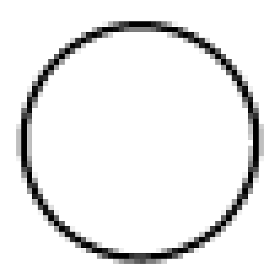  | 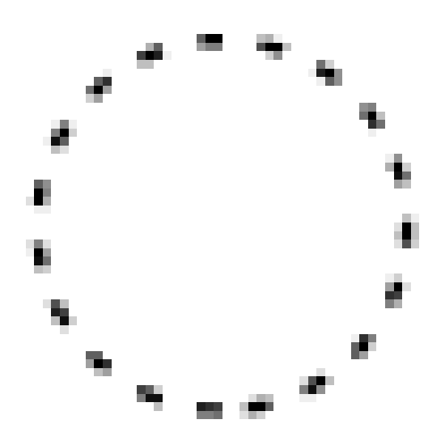 | 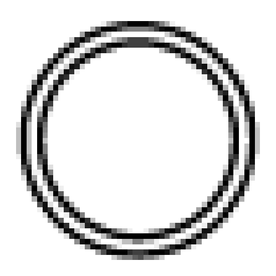 | 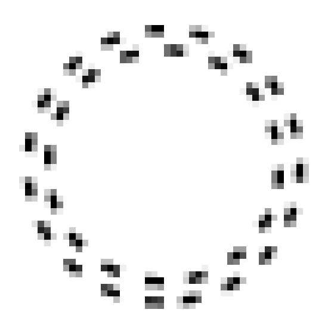 | |  |
| Message |  |  |  | | |  |
| Timer | 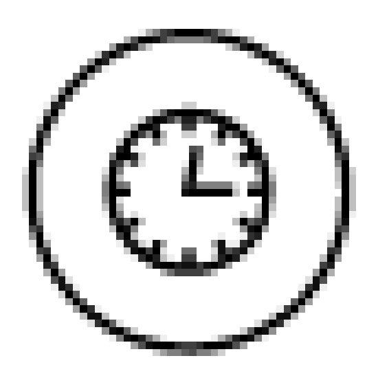 | 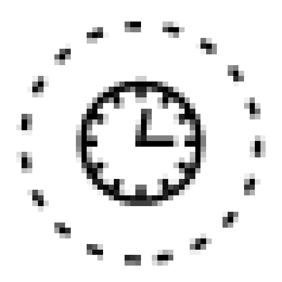 | 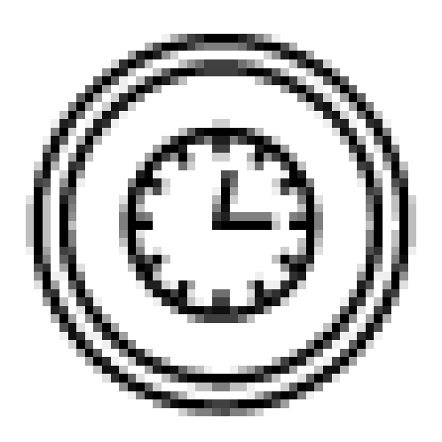|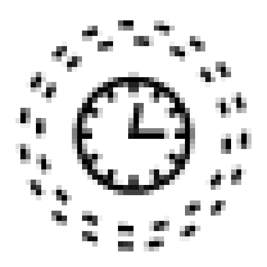 |  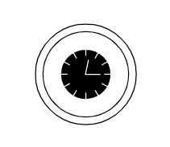 | 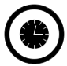 |
| Conditional |  |  | | |   |  |
| Link |  | |  | 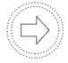 | 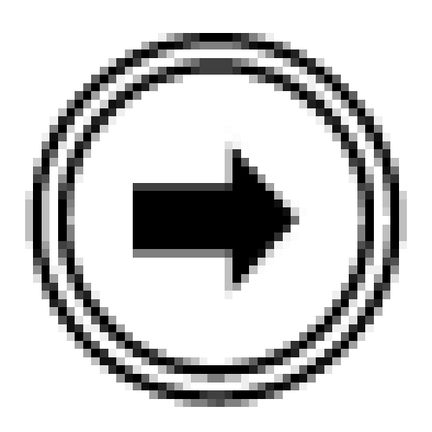 |  |
| Signal |  | 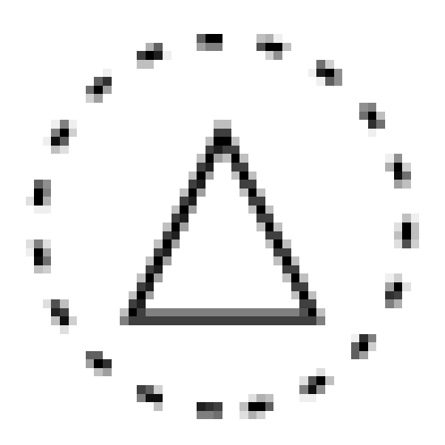 |  | 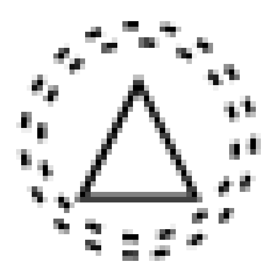|  |  |
| Error |  |  |  |   |  | |
| Escalation |  |  | | |  | |
| Termination | 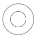 | 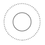 | 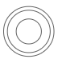 |  | 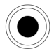 | |
| Compensation |  |  |  |  | | |
| Cancel |  |  |  |  |  |  |
| Multiple | 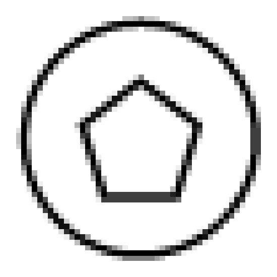 | 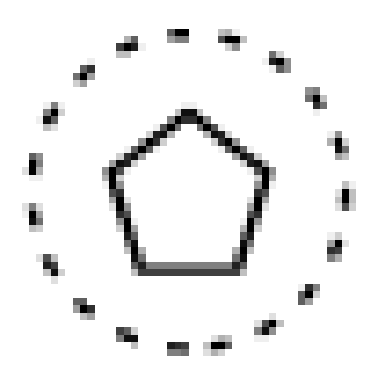  | | 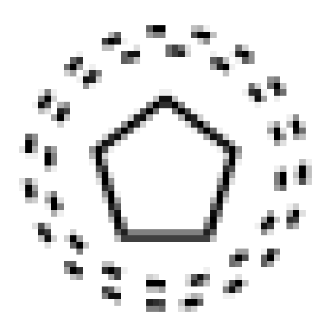 |   |  |
| Parallel |  |  | |  |  |  |

## See also

* [BPMN Activities](./bpmn-activities)
* [BPMN Data Object](./bpmn-dataObject)
* [BPMN Data Source](./bpmn-dataSource)