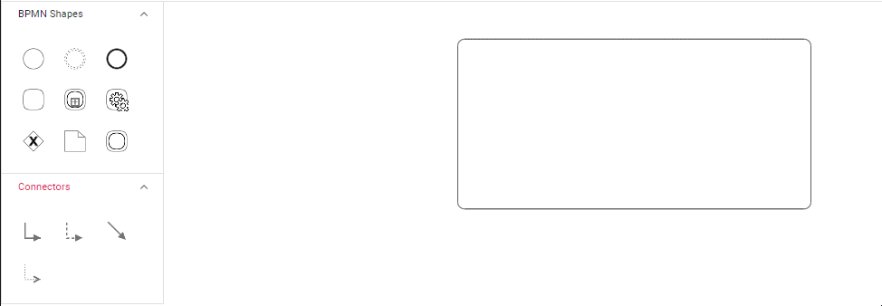

# BPMN Expanded SubProcess

## Overview

An expanded subprocess is a BPMN shape that represents a complex process containing multiple child processes within it. Unlike collapsed subprocesses, expanded subprocesses display their internal structure and allow users to view and interact with the child processes directly. This makes them ideal for detailed process modeling where visibility into subprocess components is essential.

The expanded subprocess automatically adjusts its size to accommodate child elements and provides a container-like behavior for organizing related BPMN activities.

### Create BPMN Expanded SubProcess

To create an expanded subprocess, configure the shape as[`activity`](https://ej2.syncfusion.com/react/documentation/api/diagram/bpmnActivityModel/)  and [`collapsed`](https://ej2.syncfusion.com/react/documentation/api/diagram/bpmnSubProcessModel/#collapsed) to false. Enable the [`AllowDrop`](https://ej2.syncfusion.com/react/documentation/api/diagram/nodeConstraints/) constraint to allow child nodes to be dropped inside the expanded subprocess container.










 

### Add BPMN Nodes into Expanded SubProcess

The [`Processes`](https://ej2.syncfusion.com/react/documentation/api/diagram/bpmnSubProcessModel/#processes)property is an array collection that defines the child node values for the BPMN subprocess. This allows you to programmatically specify which BPMN elements should be contained within the expanded subprocess during initialization.

The following code example demonstrates how to define child processes within an expanded subprocess:










 

### Add BPMN Nodes into Expanded SubProcess at Runtime

Users can drag and drop BPMN nodes directly onto the expanded subprocess container during runtime. The expanded subprocess automatically maintains proper containment by monitoring the bounds of child elements. When a child element is resized or repositioned within the subprocess boundaries, the expanded subprocess container dynamically adjusts its size to accommodate the changes.

This interactive behavior ensures that the subprocess container always properly encompasses all its child processes while maintaining visual clarity and proper BPMN structure.

#### Add/Remove Process Programmatically

The expanded subprocess supports dynamic process management through dedicated methods. Use the [`addProcess`](https://ej2.syncfusion.com/react/documentation/api/diagram/#addprocess) method to add new child processes at runtime, and the [`removeProcess`](https://ej2.syncfusion.com/react/documentation/api/diagram/#removeprocess) method to remove existing processes. These methods provide programmatic control over subprocess content without requiring manual manipulation.

The following example demonstrates how to implement dynamic process addition and removal:










 