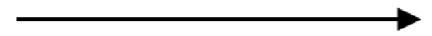
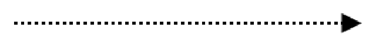
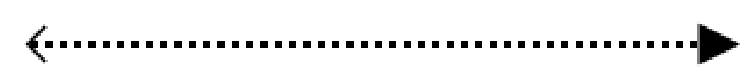
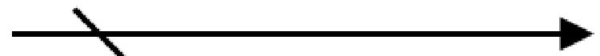
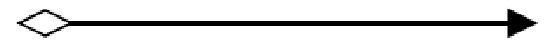
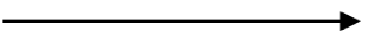
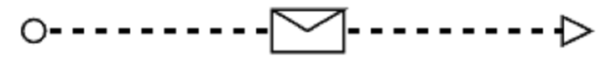
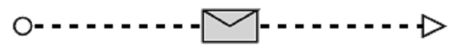

# BPMN flows in React Diagram component

[`BPMN Flows`](https://ej2.syncfusion.com/react/documentation/api/diagram/bpmnFlow#BpmnFlow) are lines that connects BPMN flow objects.

* Association
* Sequence
* Message

## Association flow

[`BPMN Association`](https://ej2.syncfusion.com/react/documentation/api/diagram/bpmnFlow#association) flow is used to link flow objects with its corresponding text or artifact. An association is represented as a dotted graphical line with opened arrow. The types of association are as follows:

* Directional
* BiDirectional
* Default

The `association` property allows you to define the type of association. The following code example illustrates how to create an association.










 

The following table demonstrates the visual representation of association flows.

| Association | Image |
| -------- | -------- |
| Default |  |
| Directional |  |
| BiDirectional |  |

N> The default value for the property `association` is **default**.

## Sequence flow

A [`sequence`](https://ej2.syncfusion.com/react/documentation/api/diagram/bpmnFlow#sequence) flow shows the order in which the activities are performed in a BPMN process and is represented by a solid graphical line. The types of sequence are as follows:

* Normal
* Conditional
* Default

The sequence property allows you to define the type of sequence. The following code example illustrates how to create a sequence flow.










 

The following table contains various representation of sequence flows.

| Sequence | Image |
| -------- | -------- |
| Default |  |
| Conditional |  |
| Normal |  |

>Note: The default value for the property `sequence` is **normal**.

## Message flow

A [`message`](https://ej2.syncfusion.com/react/documentation/api/diagram/bpmnFlow#message) flow shows the flow of messages between two participants and is represented by dashed line. The types of message are as follows:

* InitiatingMessage
* NonInitiatingMessage
* Default

The message property allows you to define the type of message. The following code example illustrates how to define a message flow.










 

The following table contains various representation of message flows.

| Message | Image |
| -------- | -------- |
| Default |  |
| InitiatingMessage |  |
| NonInitiatingMessage |  |

N> The default value for the property `message` is **default**.