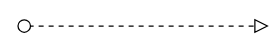

# BPMN flows in React Diagram Component

## Overview

[`BPMN Flows`](https://ej2.syncfusion.com/react/documentation/api/diagram/bpmnFlow#BpmnFlow) are connecting lines that define relationships and information flow between BPMN elements in business process diagrams. These flows are essential for modeling how activities, events, and gateways interact within a process workflow.

BPMN flows are categorized into three main types:

* **Association** - Links flow objects with supporting text or artifacts.
* **Sequence** - Shows the execution order of activities in a process.
* **Message** - Represents communication between different process participants.

## Association Flow

[`BPMN Association`](https://ej2.syncfusion.com/react/documentation/api/diagram/bpmnFlow#association) flows connect BPMN flow objects with their corresponding text annotations or artifacts. Association flows are represented as dotted lines with open arrowheads and do not affect the sequence or execution of the process.

The association flow supports three types:

* **Directional** - Shows a one-way association from source to target.
* **BiDirectional** - Indicates a two-way association between elements.
* **Default** - A simple association without directional emphasis.

The `association` property allows you to define the type of association. The following code example illustrates how to create an association flow:










 

The following table demonstrates the visual representation of association flows.

| Association | Image |
| -------- | -------- |
| Default |  |
| Directional |  |
| BiDirectional |  |

N> The default value for the property `association` is **default**.

## Sequence Flow

A [`Sequence`](https://ej2.syncfusion.com/react/documentation/api/diagram/bpmnFlow#sequence) flow defines the execution order of activities, events, and gateways within a BPMN process. Sequence flows are represented by solid lines with closed arrowheads and control the flow of the process from one element to the next.

The sequence flow supports three types:

* **Normal** - Standard flow path without special conditions.
* **Conditional** - Flow that occurs only when specific conditions are met.
* **Default** - Alternative flow path when conditional flows are not satisfied.

The `sequence` property allows you to define the type of sequence flow. The following code example illustrates how to create a sequence flow:










 

The following table contains various representations of sequence flows:

| Sequence | Image |
| -------- | -------- |
| Default |  |
| Conditional |  |
| Normal |  |

N> The default value for the property `sequence` is **normal**.

## Message Flow

A [`Message`](https://ej2.syncfusion.com/react/documentation/api/diagram/bpmnFlow#message) flow represents the exchange of messages between different participants or pools in a BPMN process. Message flows are depicted as dashed lines and show communication that crosses organizational boundaries.

The message flow supports three types:

* **InitiatingMessage** - Message that starts a process or triggers an activity.
* **NonInitiatingMessage** - Message that provides information but does not start a process.
* **Default** - Standard message flow without special initiation properties.

The `message` property allows you to define the type of message flow. The following code example illustrates how to define a message flow:










 

The following table contains various representations of message flows:

| Message | Image |
| -------- | -------- |
| Default |  |
| InitiatingMessage |  |
| NonInitiatingMessage |  |

N> The default value for the property `message` is **default**.