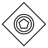
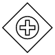

# BPMN Gateway in React Diagram Component

## Overview

BPMN (Business Process Model and Notation) gateways are crucial elements that control the flow of processes in business workflow diagrams. Gateways determine how process flows diverge or converge based on specific conditions, making them essential for modeling complex business logic and decision points.

## Gateway

A gateway is represented as a diamond shape and serves as a decision point that controls the sequence flow within a process. Gateways can split a single incoming flow into multiple outgoing flows or merge multiple incoming flows into a single outgoing flow.

To create a gateway in the React Diagram component, set the shape property of the node to "gateway" and configure the [`gateway`](https://ej2.syncfusion.com/react/documentation/api/diagram/bpmnGateways) property with the appropriate gateway type. The following code example demonstrates how to create a basic BPMN gateway.










 

N> By default, the `gateway` will be set as **none**.

## Gateway Types

The React Diagram component supports various gateway types, each serving specific process control requirements:

| Shape | Image |
| -------- | -------- |
| Exclusive |  |
| Parallel |  |
| Inclusive |  |
| Complex |  |
| EventBased |  |
| ExclusiveEventBased |  |
| ParallelEventBased |  |

