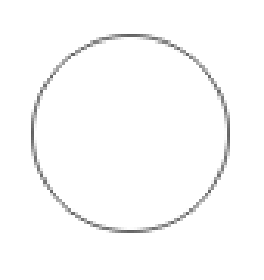

# BPMN Shapes in React Diagram Component

BPMN (Business Process Model and Notation) shapes are standardized graphical elements used to represent business processes in a visual workflow. These shapes enable teams to communicate business procedures clearly and consistently across organizations. The React Diagram component provides comprehensive support for creating BPMN diagrams with all standard shape types.

To create a BPMN shape, set the node's shape type property to **BPMN** and specify the shape property as one of the available built-in shapes. Each BPMN shape serves a specific purpose in modeling business processes, from representing events and activities to showing data flow and decision points.

> **Important**: To use BPMN shapes in the diagram, inject the BpmnDiagrams module into the diagram component. This module provides the necessary functionality for rendering and managing BPMN-specific features.










 

>Note : The default value for the property `shape` is **event**.

## Available BPMN Shapes

The react Diagram component supports the following standard BPMN shapes:

| Shape | Image |
|-------|-------|
| Event |  |
| Gateway |  |
| Task |  |
| Message |  |
| DataSource |  |
| DataObject |  |
| Group |  |

## BPMN Shape Types and Configuration

Each BPMN shape category includes multiple subtypes that can be configured to represent specific business process elements. The shapes can be customized with various properties to match specific modeling requirements and visual preferences.

### Events
Events represent specific occurrences that trigger, interrupt, or conclude process flows. They include start events, intermediate events, and end events, each serving different purposes in process modeling.

### Gateways
Gateways control the sequence flow within a process by determining how paths converge and diverge. They include exclusive, inclusive, parallel, and complex gateway types for different decision-making scenarios.

### Tasks
Tasks represent atomic work activities that cannot be broken down further. They can be configured as user tasks, service tasks, manual tasks, or other specialized task types depending on the nature of the work.

### Data Elements
Data objects and data sources represent information that flows through or supports the business process, helping to model how data is created, used, and stored throughout the workflow.

## Best Practices

- Use consistent shape sizing and positioning to maintain visual clarity.
- Apply appropriate shape subtypes to accurately represent business logic.
- Ensure proper sequence flow connections between shapes.
- Group related elements using the Group shape for better organization.
- Follow BPMN 2.0 standards for shape usage and process flow modeling.