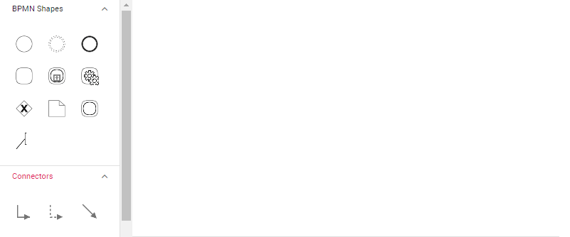
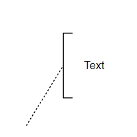
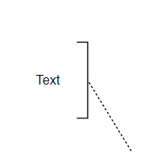
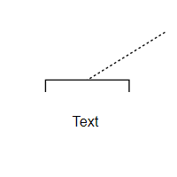
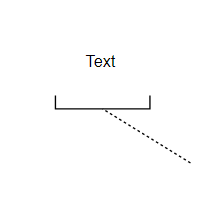

# BPMN Text Annotation in React Diagram Component

## Overview

A BPMN object can be associated with a text annotation that provides additional details about objects within a flow without affecting the actual process flow. Text annotations serve as documentation elements that help explain or clarify specific aspects of the BPMN diagram.

A TextAnnotation points to or references another BPMN shape through the [`textAnnotationTarget`](https://ej2.syncfusion.com/react/documentation/api/diagram/bpmnTextAnnotation#textannotationtarget) property. When the target shape is moved or deleted, any TextAnnotations attached to the shape will automatically move or be deleted as well. This ensures that TextAnnotations remain associated with their target shapes, though the TextAnnotation can be repositioned to any offset from its target.

The annotation element can be switched from one BPMN node to another by simply dragging the source end of the annotation connector to the desired BPMN node. By default, the TextAnnotation shape includes a connection to its target.

* By default, the TextAnnotation shape has a connection.

The [`textAnnotationDirection`](https://helpej2.syncfusion.com/react/documentation/api/diagram/bpmnTextAnnotation#textannotationdirection) property controls the shape direction of the text annotation. By default, this property is set to **Auto**, which automatically determines the optimal direction based on the target's position.

To set the size for text annotation, use the [`width`](https://ej2.syncfusion.com/react/documentation/api/diagram/node#width) and [`height`](https://ej2.syncfusion.com/react/documentation/api/diagram/node#height) properties of the node.

The [`offsetX`](https://ej2.syncfusion.com/react/documentation/api/diagram/bpmnTextAnnotation#offsetx) and [`offsetY`](https://ej2.syncfusion.com/react/documentation/api/diagram/bpmnTextAnnotation#offsety) properties determine the distance between the BPMN node and the TextAnnotation.










 

### Text Annotation in Palette.

Text annotation nodes can be rendered in the symbol palette alongside other BPMN shapes. The following example demonstrates how to render BPMN text annotation nodes in the symbol palette.










 

### Connect the TextAnnotation to BPMN Node

Users can drag and drop any BPMN shapes from the palette to the diagram and establish connections between BPMN nodes and text annotations through interactive manipulation.

The following image demonstrates how to drag a symbol from the palette and connect the text annotation to a BPMN node using interaction.

### Text Annotation Direction

The text annotation supports several directional orientations to optimize the visual layout of the diagram:

| Text annotation direction | Image |
| -------- | -------- |
| Auto |  |
| Left |  |
| Right |  |
| Top |  |
| Bottom |  |

### Add Text Annotation at Runtime

Text annotations can be added dynamically using either the [`addTextAnnotation`](https://ej2.syncfusion.com/react/documentation/api/diagram#addtextannotation) method or the [`add`](https://ej2.syncfusion.com/react/documentation/api/diagram#add) method of the diagram. The following example shows how to use these methods to add a text annotation node programmatically.
 
 








 
