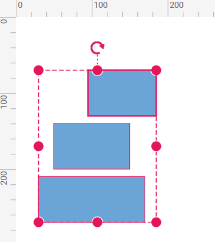
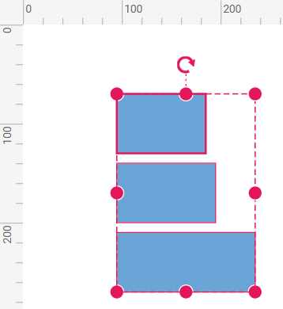
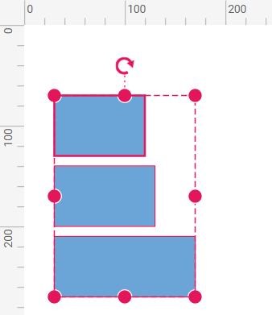

# Commands in React Diagram Component

<!-- markdownlint-disable MD010 -->

The commands in diagram control are used to perform various interactions within the diagram when called. Several commands are available in the diagram, as follows:

* Alignment commands
* Distribute commands
* Sizing commands
* Clipboard commands
* Grouping commands
* Z-order commands
* Zoom commands
* Nudge commands
* FitToPage commands
* Undo/Redo commands

## Alignment Commands

The alignment command enables you to align selected or defined objects, such as nodes and connectors, with respect to the selection boundary or the first selected object. The [`align`](https://ej2.syncfusion.com/react/documentation/api/diagram#align) method parameters are explained below.

### Alignment Options

The [`Alignment Options`](https://ej2.syncfusion.com/react/documentation/api/diagram/alignmentOptions#AlignmentOptions) defines the alignment position of objects to be aligned.

|Alignment|Description|
|----|----|
|Left| Aligns all the selected objects at the left of the selection boundary|
|Right| Aligns all the selected objects at the right of the selection boundary|
|Center| Aligns all the selected objects at the center of the selection boundary|
|Top| Aligns all the selected objects at the top of the selection boundary|
|Bottom| Aligns all the selected objects at the bottom of the selection boundary|
|Middle| Aligns all the selected objects at the middle of the selection boundary|

<!-- markdownlint-disable MD033 -->

### Objects 

Defines the objects to be aligned. This is an optional parameter. By default, all the nodes and connectors in the selected region of the diagram get aligned.

### Alignment Mode

[`Alignment Mode`](https://ej2.syncfusion.com/react/documentation/api/diagram/alignmentMode/)  defines the specific mode with respect to which the objects are aligned. This is an optional parameter. The default alignment mode is **Object**. The accepted values of the argument "alignment mode" are as follows.

The table below shows the alignment as **Left** for different alignment modes.

|Nodes before alignment|Alignment mode|Description|Output image|
|----|----|----|----|
||Object (Default)|Aligns the objects based on the bounds of the first object in the selected list.||
||Selector|Aligns the objects based on the selection boundary.||


The following code example illustrates how to align all the selected objects at the left side of the selection boundary.










 


## Distribute Commands

The [`distribute`](https://ej2.syncfusion.com/react/documentation/api/diagram#distribute)method enable you to place the selected objects on the page at equal intervals from each other. The selected objects are equally spaced within the selection boundary. The `distribute` method parameters are explained below.

### Distribute Options

The factors for distributing shapes using  [`DistributeOptions`](https://ej2.syncfusion.com/react/documentation/api/diagram/distributeOptions#DistributeOptions) are listed as follows:

|Distribute option| Description|
|----|----|
| RightToLeft | Distributes the objects based on the distance between the right and left sides of the adjacent objects. |
| Left | Distributes the objects based on the distance between the left sides of the adjacent objects. |
| Right | Distributes the objects based on the distance between the right sides of the adjacent objects. |
| Center | Distributes the objects based on the distance between the center of the adjacent objects. |
| BottomToTop | Distributes the objects based on the distance between the bottom and top sides of the adjacent objects. |
| Top | Distributes the objects based on the distance between the top sides of the adjacent objects. |
| Bottom | Distributes the objects based on the distance between the bottom sides of the adjacent objects. |
| Middle | Distributes the objects based on the distance between the vertical center of the adjacent objects. |

### Objects 

Defines the objects to be distributed. This is an optional parameter. By default, all the nodes and connectors in the selected region of the diagram get distributed.

The following code example illustrates how the nodes are distributed using the **RightToLeft** option.










 


## Sizing Commands

The [`sameSize`](https://ej2.syncfusion.com/react/documentation/api/diagram/#samesize) command enables you to size all selected nodes to match the size of the first selected object or the first node in the objects collection you provide as the second parameter. The parameters for the `sameSize` method are explained below.

### Sizing Options

[`SizingOptions`](https://ej2.syncfusion.com/react/documentation/api/diagram/sizingOptions) include:

|Sizing options|Description|
|----|----|
| Width | Adjusts the width of all objects to match the width of the first node in the objects collection. |
| Height | Adjusts the height of all objects to match the height of the first node in the objects collection. |
| Size | Adjusts both the width and height of all objects to match the size of the first node in the objects collection. |

### Objects

This optional parameter defines which objects should be scaled. By default, all nodes and connectors within the selected region of the diagram are scaled.

The following code example illustrates how to execute the size commands.










 


## Clipboard Commands

Clipboard commands are used to cut, copy, or paste selected elements in the diagram using the [`cut`](https://ej2.syncfusion.com/react/documentation/api/diagram#cut), [`copy`](https://ej2.syncfusion.com/react/documentation/api/diagram#copy), and [`paste`](https://ej2.syncfusion.com/react/documentation/api/diagram#paste) methods. You can also use keyboard shortcuts for these actions. For detailed information on using these methods refer to the table below.

| Command (Shortcut key) | Description |
|---------|-------------|
| `Cut` (CTRL+X)  | Removes the selected elements from the diagram and places them onto the diagram’s clipboard. This operation is performed using the `cut`  method. |
| `Copy`(CTRL+C)  | Duplicates the selected elements and places them onto the diagram’s clipboard without removing them from their original location. Use the `copy` method for this operation. |
| `Paste`(CTRL+V) | Inserts the elements stored on the diagram’s clipboard (nodes and connectors) into the diagram. This can be done using the `paste` method. |

The `paste` method optionally accepts a collection of nodes or connectors to be added to the diagram.

The following code illustrates how to execute the clipboard commands.










 

## Grouping Commands

Grouping commands are used to group or ungroup selected elements in the diagram. Grouping commands help in managing and organizing multiple elements by combining them into a single group or separating them into individual elements. You can also use keyboard shortcuts for these actions. The following table provides more details on these commands:

| Commands (Shortcut key) | Description|
|----|----|
| [`Group`](https://ej2.syncfusion.com/react/documentation/api/diagram#group) (CTRL+G) | Combines the selected nodes and connectors into a single group, allowing you to move, resize, or apply other operations to all grouped elements as a unit. |
| [`Ungroup`](https://ej2.syncfusion.com/react/documentation/api/diagram#ungroup) (CTRL+Shift+U) | Splits a previously grouped set of nodes and connectors into individual elements, enabling you to modify or manipulate them separately. |

The following code examples demonstrate how to use the grouping commands in diagram:










 

## Rotate Commands

The [`rotate`](https://ej2.syncfusion.com/react/documentation/api/diagram/#rotate) commands in the diagram allow users to rotate selected elements by specified angles. These commands are useful for adjusting the rotation angle of nodes or shapes within the diagram.

| Parameter | Type | Description |
|----------|-------|-------------|
| obj | NodeModel / ConnectorModel/ SelectorModel | The objects to be rotated. |
| angle | number | The angle by which the objects should be rotated (in degrees). |
| pivot (optional)   | PointModel| The reference point with respect to which the objects will be rotated. |
| rotateUsingHandle (optional) | boolean | Whether to rotate using the handle. |

You can also use CTRL+R to rotate clockwise and CTRL+L to rotate anti-clockwise. The following example shows how to rotate nodes in clockwise and anti-clockwise directions.










 

## Z-Order Command

**Z-Order Commands** enable you to visually arrange the selected objects such as nodes and connectors on the diagram page.

### Bring To Front Command

The [`bringToFront`](https://ej2.syncfusion.com/react/documentation/api/diagram/#bringtofront)command moves the selected element to the front, placing it above all other elements in the diagram. The following code illustrates how to use the `bringToFront` command.










 

### Send To Back Command

The [`sendToBack`](https://ej2.syncfusion.com/react/documentation/api/diagram/#sendtoback) command visually moves the selected element behind all the other overlapped elements. The following code illustrates how to execute the `sendToBack` command.










 

### Move Forward Command

The [`moveForward`](https://ej2.syncfusion.com/react/documentation/api/diagram/#moveforward) command visually moves the selected element over the nearest overlapping element. The following code illustrates how to execute the `moveForward` command.










 

### Send Backward Command

The [`sendBackward`](https://ej2.syncfusion.com/react/documentation/api/diagram#sendbackward) command visually moves the selected element behind the underlying element. The following code illustrates how to execute the `sendBackward` command.










 

 
The Z-order commands can also be performed using keyboard shortcuts. For more information, refer to the [`keyboard commands`](./interaction/#keyboard).

## Zoom

The [`zoom`](https://ej2.syncfusion.com/react/documentation/api/diagram#zoom) command is used to zoom-in and zoom-out the diagram view.

The following code illustrates how to zoom-in/zoom out the diagram.

```ts
import * as React from "react";
import * as ReactDOM from "react-dom";
import {
    Diagram,
    DiagramComponent,
} from "@syncfusion/ej2-react-diagrams";
let diagramInstance: DiagramComponent;
//Initializes the Diagram component
function App() {
  return (
    <DiagramComponent
      id="container"
      ref={(diagram) => (diagramInstance = diagram)}
      width={'650px'}
      height={'350px'}
      created={() => {
        // Sets the zoomFactor
        //Defines the focusPoint to zoom the Diagram with respect to any point
        //When you do not set focus point, zooming is performed with reference to the center of current Diagram view.
        diagramInstance.zoom(1.2, {
          x: 100,
          y: 100,
        });
      }}
    />
  );
}
const root = ReactDOM.createRoot(document.getElementById('diagram'));
root.render(<App />);

```
For more information about zoom refer to the [zoom](./scroll-settings/#update-zoom-at-runtime)

## Nudge Command

The [`nudge`](https://ej2.syncfusion.com/react/documentation/api/diagram#nudge) commands move the selected elements towards up, down, left, or right by 1 pixel.The parameters of the `nudge` method is explained below.

| Parameter    | Type           | Description                                                      |
|--------------|-----------|-----------|
| direction    |[`NudgeDirection`](https://ej2.syncfusion.com/react/documentation/api/diagram/nudgeDirection) | Defines the direction in which the objects should be moved.      |
| x (optional) | number         | The horizontal distance by which the selected objects should be moved. |
| y (optional) | number         | The vertical distance by which the selected objects should be moved.   |
| type (optional) | string      | A string that defines the type of nudge action.                           |

The accepted values for the "direction" argument are as follows:

* Up: Moves the selected elements up by the specified delta value.
* Down: Moves the selected elements down by the specified delta value.
* Left: Moves the selected elements left by the specified delta value.
* Right: Moves the selected elements right by the specified delta value.

The following code illustrates how to execute the nudge command.










 

### Nudge by Using Arrow Keys

The arrow keys can be used to move the selected elements up, down, left, or right by 1 pixel.


Nudge commands are particularly useful for accurate placement of elements.

N> The position change event will not trigger when using keyboard keys to move a node or connector.

## BringIntoView

The [`bringIntoView`](https://ej2.syncfusion.com/react/documentation/api/diagram#bringintoview) command brings the specified rectangular region into the viewport of the diagram, ensuring that it is visible within the current view.

The `bringIntoView` method takes a single parameter, an object that defines the rectangular region to bring into view. This object should include properties such as x, y, width, and height to specify the exact region to be made visible.

The following code illustrates how to execute the `bringIntoView` command.










 

## BringToCenter

The [`bringToCenter`](https://ej2.syncfusion.com/react/documentation/api/diagram#bringtocenter) command centers the specified rectangular region of the diagram content within the viewport.

The `bringToCenter` method takes a single parameter, an object that defines the rectangular region to be centered. This object should include properties such as x, y, width, and height to specify the exact region to be brought to the center.

The following code illustrates how to execute the `bringToCenter` command.










 

## FitToPage

The [`fitToPage`](https://ej2.syncfusion.com/react/documentation/api/diagram#fittopage)command helps to fit the diagram content into the view with respect to either width, height, or the entire content. The fitToPage method takes one parameter,[`fitOptions`](https://ej2.syncfusion.com/react/documentation/api/diagram/FitOptions/), which specifies the options for fitting the diagram to the page.

### FitOptions

The [`mode`](https://ej2.syncfusion.com/react/documentation/api/diagram/fitModes#modes)  parameter defines whether the diagram has to be horizontally/vertically fit into the viewport with respect to width, height, or entire bounds of the diagram.

The [`region`](https://ej2.syncfusion.com/react/documentation/api/diagram/diagramRegions#region) parameter defines the region that has to be drawn as an image.

The [`margin`](https://ej2.syncfusion.com/react/documentation/api/diagram/iFitOptions#margin) parameter defines the region/bounds of the diagram content that is to be fit into the view.

The [`canZoomIn`](https://ej2.syncfusion.com/react/documentation/api/diagram/iFitOptions#canZoomIn) parameter enables/disables zooming to fit the smaller content into a larger viewport.

The [`canZoomOut`](https://ej2.syncfusion.com/react/documentation/api/diagram/iFitOptions/#canzoomout) parameter enables or disables zooming out to fit larger content into a smaller viewport.

The [`customBounds`](https://ej2.syncfusion.com/react/documentation/api/diagram/iFitOptions#customBounds) parameter defines a custom region that should be fit into the viewport.

The following code illustrates how to execute `FitToPage` command.










 

## Command Manager

The Diagram provides support for mapping or binding command execution to specific key gestures. It includes built-in commands and allows for the definition of custom commands through the [`CommandManager`](https://ej2.syncfusion.com/react/documentation/api/diagram/commandManager#commandManager) Custom commands are executed when the specified key gesture is recognized.

## Custom Command

To define a custom command, you need to specify the following properties:

* [`execute`](https://ej2.syncfusion.com/react/documentation/api/diagram/command#execute): A method to be executed when the command is triggered.
* [`canExecute`](https://ej2.syncfusion.com/react/documentation/api/diagram/command#canexecute): A method to define whether the command can be executed at the moment.
* [`gesture`](https://ej2.syncfusion.com/react/documentation/api/diagram/keyGestureModel#gesture): A combination of [`keys`](https://ej2.syncfusion.com/react/documentation/api/diagram/keys#key) and [`KeyModifiers`](https://ej2.syncfusion.com/react/documentation/api/diagram/keyModifiers#keymodifiers).that defines the key gesture for the command.
* [`parameter`](https://ej2.syncfusion.com/react/documentation/api/diagram/command#parameter):  Any additional parameters required at runtime for the command.
* [`name`](https://ej2.syncfusion.com/react/documentation/api/diagram/command#name): The name of the command.

To explore the properties of custom commands, refer to [`Commands`](https://ej2.syncfusion.com/react/documentation/api/diagram/command#commands).

The following code example illustrates how to use the command manager to clone a node and change the fill color of a node while pressing **G** and **Shift+G** or **Alt+G**, respectively:










 

### Disable/Modify the Existing Command

When any one of the default commands is not desired, they can be disabled. To change the functionality of a specific command, the command can be completely modified.

The following code example illustrates how to disable the default cut and delete commands using CTRL+X and Delete keys, and how to modify the copy command to clone a node using CTRL+C:










 

## Undo-Redo

Undo/redo commands can be executed through shortcut keys. Shortcut key for undo is **Ctrl+z** and shortcut key for redo is **Ctrl+y**. For more information refer to the [`undo-redo`](./undo-redo)

## See Also

* [How to create the custom context menu items](../context-menu)