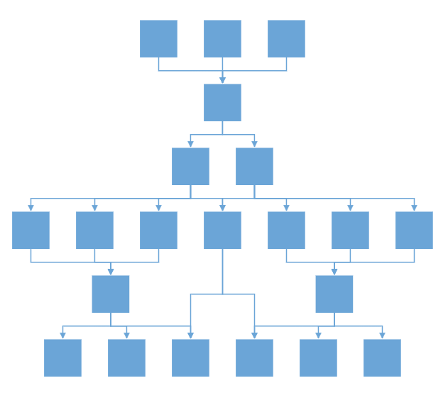

# Complex Hierarchical Tree Layout in React Diagram Component

Complex hierarchical tree layout arranges nodes in a tree-like structure where child nodes can have multiple parent nodes, creating interconnected relationships beyond traditional single-parent hierarchies. This layout type is ideal for organizational charts with dotted-line relationships, project dependencies, or any structure where entities report to multiple authorities. This layout extends the standard hierarchical tree layout to support these complex relationships.

To create a complex hierarchical tree, set the [`type`](https://ej2.syncfusion.com/react/documentation/api/diagram/layout/#type) property of layout to **ComplexHierarchicalTree**.
## Complex Hierarchical Tree Layout with Nodes and Connectors

This example demonstrates how to create a complex hierarchical tree layout by manually defining nodes and connectors. The layout automatically positions nodes based on their hierarchical relationships while handling multiple parent-child connections.










 

## Complex Hierarchical Tree Layout with DataSource

When working with large datasets, binding the layout to a data source provides better maintainability and dynamic content management. The following example shows how to create a complex hierarchical tree using a data source configuration.










 

>Note: In Diagram layouts, all root nodes will always render at the same level. This default behavior cannot be changed to render different trees at distinct levels.

## Line Distribution

Line distribution prevents connector overlap by controlling how multiple connectors from a single parent node are positioned. Without line distribution, connectors may overlap and create visual confusion in complex layouts. The [`connectionPointOrigin`](https://ej2.syncfusion.com/react/documentation/api/diagram/connectionPointOrigin/#connectionpointorigin) property of layout is used to enable or disable the line distribution in layout. By default ConnectionPointOrigin will be **SamePoint**.

The following code example illustrates how to create a complex hierarchical tree with line distribution.










 

>Note: If you want to use line distribution in diagram layout, you need to inject  LineDistribution module in the diagram.

## Linear Arrangement

Linear arrangement is used to linearly arrange the child nodes in layout, which means the parent node is placed in the center corresponding to its children. When line distribution is enabled, linear arrangement is also activated by default. The [`arrangement`](https://ej2.syncfusion.com/react/documentation/api/diagram/childarrangement/) property provides control over this feature:

- **Nonlinear (default)**: Child nodes are arranged based on available space
- **Linear**: Child nodes are arranged in a straight line with the parent centered. By default arrangement will be **Nonlinear**.

>Note: If you want to use linear arrangement in diagram layout, you need to inject  LineDistribution module in the diagram. Linear arrangement is applicable only for complex hierarchical tree layout.

The following code illustrates how to allow a linear arrangement in diagram layout.










 

## Enable Routing for Layout

In complex diagrams with intricate parent-child relationships, connectors may pass through or overlap with nodes, making the diagram difficult to read. Routing functionality automatically calculates connector paths that avoid intersecting with nodes and other obstacles.

Set the [`enableRouting`](https://ej2.syncfusion.com/react/documentation/api/diagram/layoutModel/#enablerouting) property to **true** to activate intelligent connector routing.

The following example shows how to activate enableRouting in the layout:










 

## Best Practices

- Use data source binding for dynamic content and better maintainability.
- Enable line distribution when dealing with nodes that have multiple connections.
- Consider enabling routing for complex layouts to improve visual clarity.
- Test layout performance with large datasets and optimize as needed.
- Ensure proper module injection for advanced features like line distribution.