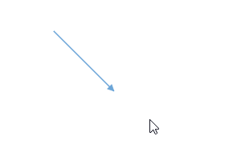
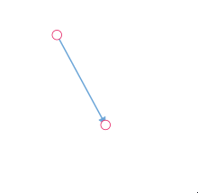
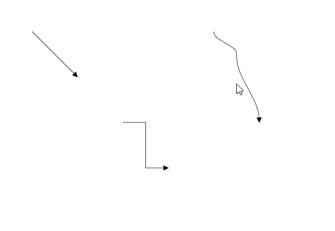

# Connector Interaction in EJ2 React Diagram Component

Connectors in the React Diagram component support various interaction capabilities including selection, dragging, endpoint manipulation, segment editing, and flipping operations. These interactions enable users to dynamically modify connector behavior and appearance within the diagram.

## Select and Unselect connector

A connector can be selected by clicking on it. This selection enables further operations such as dragging, editing, or applying transformations.

Connectors can be selected programmatically at runtime using the **select** method and selection can be cleared using the **clearSelection** method. The following code demonstrates how to select and clear selection in the diagram.










 

## Drag Connector

Connectors can be repositioned by clicking and dragging them to a new location within the diagram canvas.



A connector can be dragged at runtime by using the Drag method. The following code explains how to drag the connector by using the drag method.










 

## End Point Dragging

When a connector is selected, circular handles (thumbs) appear at the source and target endpoints. These handles allow users to adjust the connector's start and end positions by clicking and dragging them.



The end points of connectors can also be updated programmatically using the [`dragSourceEnd`](https://helpej2.syncfusion.com/react/documentation/api/diagram/#dragsourceend) and [`dragTargetEnd`](https://helpej2.syncfusion.com/react/documentation/api/diagram/#dragtargetend) methods of the diagram component.

The following code example demonstrates how to drag connector end points at runtime.










 

## Segment Editing

The diagram allows editing of individual connector segments at runtime. To enable this feature, activate the [`DragSegmentThumb`](https://helpej2.syncfusion.com/react/documentation/api/diagram/connector/#constraints) constraint for the connector.

```ts
{     connector.constraints =
      ConnectorConstraints.Default | ConnectorConstraints.DragSegmentThumb;
}

```

N> To edit connector segments, inject the **ConnectorEditing** module into the diagram.



## Flip

The diagram provides support for flipping connectors to create mirrored versions of the original element. The [`flip`](https://helpej2.syncfusion.com/react/documentation/api/diagram/connector/#flip) operation transforms the connector based on the specified flip direction.

The available flip types are:

* **Horizontal Flip** - [`Horizontal`](https://helpej2.syncfusion.com/react/documentation/api/diagram/flipDirection/) interchanges the connector source and target x coordinates.

* **Vertical Flip** - [`Vertical`](https://helpej2.syncfusion.com/react/documentation/api/diagram/flipDirection/) interchanges the connector source and target y coordinates.

* **Both** - [`Both`](https://helpej2.syncfusion.com/react/documentation/api/diagram/flipDirection/) swaps the source point as the target point and the target point as the source point.











 

 N> The flip operation is not applicable when connectors are connected to nodes.