# Orthogonal Connectors in React Diagram Component

Orthogonal connectors use segments that are always perpendicular to each other, which is ideal for creating structured layouts in flowcharts or organizational charts.

To create an orthogonal connector, set its [`type`](https://helpej2.syncfusion.com/react/documentation/api/diagram/connector/#type) property to **Orthogonal**. The following code example illustrates how to create a default orthogonal connector.

Multiple segments can be defined one after another. To create a connector with multiple segments, define and add the segments to [`connector.segments`](https://helpej2.syncfusion.com/react/documentation/api/diagram/connector/#segments) collection. The following code example illustrates how to create a connector with multiple segments.

The [`length`](https://helpej2.syncfusion.com/react/documentation/api/diagram/orthogonalSegment/#length) and [`direction`](https://helpej2.syncfusion.com/react/documentation/api/diagram/orthogonalSegment/#direction) properties allow to define the flow and length of segment. The following code example illustrates how to create customized orthogonal segments.












N> You need to mention the segment type as same as what you mentioned in connector type. There should be no contradiction between connector type and segment type.

## Orthogonal Segment Editing

* Orthogonal thumbs allow you to adjust the length of adjacent segments by clicking and dragging them.
* When necessary, some segments are added or removed automatically, while dragging the segment. 
* This is to maintain proper routing of orthogonality between segments.










 

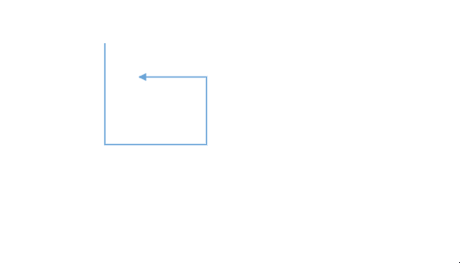

## Avoid Overlapping

Orthogonal segments automatically reroute themselves to avoid overlapping with their connected source and target nodes. The following example illustrates how an orthogonal connector adjusts its path when a connected node is moved.










 

## How to Customize Orthogonal Segment Thumb Shape

The thumbs used to edit orthogonal segments are rendered as a `Circle` by default. You can change this shape using the diagram's[`segmentThumbShape`](https://helpej2.syncfusion.com/react/documentation/api/diagram/#segmentthumbshape) property. The following predefined shapes are available:

| Shape name | Shape |
|-------- | -------- |
|Rhombus| 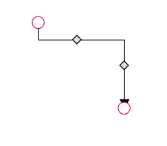 |
| Square |  |
| Rectangle | 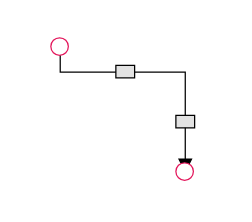 |
| Ellipse |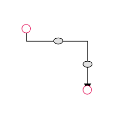 |
|Arrow| 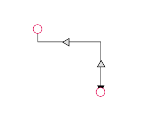 |
| OpenArrow |  |
| Circle |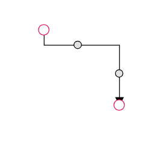 |
| Fletch|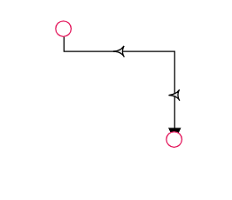 |
|OpenFetch|  |
| IndentedArrow | 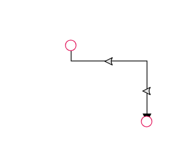 |
| OutdentedArrow | 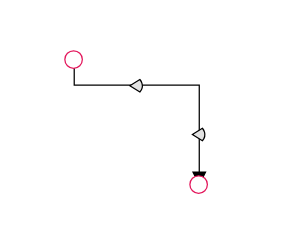 |
| DoubleArrow |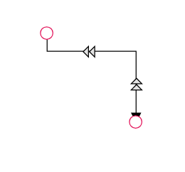 |

You can also customize the style of the thumb shape by overriding the `e-orthogonal-thumb` CSS class.










 

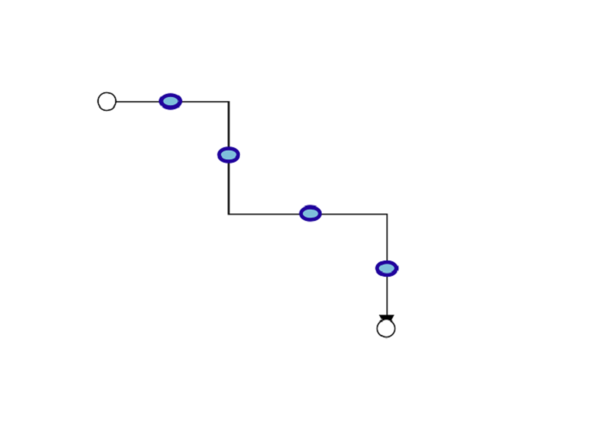

Use the following CSS to customize the segment thumb's appearance.

```scss

 .e-orthogonal-thumb {

            stroke:#24039e;

            fill:rgb(126, 190, 219);

            stroke-width: 3px;

            }

```

## How to customize Orthogonal Segment Thumb Size

By default, orthogonal segment thumbs have a width and height of 10px. This can be customized for all connectors or for individual ones using the[`segmentThumbSize`](https://helpej2.syncfusion.com/react/documentation/api/diagram/#segmentthumbsize) property.
To change the thumb size for all orthogonal connectors in a diagram, set the `segmentThumbSize` property in the diagram model.
To customize the thumb size for a specific connector, you must first disable its `InheritSegmentThumbSize`  property. Then, you can set the connector's unique  `segmentThumbSize` value. 










 