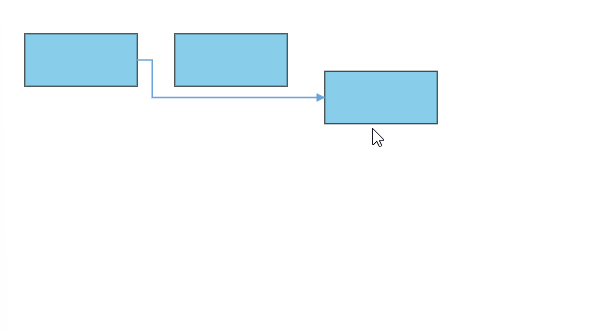
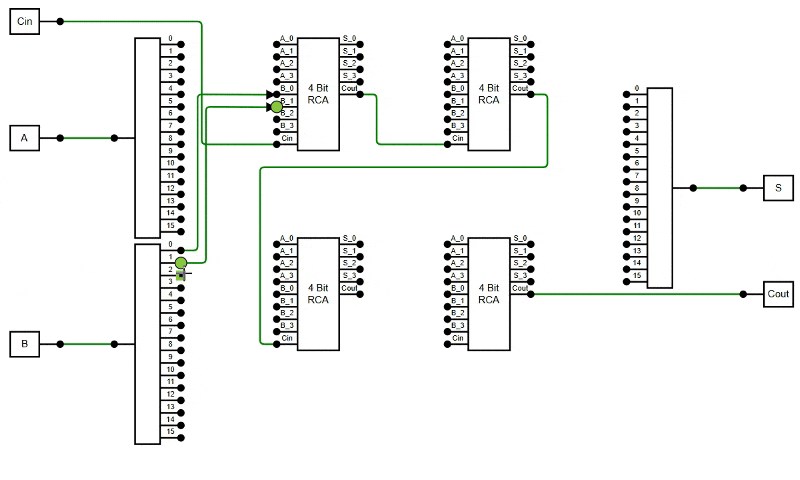

# Connectors in React Diagram Component

Connectors are objects used to create links between two points, nodes, or ports to represent relationships between them. They provide visual connections that help illustrate data flow, process sequences, hierarchical relationships, and other logical connections in diagrams.

## Create Connector

Connectors can be created by defining the source and target points. The path to be drawn can be defined with a collection of segments. To explore the properties of a [`connector`](https://helpej2.syncfusion.com/react/documentation/api/diagram/connector/), refer to [`Connector Properties`](https://helpej2.syncfusion.com/react/documentation/api/diagram/connector/). The [`id`](https://helpej2.syncfusion.com/react/documentation/api/diagram/connectorModel/#id) property of a connector is used to define its unique identifier and can later be used to find the connector at runtime for customization.

```ts
let connectors = [{
        // id of the connector
        id: "connector1",
        sourcePoint: {x: 100, y: 100 },
        targetPoint: { x: 200,y: 200 }
    }];
```
N> When setting a Connector's ID, ensure that it does not contain white spaces, does not start with numbers or special characters, and does not include special characters like underscores (_) or spaces.

## Add connectors through Connectors Collection

The [`sourcePoint`](https://helpej2.syncfusion.com/react/documentation/api/diagram/connector/#sourcepoint) and [`targetPoint`](https://ej2.syncfusion.com/react/documentation/api/diagram/connector/#targetpoint) properties of connector allow you to define the end points of a connector.

The following code example illustrates how to add a connector through connector collection.










 

## Add/Remove Connector at Runtime

Connectors can be added at runtime by using public method, [`add`](https://helpej2.syncfusion.com/react/documentation/api/diagram/#add) and can be removed at runtime by using public method, [`remove`](https://helpej2.syncfusion.com/react/documentation/api/diagram/#remove).These methods are useful when you need to dynamically modify diagram structure based on user interactions or data changes.

The following code example illustrates how to add connector at runtime.










 

## Add Collection of Connectors at Runtime

The collection of connectors can be dynamically added using [`addElements`](https://helpej2.syncfusion.com/react/documentation/api/diagram/#addelements) method.Each time an element is added to the diagram canvas, the [`collectionChange`](https://helpej2.syncfusion.com/react/documentation/api/diagram/#collectionchange) event will be triggered.

The following code illustrates how to add connectors collection at runtime.









          


## Add Connectors from Palette

Connectors can be predefined and added to the symbol palette. You can drop those connectors into the diagram, when required. This approach is useful for creating reusable connector templates that users can easily drag and drop into their diagrams.

The following code example illustrates how to add connectors in palette.










 

## Draw Connectors

Connectors can be interactively drawn by clicking and dragging on the diagram surface. This feature enables users to create connections dynamically during diagram creation or editing.

To draw a shape, you have to activate the drawing tool by setting **DrawOnce** or **ContinuousDraw** to the [`tool`](https://helpej2.syncfusion.com/react/documentation/api/diagram/#tool) property and you need to set the `connector` object by using the [`drawingObject`](https://helpej2.syncfusion.com/react/documentation/api/diagram/#drawingobject) property.

The following code example illustrates how to draw a connector at runtime.










 

 For more information about drawing connectors, refer to [`Draw Connectors`](https://ej2.syncfusion.com/react/documentation/api/diagram/#drawingobject).

## Update Connector at Runtime

Various connector properties such as `sourcePoint`, `targetPoint`, `style`, `sourcePortID`, `targetPortID`, etc., can be updated at the runtime.

The following code example illustrates how to update a connector's source point, target point, styles properties at runtime.This flexibility allows for dynamic modification of connector appearance and behavior based on application logic or user interactions.










 

## Clone Connector at Runtime

Cloning a connector creates a new connector instance with identical properties and attributes. This feature is useful when you need to duplicate existing connectors while maintaining their configuration.

The following code example illustrates how to clone a connector.










 

## Configure Default Connector Properties

The connector defaults functionality allows you to define default properties for all connectors in the diagram. This is triggered when the diagram is initialized, providing an opportunity to customize connector properties globally rather than setting them individually for each connector.

The following code example explains how to customize connector defaults using [`getConnectorDefaults`](https://helpej2.syncfusion.com/react/documentation/api/diagram/#getconnectordefaults).










 

## Connections

### Connection with Nodes

* The [`sourceID`](https://helpej2.syncfusion.com/react/documentation/api/diagram/connector/#sourceid) and [`targetID`](https://helpej2.syncfusion.com/react/documentation/api/diagram/connector/#targetid) properties allow you to define the nodes to be connected. When these properties are set, the connector will automatically attach to the specified nodes and move with them when the nodes are repositioned.

The following code example illustrates how to connect two nodes.












* When you remove NodeConstraints [`InConnect`](https://ej2.syncfusion.com/react/documentation/api/diagram/nodeConstraints) from Default, the node accepts only an outgoing connection to dock in it. Similarly, when you remove NodeConstraints [`OutConnect`](https://ej2.syncfusion.com/react/documentation/api/diagram/nodeConstraints) from Default, the node accepts only an incoming connection to dock in it.

When you remove both InConnect and OutConnect NodeConstraints from Default, the node restricts connectors from establishing connections to it.

The following code illustrates how to disable InConnect constraints.

```ts
import * as React from "react";
import * as ReactDOM from "react-dom";
import {
    Diagram,
    DiagramComponent,
    NodeModel,
    ConnectorModel
} from "@syncfusion/ej2-react-diagrams";
let nodes: NodeModel[] = [{
        id: 'Start',
        width: 140,
        height: 50,
        offsetX: 300,
        offsetY: 100,
        //Disable InConnect constraints
        constraints: NodeConstraints.Default & ~NodeConstraints.InConnect,
    }
];
function App() {
  return (
    <DiagramComponent
      id="container"
      width={'100%'}
      height={'600px'}
      nodes={nodes}
    />
  );
}
const root = ReactDOM.createRoot(document.getElementById('diagram'));
root.render(<App />);

```

## Connections with Ports

The [`sourcePortID`](https://ej2.syncfusion.com/react/documentation/api/diagram/connector/#sourceportid) and [`targetPortID`](https://ej2.syncfusion.com/react/documentation/api/diagram/connector/#targetportid) properties allow you to create connections between specific points of source and target nodes. This provides more precise control over where connectors attach to nodes.

The following code example illustrates how to create port to port connections.










 

Similarly, the `sourcePortID` or `targetPortID` can be changed at the runtime by changing the port [`sourcePortID`](https://ej2.syncfusion.com/react/documentation/api/diagram/connector/#sourceportid) or [`targetPortID`](https://ej2.syncfusion.com/react/documentation/api/diagram/connector/#targetportid).










 

* When you set PortConstraints to [`InConnect`](https://ej2.syncfusion.com/react/documentation/api/diagram/portConstraints), the port accepts only an incoming connection to dock in it. Similarly, when you set PortConstraints to [`OutConnect`](https://ej2.syncfusion.com/react/documentation/api/diagram/portConstraints), the port accepts only an outgoing connection to dock in it.

* When you set PortConstraints to None, the port restricts connector to establish connection in it.

```ts
import * as React from "react";
import * as ReactDOM from "react-dom";
import {
    ConnectorModel,
    NodeModel,
    BasicShapeModel,
    PointPortModel,
    Diagram,
    DiagramComponent,
    PortVisibility
} from "@syncfusion/ej2-react-diagrams";
let port1: PointPortModel = {
    style: {
        strokeColor: '#366F8C',
        fill: '#366F8C'
        }
        }
    port1.shape = 'Circle';
    port1.id = 'nodeportnew';
    //Enable portConstraints Inconnect
    port1.constraints = PortConstraints.InConnect;
    let nodes: NodeModel[] = [{
        id: 'node',
        width: 100,
        height: 100,
        offsetX: 100,
        offsetY: 150,
        ports: [port1]
    },
];
function App() {
  return (
    <DiagramComponent id="container" width={900} height={900} nodes={nodes} />
  );
}
const root = ReactDOM.createRoot(document.getElementById('diagram'));
root.render(<App />);
```

## Automatic Line Routing

Diagram provides additional flexibility to re-route diagram connectors automatically. A connector will frequently re-route itself when a shape moves next to it. Routing adjusts the geometry of connectors to prevent them from overlapping with any nearby nodes in their path. This feature can be activated by adding the LineRouting constraints property to the diagram.

The LineRouting module should be injected to the application as shown in the following code snippet.

    ```ts

     import { Diagram,  LineRouting } from "@syncfusion/ej2-react-diagrams";
     /**
     * Injecting the automatic line routing module.
      */
     Diagram.Inject(LineRouting);
   ```

The line routing constraints must be included in the default diagram constraints to enable automatic line routing support as shown below.

    ```ts
     /**
     *  Initialize the Diagram
     */
       <DiagramComponent constraints={DiagramConstraints.Default | DiagramConstraints.LineRouting} />
    ```

* The following code block shows how to create the diagram with specifying nodes, connectors, constraints, and necessary modules for line routing.












  


The following image illustrates how the connector automatically re-routes the segments.  



* In some situations, automatic line routing enabled diagram needs to ignore a specific connector from automatic line routing. So, in this case, auto routing feature can be disabled to the specific connector using the [`constraints`](https://ej2.syncfusion.com/react/documentation/api/diagram/connector#constraints) property of the connector like the following code snippet.

 










        


## Avoid Line Overlapping

The diagram provides flexibility to prevent connectors from overlapping, ensuring better clarity and readability. This feature intelligently adjusts connector paths to avoid stacking orthogonal connectors on top of each other, reducing visual clutter and enhancing diagram structure. It is especially useful in complex diagrams with multiple orthogonal connectors, where overlapping lines can make interpretation difficult.

To enable this feature, inject the `AvoidLineOverlapping` module and add its constraints to the diagram.

* Inject both the `LineRouting` and `AvoidLineOverlapping` modules into the application.

  ```ts

  import { Diagram,  LineRouting, AvoidLineOverlapping } from "@syncfusion/ej2-react-diagrams";
  /**
  * Injecting the line routing and avoid line overlapping module.
  */
  Diagram.Inject(LineRouting, AvoidLineOverlapping);

  ```

* Add `LineRouting` and `AvoidLineOverlapping` constraints to the diagram constraints to enable line routing with avoid line overlapping support.

  ```ts

  /**
  *  Initialize the Diagram
  */
  <DiagramComponent constraints={DiagramConstraints.Default | DiagramConstraints.LineRouting | DiagramConstraints.AvoidLineOverlapping} />

  ```



The following example demonstrates how to enable the AvoidLineOverlapping feature in the diagram.












        


N> The `AvoidLineOverlapping` feature applies only to orthogonal connectors and requires the `LineRouting` module to be injected with its constraints enabled.

## See Also

* [How to add annotations to the connector.](./labels)
* [How to enable/disable the behavior of the node.](./constraints)
* [How to add connectors to the symbol palette.](./symbol-palette)
* [How to perform the interaction on the connector.](./interaction#connection-editing)
* [How to create diagram connectors using drawing tools.](./tools)