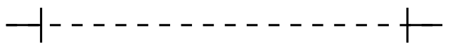
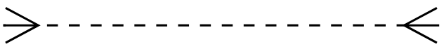
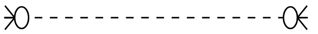

# Entity Relationship Diagrams in React Diagram Component

An Entity Relationship (ER) diagram is a visual representation of a database structure. It displays entities (such as tables), their attributes (such as columns), and the relationships between those entities. In the Syncfusion® React Diagram component, ER diagrams can be created by configuring nodes with [ErShapeModel](https://ej2.syncfusion.com/react/documentation/api/diagram/erShapeModel) and connectors with [ErConnectorShapeModel](https://ej2.syncfusion.com/react/documentation/api/diagram/erConnectorShapeModel).

ER entity nodes are added to the [nodes](https://ej2.syncfusion.com/react/documentation/api/diagram#nodes) property, and ER relationships are defined as connectors and added to the [connectors](https://ej2.syncfusion.com/react/documentation/api/diagram#connectors) property.

## ER diagram elements

An ER diagram is built using the following main elements:

* **Entities** - Represent database tables or objects, such as Customer, Order, or Product.
* **Fields** - Represent columns or attributes inside an entity, such as CustomerID, Name, or Email.
* **Relationships** - Represent how one entity is associated with another entity.

## Creating ER entity nodes

An ER entity node represents a database entity, such as a table or object. It appears as a box that displays the entity name in the header and its fields as rows. The node shape can be defined by setting the [type](https://ej2.syncfusion.com/react/documentation/api/diagram/shape#type) property to **Er**.












### Configure the entity header

The header is the top section of an ER entity node that displays the entity name. The header appearance can be customized using the [header](https://ej2.syncfusion.com/react/documentation/api/diagram/erShapeModel#header) property.

| ER Header Property | Description |
|---|---|
| [annotation](https://ej2.syncfusion.com/react/documentation/api/diagram/erHeaderModel#annotation) | Defines the text content displayed in the header. |
| [height](https://ej2.syncfusion.com/react/documentation/api/diagram/erHeaderModel#height) | Defines the height of the header area in pixels. |
| [style](https://ej2.syncfusion.com/react/documentation/api/diagram/erHeaderModel#style) | Defines style properties such as fill color, text color, and font settings. |












N> If no header is specified, a default header is automatically added to the ER entity node with the default style and height.

### Define entity fields

Fields represent the columns or attributes of an entity. They can be defined using the [fields](./api/diagram/erShapeModel#fields) property. Each field can display information such as the field name, data type, and key constraints, including primary key, foreign key, unique, and not null.

| ER Field Property | Description |
|---|---|
| [id](https://ej2.syncfusion.com/react/documentation/api/diagram/erFieldModel#id) | Defines the unique identifier for the field within the entity. |
| [name](https://ej2.syncfusion.com/react/documentation/api/diagram/erFieldModel#name) | Defines the display name of the field. |
| [dataType](https://ej2.syncfusion.com/react/documentation/api/diagram/erFieldModel#datatype) | Defines the data type of the field, such as **INT**, **VARCHAR(255)**, or **BOOLEAN**. |
| [isPrimaryKey](https://ej2.syncfusion.com/react/documentation/api/diagram/erFieldModel#isprimarykey) | Indicates whether the field is the primary key of the entity. |
| [isForeignKey](https://ej2.syncfusion.com/react/documentation/api/diagram/erFieldModel#isforeignkey) | Indicates whether the field is a foreign key that references another entity. |
| [constraints](https://ej2.syncfusion.com/react/documentation/api/diagram/erFieldModel#constraints) | Defines additional constraints applied to the field. Accepts one or more [ErFieldConstraint](./api/diagram/erfieldconstraint) values. |
| [style](https://ej2.syncfusion.com/react/documentation/api/diagram/erFieldModel#style) | Defines the visual style of the ER field row. Supports standard shape style properties such as fill, stroke color, stroke width, opacity, and other supported diagram style values. Field-level style values override applicable values from field defaults. |
| [annotation](https://ej2.syncfusion.com/react/documentation/api/diagram/erFieldModel#annotation) | Defines text styling for the ER field row. Only annotation [style](./api/diagram/shapeannotation#style) property is applicable. The annotation [content](./api/diagram/shapeannotation#content) property is ignored. |












N> If no fields are specified, a default single field is automatically added to the ER entity node.

### Add or remove ER fields at runtime

ER fields can be updated after the diagram is rendered by using the [addErField](https://ej2.syncfusion.com/react/documentation/api/diagram#addErField) and [removeErField](https://ej2.syncfusion.com/react/documentation/api/diagram#removeErField) methods. These methods help add new fields to an ER entity node or remove existing fields without recreating the diagram.

The `addErField` method adds a field to an ER entity node.

```ts
let entityNode = diagramInstance.nodes[0];
let newField = {
    id: 'customer_phone',
    name: 'Phone',
    dataType: 'VARCHAR(20)'
};

diagramInstance.addErField(entityNode, newField);
```

To insert the field at a specific position, pass the index as the third argument:

```ts
diagramInstance.addErField(entityNode, newField, 2);
```

The `removeErField` method removes an existing field from an ER entity node.

```ts
// Find the field that needs to be removed from the ER entity.
let fieldToRemove = entityNode.shape.fields.find(
    field => field.id === 'customer_phone'
);

if (fieldToRemove) {
    diagramInstance.removeErField(entityNode, fieldToRemove);
}
```

### Configure default field appearance

The [fieldDefaults](https://ej2.syncfusion.com/react/documentation/api/diagram/erFieldDefaults) property defines the default visual appearance for all fields in an ER entity node. These settings are applied to every field unless they are overridden by individual field-level style settings.

| ER Field Defaults Property | Description |
|---|---|
| [alternateRowColors](https://ej2.syncfusion.com/react/documentation/api/diagram/erFieldDefaults#alternaterowcolors) | Defines exactly two colors cycled across field rows in alternating order. Row 0 uses `alternateRowColors[0]`, row 1 uses `alternateRowColors[1]`, row 2 uses `alternateRowColors[0]`, and so on. |
| [height](https://ej2.syncfusion.com/react/documentation/api/diagram/erFieldDefaults#height) | Defines the default height of each ER entity field row. |

### Style ER entities and fields

The appearance of ER entities and their fields can be customized using style properties. The node-level [style](./api/diagram/node#style) property controls the overall ER entity appearance, while individual field [style](./api/diagram/erfield#style) values can override applicable styles for specific field rows.












N> Field-level styles override applicable node-level and field default styles.

### Track entity field changes

The [erEntityChanged](https://ej2.syncfusion.com/react/documentation/api/diagram#erEntityChanged) event is triggered when ER entity fields are added, removed, or reordered. This event provides the previous and updated entity states, which can be used to track modifications, validate field changes, or synchronize updates with an external data source.

```ts
erEntityChanged = {(args: IErEntityChangedEventArgs) => {
    if (args.cause === 'FieldsReorder' && args.state === 'Completed') {
        console.log('ER fields reordered successfully.');
    }
}}
```

## Creating ER relationships

Relationships define how one ER entity is connected to another entity. In the Diagram control, relationships are created using ER connectors. They are rendered as lines with multiplicity symbols at the connector ends.The connector shape can be defined by setting the [type](https://ej2.syncfusion.com/react/documentation/api/diagram/connectorshape#type) property to **Er**.

| ER Connector Shape Property | Description |
|---|---|
| [type](https://ej2.syncfusion.com/react/documentation/api/diagram/erConnectorShapeModel#type) | Defines the connector shape type as `'Er'`. Default: **`'Er'`**. |
| [relationship](https://ej2.syncfusion.com/react/documentation/api/diagram/erConnectorShapeModel#relationship) | Defines whether the relationship is identifying or non-identifying. |
| [sourceMultiplicity](https://ej2.syncfusion.com/react/documentation/api/diagram/erConnectorShapeModel#sourcemultiplicity) | Defines the Crow's Foot multiplicity rendered at the source end of the ER connector. |
| [targetMultiplicity](https://ej2.syncfusion.com/react/documentation/api/diagram/erConnectorShapeModel#targetmultiplicity) | Defines the Crow's Foot multiplicity rendered at the target end of the ER connector. |

### Define relationship multiplicity

Multiplicity defines how many instances of one entity can be associated with instances of another entity. In ER diagrams, multiplicity is represented using Crow's Foot symbols at the source and target ends of a connector.

| Multiplicity Type | Meaning | Example | Image |
|---|---|---|---|
| **One** | Represents a single participation marker. | A customer has one primary account. |  |
| **OneAndOnlyOne** | Represents mandatory participation of exactly one instance. | A user must have exactly one profile. |  |
| **Many** | Represents multiple instances. | A customer can have many orders. |  |
| **ZeroOrOne** | Represents zero or one instance. | An employee may have zero or one manager badge. |  |
| **OneOrMany** | Represents one or more instances. | A department must have one or more employees. |  |
| **ZeroOrMany** | Represents zero or more instances. | A customer may have zero or more wish list items. |  |












## See also

* [How to add nodes to the symbol palette](./symbol-palette)
* [How to customize the connector appearance](./connector-customization)
* [How to perform nodes interaction](./nodes-interaction)