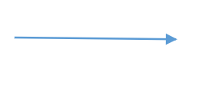
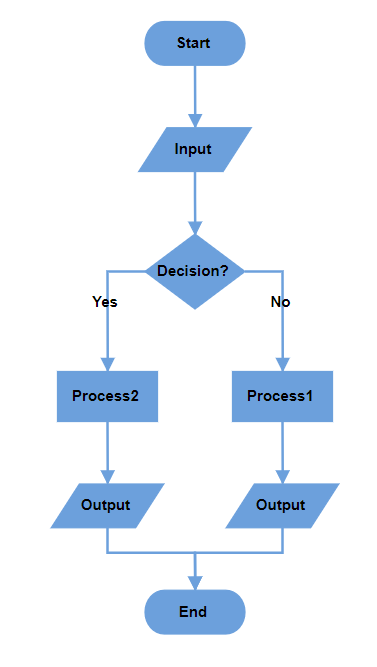
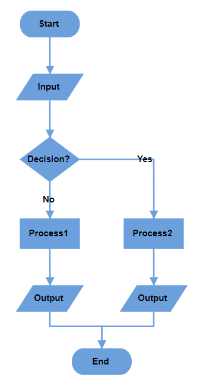
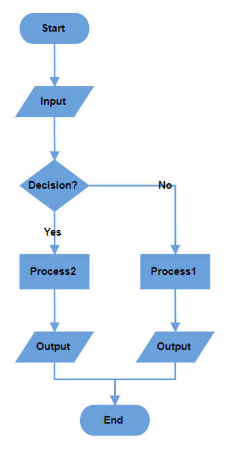

# Flowchart Layout in React Diagram Component

The flowchart layout provides a visual representation of processes, workflows, systems, or algorithms in a diagrammatic format. It uses various symbols to depict different actions, with arrows connecting these symbols to indicate the flow or direction of the process. Flowcharts are Essential<sup style="font-size:70%">&reg;</sup> tools for illustrating step-by-step sequences, making complex processes easier to understand and communicate.

## Common Flowchart Symbols

Different flowchart symbols have specific meanings used to represent various states and actions in flowcharts. The following table describes the most common flowchart symbols used when creating flowcharts.

|Symbol|Shape name|Description|
|---|---|---|
||Terminator|Indicates the beginning and ending of the process.|
||Data|Indicates data input or output for a process.|
||Process|Represents an operation or set of operations and data manipulations.|
||Decision|Shows a branching point where the decision is made to choose one of the two paths|
||Document|Represents a single document or report in the process.|
||PreDefinedProcess|Represents a sequence of actions that combine to perform a specific task that is defined elsewhere.|
||StoredData|Represents a step where data get stored within a process.|
||InternalStorage|Represents the internal storage|
||DirectData|Represents a collection of information that allows searching, sorting, and filtering.|
||SequentialData|Represents the data that must be accessed sequentially|
||Sort|Represents a step that organizes items list sequentially|
||PaperTap|Represents a step where data get stored within a process.|
||ManualInput|Represents the manual input of data into a field or step in a process.|
||ManualOperation|Represents an operation in a process that must be done manually, not automatically.|
||Preparation|Represents a setup or initialization process to another step in the process.|
||OffPageReference|Represents a labeled connector used to link two flowcharts on different pages.|
||MultiDocument|Represents multiple documents or reports in the process.|
||Card|Represents a data card or punched card used for data entry or storage |
||SummingJunction|Represents the logical AND (merge multiple inputs into a single output). |
||Or|Represents the logical OR|
||Merge|Represents a step where two or more sub-lists or sub-processes become one.|
||Extract|Represents retrieving or obtaining data from a source for further processing or analysis in a flowchart.|
||Delay|Represents the period of delay in a process|
||Collate|Represents the process of gathering and arranging data or documents from multiple sources into a structured format.|
||Annotation|Represents additional information, clarifications, about a process or decision point in the flowchart.|
||Annotation2|Represents additional information, or comments about a process in the flowchart.|
||SequentialAccessStorage|Represents information that is stored in a sequence.|
||Display|Represents that the information, data, or output is being shown on a screen or printed for the user’s review.|
||LoopLimit|Represents a maximum number of times a particular process or operation can be repeated within a loop.|
||Connector|Represents a direction of flow from one step to another. It will get created automatically based on the relationship between the parent and child.|

## Render Flowchart layout with Data Source

To render a flowchart layout, set the [`layoutType`](https://ej2.syncfusion.com/react/documentation/api/diagram/layout#type) property to **Flowchart**. The following code example demonstrates how to render a flowchart layout using a data source.










 


>Note: If you want to convert the data source into flowchart layout, you need to inject DataBinding along with FlowchartLayout module in the diagram.


## Configuring Data Source with Appearance Settings

In the flowchart layout, you can define the desired shape, style, and label for each node, as well as the decorator type for connectors, directly within the data source. Structure the data source as shown in the example below:

```javascript
 var Data =  [
        {
            "id": "A",
            "name": "Start",
            "shape": "Terminator",
            "color": "#90EE90",
            "parentId": null,
            "stroke": "#333",
            "strokeWidth": 2
        },
        {
            "id": "B",
            "name": "Process",
            "shape": "Process",
            "color": "#4682B4",
            "parentId": [
                "A"
            ],
            "label":['A-B'],
            "arrowType": "Fletch",
            "stroke": "#333",
            "strokeWidth": 2
        },
    ]

```


### Data Source Field Definitions

- **`name`**: Text annotation displayed on the node.
- **`shape`**: Node shape type (e.g., Terminator, Process, Decision).
- **`color`**: Fill color for the node background.
- **`stroke`**: Border color of the node.
- **`strokeWidth`**: Border thickness in pixels.
- **`label`**: Annotations for incoming connectors.
- **`arrowType`**: Arrowhead type for incoming connectors (e.g., Diamond, Fletch).

This structure enables comprehensive customization of the flowchart's visual elements based on the provided data source.


## Render Flowchart Layout with Nodes and Connectors

The following example demonstrates how to render a flowchart layout using nodes and connectors. To achieve this, you need to define the [`nodes`](https://ej2.syncfusion.com/react/documentation/api/diagram/nodeModel) and [`connectors`](https://ej2.syncfusion.com/react/documentation/api/diagram/connectormodel) collections and assign them to the diagram. Additionally, you need to set the `layoutType` to **Flowchart**.











 


## Customize Flowchart Layout Orientation

Customize the flow direction of the flowchart using the [orientation](https://ej2.syncfusion.com/react/documentation/api/diagram/layout#orientation) property of the layout class. The flowchart can flow either vertically from top to bottom or horizontally from left to right. The default orientation is **TopToBottom**.


### TopToBottom Orientation

This orientation arranges elements vertically, flowing from top to bottom. It is commonly used in flowcharts to represent the sequential progression of steps or actions in a process.

```typescript

//Initialize the diagram
<ejs-diagram #diagram id="diagram" width="100%" height="600px" [layout]="layout"> </ejs-diagram>

export class AppComponent {
  @ViewChild("diagram")
  public diagram!: DiagramComponent;
  public layout?: LayoutModel;
  ngOnInit(): void {
    this.layout = {
        //Sets layout type
        type: 'Flowchart',
        //Sets the orientation of the layout
        orientation: 'TopToBottom'
    },
  }
};

```


### LeftToRight Orientation

This orientation arranges elements in the layout horizontally, flowing from left to right. It is typically used to represent processes or workflows that move sequentially across the page, emphasizing a linear progression of steps or actions.

```typescript

//Initialize the diagram
<ejs-diagram #diagram id="diagram" width="100%" height="600px" [layout]="layout"> </ejs-diagram>

export class AppComponent {
  @ViewChild("diagram")
  public diagram!: DiagramComponent;
  public layout?: LayoutModel;
  ngOnInit(): void {
    this.layout = {
        //Sets layout type
        type: 'Flowchart',
        //Sets the orientation of the layout
        orientation: 'LeftToRight'
    },
  }
};

```


## Customize the Decision Output Directions

The decision symbol in a flowchart represents a question or condition that leads to different paths based on a binary outcome (Yes/No, True/False). You can customize the output direction of these paths using the [`yesBranchDirection`](https://ej2.syncfusion.com/react/documentation/api/diagram/branchDirection) and [`noBranchDirection`](https://ej2.syncfusion.com/react/documentation/api/diagram/branchDirection) properties of the [`flowchartLayoutSettings`](https://ej2.syncfusion.com/react/documentation/api/diagram/flowchartLayoutSettingsModel) class.

### Branch Direction Options

- **`LeftInFlow`** - Arranges the Yes/No branch to the left of the decision symbol.
- **`RightInFlow`** - Arranges the Yes/No branch to the right of the decision symbol.
- **`SameAsFlow`** - Aligns the Yes/No branch in the same direction as the flow of the decision symbol.

The following example shows a flowchart layout with `yesBranchDirection` set to `SameAsFlow` and `noBranchDirection` set to `LeftInFlow`.










 


The following table illustrates the visual behavior of different branch direction combinations:

|YesBranchDirection| NoBranchDirection | TopToBottom | LeftToRight |
|---|---|---|---|
| Left In Flow |Right In Flow|||
| Right In Flow |Left In Flow || |
| Same As Flow |Right In Flow || |
| Same As Flow |Left In Flow || |
| Right In Flow | Same As Flow || |
| Left In Flow | Same As Flow || |
|Same As Flow |Same As Flow|||

>Note: When both branch directions are set to the same value, the **Yes** branch takes priority in positioning.


## Custom Yes and No Branch Values

The decision symbol produces two output branches: a Yes branch and a No branch. Configure custom text values to determine branch classification using the  `yesBranchValues` property of the `flowchartLayoutSettings` class, it will be considered a Yes branch. Similarly, if the connector text value matches any value in the `noBranchValues`.

By default:
- **`yesBranchValues`** contains: **"Yes"** and **"True"**.
- **`noBranchValues`** contains: **"No"** and **"False"**.

### Custom Branch Classification

When a connector's text value matches any value in the `yesBranchValues` array, it is classified as a Yes branch. Similarly, when the connector text matches any value in the `noBranchValues` array, it is classified as a No branch. This enables flexible decision flow control using custom terminology appropriate for your specific use case.

The following example demonstrates how to set custom text values for yes and no branches.










 


