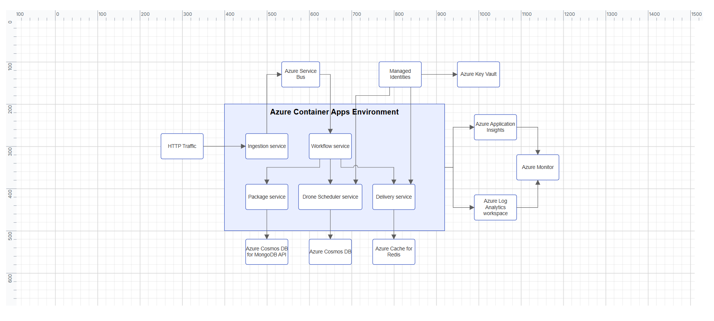

# Getting Started with React Diagram

This section explains how to create a React application from scratch and build a simple diagram using the Syncfusion® React Diagram component.

> **Ready to streamline your Syncfusion<sup style="font-size:70%">&reg;</sup> React development?** Discover the full potential of Syncfusion<sup style="font-size:70%">&reg;</sup> React components with Syncfusion<sup style="font-size:70%">&reg;</sup> AI Coding Assistant. Effortlessly integrate, configure, and enhance your projects with intelligent, context-aware code suggestions, streamlined setups, and real-time insights—all seamlessly integrated into your preferred AI-powered IDEs like VS Code, Cursor, Syncfusion<sup style="font-size:70%">&reg;</sup> Code Studio and more. [Explore Syncfusion<sup style="font-size:70%">&reg;</sup> AI Coding Assistant](https://ej2.syncfusion.com/react/documentation/mcp-server/ai-coding-assistant/getting-started).





## Prerequisites

- [Node.js 24+](https://nodejs.org/en) (LTS recommended).
- Syncfusion CLI.

## Install the Syncfusion CLI 

Install the Syncfusion CLI globally using the following command:



npm install -g @syncfusion/syncfusion-cli



## Set up the Vite project using Syncfusion CLI

You can create a React Vite application using the Syncfusion CLI. The CLI provides two ways to create a project:

### Non-interactive mode

Non-interactive mode allows you to create a project directly using a single command with the required command-line arguments.



sf new my-diagram-app --framework react --type ts --template diagram --theme tailwind3



In this mode, the project configuration is passed directly in the command. The above command creates a React Vite application configured with the Syncfusion<sup style="font-size:70%">&reg;</sup> `Diagram` component.

### Interactive mode

Interactive mode guides you through the project creation process with step-by-step prompts.



sf



When you run the `sf` command, the CLI prompts you to select the required project configuration. To create a React Vite application with the Syncfusion<sup style="font-size:70%">&reg;</sup> `Diagram` component, select the following options:




√ Project name? ... my-diagram-app
√ Choose Framework: » React
√ Choose Build Tool: » Vite
√ Choose Language: » Typescript
√ Choose Template: » Diagram
√ Choose Theme: » Tailwind3
√ Choose Style Format: » CSS
√ Would you like to integrate the Syncfusion MCP Server (AI Assistant) into this project? ... no
√ Would you like to install Syncfusion Component Skills for AI-powered development? ... no      
√ Install dependencies and start app now? ... no




The above selections generate a React Vite application configured with the Syncfusion<sup style="font-size:70%">&reg;</sup> `Diagram` component. You can choose different values for language, theme, style format, MCP setup, and skills installation based on your project requirements.

The Syncfusion<sup style="font-size:70%">&reg;</sup> CLI creates the project with a predefined template. After the project is generated, you can customize or replace the component code based on your application requirements.

## Run the project

Once the project is created, navigate to the project directory and run the following commands in your terminal.



cd my-diagram-app
npm install
npm run dev



The output will appear as follows:







## Prerequisites

| Requirement | Version |
|-------------|---------|
| React | 16 or higher |
| Node.js | 18.0.0 or above |

### React supported versions

| React version | Minimum Syncfusion® React Diagram version |
| ------------- | ------------------------------------------- |
| [React v19](https://react.dev/blog/2024/12/05/react-19) | 29.1.33 and above |
| [React v18](https://reactjs.org/blog/2022/03/29/react-v18.html) | 20.2.36 and above |
| [React v17](https://reactjs.org/blog/2020/10/20/react-v17.html) | 18.3.50 and above |
| [React v16](https://reactjs.org/blog/2017/09/26/react-v16.0.html) | 16.2.45 and above |

### Browser Support

| Browser | Supported versions |
|---|---|
| Chrome | Latest |
| Firefox | Latest |
| Opera | Latest |
| Edge | 79+ (Chromium) |
| Safari | 9+ |
| iOS Safari | 9+ |
| Android Browser / Chrome for Android | 4.4+ |

## Before You Begin

This guide uses the React application structure generated by Vite with the TypeScript template.

The main files used in this guide are:

* `src/App.tsx` — Defines the root React component.
* `src/App.css` — Contains Syncfusion® theme references.

N> In a Vite React TypeScript application, the root component is generated as **src/App.tsx** by default. If your application uses JavaScript, the equivalent file is **src/App.jsx**.

N> This guide uses the TypeScript template for better type checking with Diagram models such as `NodeModel`, `ConnectorModel`, and `FlowShapeModel`.

## Step 1: Create a React application

Use [Vite](https://vite.dev) to create and manage React applications. Vite provides a fast development environment and optimized builds for modern React applications. Syncfusion® recommends using Vite for setting up React applications.

Create a new React application using the following command:

```
npm create vite@latest my-diagram-app -- --template react-ts
```

During the setup process, the CLI will prompt you for a few configuration options. Select the following:

- **Which linter to use?** → **ESLint**
- **Install with npm and start now?** → **No**

The base dependencies and the Syncfusion® package are installed in the next steps.

N> To use JavaScript instead of TypeScript, create the application using `npm create vite@latest my-diagram-app -- --template react`. The root component file will then be **src/App.jsx** instead of **src/App.tsx**.

Navigate to the project folder:

```
cd my-diagram-app
```

## Step 2: Install the Syncfusion® React Diagram package

All Syncfusion Essential® JS 2 packages are available in the [npmjs.com](https://www.npmjs.com/~syncfusionorg) registry.

Install the React Diagram package using the following command:

```
npm install @syncfusion/ej2-react-diagrams
```

N> Installing `@syncfusion/ej2-react-diagrams` automatically installs the required dependency packages.

N> A Syncfusion® license key is not required for local development. However, a valid Syncfusion® license key must be registered before deploying the application to production. For details, see [Registering a Syncfusion® license key](https://ej2.syncfusion.com/react/documentation/licensing/overview).

## Step 3: Add the required styles

The Diagram component needs Syncfusion® theme styles to display correctly. Syncfusion® theme packages include ready-to-use styles for supported components.

Install the Tailwind 3 theme package using the following command:

```
npm install @syncfusion/ej2-tailwind3-theme
```

Add the following import to the **src/App.css** file:

```
@import '../node_modules/@syncfusion/ej2-tailwind3-theme/styles/diagram/index.css';
```

For the list of available themes, refer to the [Themes](https://ej2.syncfusion.com/react/documentation/appearance/theme) documentation.

N> Syncfusion® provides multiple built-in themes. If the application uses a different theme, replace the `@syncfusion/ej2-tailwind3-theme/styles/diagram/index.css` reference with the corresponding theme path, such as `@syncfusion/ej2-material3-theme/styles/diagram/index.css`.

N> Ensure that **App.css** is imported in the **src/App.tsx** file so that the theme styles are applied to the Diagram component.

N> The `@import` path depth (`../node_modules/...`) assumes `App.css` lives in `src/`. If `App.css` is at the project root, use `./node_modules/...` instead.

## Step 4: Add the Diagram component

Import `DiagramComponent` from `@syncfusion/ej2-react-diagrams` and add it to the React component.

Update the **src/App.tsx** file as follows:

```
import { DiagramComponent } from '@syncfusion/ej2-react-diagrams';
import './App.css';

function App() {
  return (
    <DiagramComponent
      id="diagram"
      width="100%"
      height="580px"
    />
  );
}

export default App;
```

At this stage, the Diagram component renders an empty canvas. The next step replaces this code with a more complete example.

N> The Diagram component must have a valid height. If the height is not set, the Diagram canvas may not be visible.

## Step 5: Create your first Diagram with nodes and connectors

This section explains how to create a simple flowchart by adding nodes, customizing their appearance, and connecting them using connectors.

The following example creates a flowchart with four nodes: **Start**, **Process**, **Decision**, and **End**. It also applies common node and connector settings using the `getNodeDefaults` and `getConnectorDefaults` callback bindings.

Replace the entire contents of **src/App.tsx** with the following code:

```
import {
  DiagramComponent,
  type ConnectorModel,
  type FlowShapeModel,
  type NodeModel
} from '@syncfusion/ej2-react-diagrams';
import './App.css';

const terminator: FlowShapeModel = {
  type: 'Flow',
  shape: 'Terminator'
};

const process: FlowShapeModel = {
  type: 'Flow',
  shape: 'Process'
};

const decision: FlowShapeModel = {
  type: 'Flow',
  shape: 'Decision'
};

const nodes: NodeModel[] = [
  {
    id: 'node1',
    offsetX: 300,
    offsetY: 100,
    shape: terminator,
    annotations: [
      {
        content: 'Start'
      }
    ]
  },
  {
    id: 'node2',
    offsetX: 300,
    offsetY: 200,
    shape: process,
    annotations: [
      {
        content: 'Process'
      }
    ]
  },
  {
    id: 'node3',
    offsetX: 300,
    offsetY: 300,
    shape: decision,
    annotations: [
      {
        content: 'Decision?'
      }
    ]
  },
  {
    id: 'node4',
    offsetX: 300,
    offsetY: 400,
    shape: terminator,
    annotations: [
      {
        content: 'End'
      }
    ]
  }
];

const connectors: ConnectorModel[] = [
  {
    id: 'connector1',
    sourceID: 'node1',
    targetID: 'node2'
  },
  {
    id: 'connector2',
    sourceID: 'node2',
    targetID: 'node3'
  },
  {
    id: 'connector3',
    sourceID: 'node3',
    targetID: 'node4'
  }
];

function nodeDefaults(node: NodeModel): NodeModel {
  node.width = 140;
  node.height = 50;
  node.style = {
    fill: '#E8F4FF',
    strokeColor: '#357BD2'
  };
  return node;
}

function connectorDefaults(connector: ConnectorModel): ConnectorModel {
  connector.type = 'Orthogonal';
  connector.targetDecorator = {
    shape: 'Arrow',
    width: 10,
    height: 10
  };
  return connector;
}

function App() {
  return (
    <DiagramComponent
      id="diagram"
      width="100%"
      height="580px"
      nodes={nodes}
      connectors={connectors}
      getNodeDefaults={nodeDefaults}
      getConnectorDefaults={connectorDefaults}
    />
  );
}

export default App;
```

In this example:

* [`offsetX`](https://ej2.syncfusion.com/react/documentation/api/diagram/nodemodel#offsetx) and [`offsetY`](https://ej2.syncfusion.com/react/documentation/api/diagram/nodemodel#offsety) define the position of each node.
* [`shape`](https://ej2.syncfusion.com/react/documentation/api/diagram/nodemodel#shape) defines the node shape configuration, and [`FlowShapeModel.shape`](https://ej2.syncfusion.com/react/documentation/api/diagram/flowshapemodel#shape) specifies flowchart shapes such as `Terminator`, `Process`, or `Decision`.
* The [`annotations`](https://ej2.syncfusion.com/react/documentation/api/diagram/annotationmodel) property adds text inside each node using the [`content`](https://ej2.syncfusion.com/react/documentation/api/diagram/annotationmodel#content) field.
* [`sourceID`](https://ej2.syncfusion.com/react/documentation/api/diagram/connectormodel#sourceid) and [`targetID`](https://ej2.syncfusion.com/react/documentation/api/diagram/connectormodel#targetid) define the connection between nodes.
* [`getNodeDefaults`](https://ej2.syncfusion.com/react/documentation/api/diagram/index-default#getnodedefaults) applies common width, height, fill color, and stroke color to all nodes.
* [`getConnectorDefaults`](https://ej2.syncfusion.com/react/documentation/api/diagram/index-default#getconnectordefaults) applies common connector settings, such as orthogonal routing and target arrows.

## Step 6: Run the application

Run the application using the following command:

```
npm run dev
```

Open the generated local URL (by default, `http://localhost:5173`) in the browser. The application displays the diagram as shown below:


N> To stop the development server, press `Ctrl + C` in the terminal where it is running.

N> To build the application for production, run `npm run build`. The generated output is placed in the `dist` folder.





## Next steps

To explore the Diagram component in more depth, refer to the following topics:

* [Nodes](https://ej2.syncfusion.com/react/documentation/diagram/nodes)
* [Connectors](https://ej2.syncfusion.com/react/documentation/diagram/connectors)
* [Annotations](https://ej2.syncfusion.com/react/documentation/diagram/labels)
