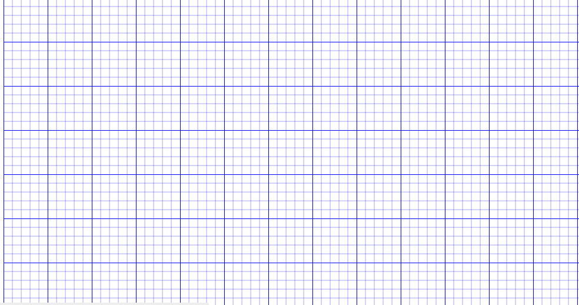
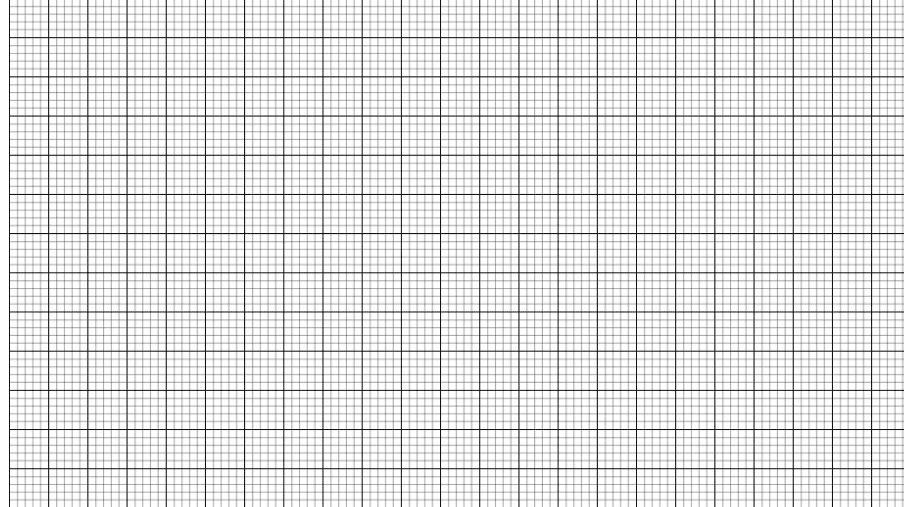
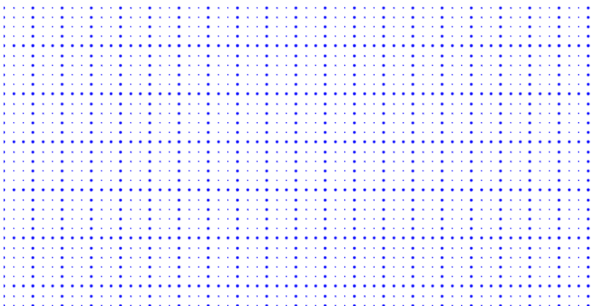
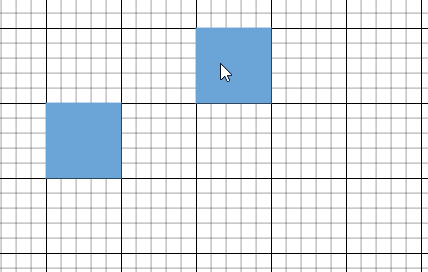
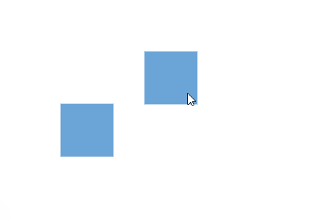
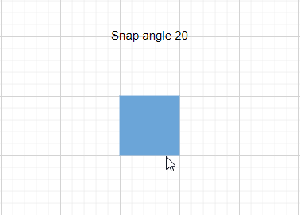

# Grid Lines in React Diagram

Gridlines are crisscross lines drawn in diagram pages like the lines on traditional graph paper. They help position diagram elements precisely on the diagram page and provide visual reference points for accurate layout design.

## Prerequisites

To use gridlines and snapping functionality, ensure that the snapping module is injected into the diagram component.

The [`snapSettings`](https://helpej2.syncfusion.com/react/documentation/api/diagram#snapsettings) property is used to customize the gridlines and control the snapping behavior in the diagram.

## Customize the Gridlines Visibility

The [`snapConstraints`](https://helpej2.syncfusion.com/react/documentation/api/diagram/snapSettings#constraints) enables you to show/hide the gridlines. The following code example illustrates how to show the gridlines.










 

N>If you want to enable snapping, then inject snapping module into the diagram.

To show only horizontal/vertical gridlines or to hide gridlines, refer to [`Constraints`](https://helpej2.syncfusion.com/react/documentation/api/diagram/snapSettings#constraints).

## Appearance

The appearance of the gridlines can be customized using a set of predefined properties to match your application's design requirements.

* The [`horizontalGridLines`](https://helpej2.syncfusion.com/react/documentation/api/diagram/snapSettings#horizontalgridlines) and the [`verticalGridLines`](https://helpej2.syncfusion.com/react/documentation/api/diagram/snapSettings#verticalgridlines) properties allow you to customize the appearance of the horizontal and vertical gridlines respectively.

* The horizontal gridlines [`lineColor`](https://helpej2.syncfusion.com/react/documentation/api/diagram/gridlines#linecolor) and [`lineDashArray`](https://helpej2.syncfusion.com/react/documentation/api/diagram/gridlines#linedasharray) properties are used to customize the line color and line style of the horizontal gridlines. The `lineColor` accepts hexadecimal, RGB, or predefined color names, and the default `lineDashArray` is an empty string (solid line).

* The vertical gridlines `lineColor` and [`lineDashArray`](https://helpej2.syncfusion.com/react/documentation/api/diagram/gridlines#linedasharray) properties are used to customize the line color and line style of the vertical gridlines. The `lineColor` accepts hexadecimal, RGB, or predefined color names, and the default `lineDashArray` is an empty string (solid line).

The following code example illustrates how to customize the appearance of gridlines.










 

 

## Line Intervals

The thickness and spacing between gridlines can be customized using the [`linesInterval`](https://helpej2.syncfusion.com/react/documentation/api/diagram/gridlines#lineintervals) of the horizontal gridlines and the `linesInterval` of the vertical gridlines. In the lines interval array, values at the odd indices (1, 3, 5...) are referred to as the thickness of lines and values at the even indices (0, 2, 4...) are referred to as the space between gridlines.

The following code example illustrates how to customize the thickness of lines and the line intervals.










 

 

## Dot Grid Patterns

The appearance of the grid lines can be changed into dots by setting the [`gridType`](https://helpej2.syncfusion.com/react/documentation/api/diagram/snapSettings#gridtype) of `snapSettings` as `Dots`. By default, the grid type is **Lines**. Dot patterns can be particularly useful for creating a less intrusive visual guide while maintaining alignment functionality. For example:

```javascript
let snapSettings = {
    gridType: 'Dots'
};
```

The following code illustrates how to render grid patterns as dots.










 



## Snapping

Snapping functionality works in conjunction with gridlines to provide precise alignment capabilities. When you draw, resize, or move a diagram element on the page, you can set it to align or snap to the nearest intersection, regardless of whether the grid is visible.

### Snap to Lines

This feature allows diagram objects to snap to the nearest intersection of gridlines while being dragged or resized, facilitating easier alignment during layout or design.

Snapping to gridlines can be enabled or disabled using the `snapConstraints` property of the `SnapSettings` class. The default value is **All**, which combines `ShowLines | SnapToLines | SnapToObject | InteractionDefault`.










 



### Snap to Objects

The snap-to-object feature provides visual cues to assist with aligning and spacing diagram elements. A node can snap to its neighboring objects based on specific alignments, such as matching size and position. These alignments are visually represented by smart guide lines in a cyan shade, with the color code `#07EDE1`. To enable or disable this feature, set or unset the `SnapConstraints.SnapToObject` flag on `snapSettings.constraints`.

The [`snapObjectDistance`](https://helpej2.syncfusion.com/react/documentation/api/diagram/snapSettings#snapobjectdistance) property allows you to define the minimum distance between the selected object and the nearest object. By default, the snap object distance is set to **5 pixels**.










 



## Snap Angle

The [`snapAngle`](https://helpej2.syncfusion.com/react/documentation/api/diagram/snapSettings#snapangle) property defines the increments by which an object can be rotated within a diagram. 

For example, if the snapAngle is set to 15 degrees, an object can only be rotated to angles that are multiples of 15 degrees, such as 15°, 30°, 45°, and so on. This ensures precise angular alignment and consistent object positioning, enhancing the overall design accuracy. By default, the snap angle is set to 5 degrees. The following sample sets the value to 20 degrees for demonstration.

The following code example demonstrates how to set the `snapAngle` property and update it dynamically.










 



## Snap Line Color

The [`snapLineColor`](https://helpej2.syncfusion.com/react/documentation/api/diagram/snapSettings#snaplinecolor) property defines the color of the snap lines rendered while dragging objects (the smart guides described in the [Snap to Objects](#snap-to-objects) section). By customizing the snap line color, you can enhance the visual contrast and visibility of these guides, making it easier to achieve accurate alignment. 

This property accepts color values in various formats, such as hexadecimal, RGB, or predefined color names, providing flexibility in how you choose to represent the snap lines in your diagramming application. By default the snap line color is set to `'#07EDE1'`. The following sample overrides this default using the predefined color name `red`.

The following code example demonstrates how to set the `snapLineColor` property and update it dynamically.










 

## Customization of Snap Intervals

By default, objects snap toward the nearest gridline. The gridline or position toward which the diagram object snaps can be customized using the [`snapInterval`](https://helpej2.syncfusion.com/react/documentation/api/diagram/gridlines#snapintervals) of the horizontal gridlines and the `snapInterval` of the vertical gridlines.










 

## Snap Constraints

The `snapConstraints` property allows you to enable or disable certain features of the snapping functionality.

| Flag | Description |
|------|-------------|
| `None` | Disables all snapping behavior. |
| `ShowLines` | Shows the gridlines. |
| `SnapToLines` | Snaps objects to gridlines. |
| `SnapToObject` | Snaps objects to neighboring objects with smart guides. |
| `InteractionDefault` | Default snapping during interactions. |
| `All` | Enables all snapping features (default). |

For detailed information, refer to [`constraints`](https://ej2.syncfusion.com/react/documentation/api/diagram/snapConstraints).
