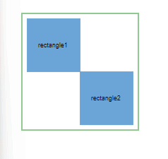

# Group in React Diagram Component
Groups enable developers to cluster multiple nodes and connectors into a single manageable element, acting as a container that maintains relationships between child elements while allowing both collective and individual manipulation. This powerful feature streamlines complex diagram management by treating related elements as cohesive units while preserving the ability to edit individual components when needed.

## Create Group

A group functions as a container for its children (nodes, groups, and connectors). Every change made to the group affects all children proportionally, while child elements remain individually editable. Groups can contain other groups, creating nested hierarchies for complex diagram structures.

## Add Group when Initializing Diagram

A group can be added to the diagram model through [`nodes`](https://ej2.syncfusion.com/react/documentation/api/diagram/#nodes) collection. To define an object as group, add the child objects to the [`children`](https://ej2.syncfusion.com/react/documentation/api/diagram/node/#children) collection of the group.  The following code illustrates how to create a group node.

* While creating group, its child node need to be declared before the group declaration.









         


Connectors can be added to a group. The following code illustrates how to add connectors into a group.









         


## Runtime Group Operations

### Group Nodes at Runtime

Groups can be dynamically created during runtime in the diagram by invoking the [`diagram.group`](https://ej2.syncfusion.com/react/documentation/api/diagram/#group) method. To initiate this process, first, select the nodes that you intend to include within the group. Subsequently, by utilizing the `diagram.group` method will encapsulate the selected nodes within a newly formed group node.

The following code illustrates how to group at runtime.









         


### Ungroup Nodes at Runtime

Group node can be unGrouped dynamically using the [`diagram.unGroup`](https://ej2.syncfusion.com/react/documentation/api/diagram/#ungroup) method.This operation dissolves the group container while preserving all child elements as individual diagram elements.
The following code example shows how to ungroup a group node at runtime:










 

### Add Group Node at Runtime

A group node can be added at runtime by using the diagram method [`diagram.add`](https://ej2.syncfusion.com/react/documentation/api/diagram/#add).This method allows programmatic addition of predefined group structures to an existing diagram.

The following code illustrates how a group node is added at runtime:










 

### Add Collection of Group Nodes at Runtime

The collection of group nodes can be dynamically added using the [`addElements`](https://ej2.syncfusion.com/react/documentation/api/diagram/#addelements) method.Each time an element is added to the diagram canvas, the [`collectionChange`](https://ej2.syncfusion.com/react/documentation/api/diagram/iCollectionChangeEventArgs/) event will be triggered.

The following code illustrates how to add group nodes collection at runtime.










 

## Manage Group Children at Runtime

### Add Children to Group at Runtime

A child node can be added to a specified group at runtime using the diagram method [`diagram.addChildToGroup`](https://ej2.syncfusion.com/react/documentation/api/diagram/#addchildtogroup). This functionality requires passing the group and the existing child node as arguments to the method.

The following code illustrates how a child node can be added to a group node at runtime:

```html

diagram.addChildToGroup(groupNode, childNode); 

```
### Remove Children from Group at Runtime

A specific child from a group node can be removed at runtime by utilizing the diagram method [`diagram.removeChildFromGroup`](https://ej2.syncfusion.com/react/documentation/api/diagram/#removechildfromgroup). This functionality requires passing the group and its child node as arguments to the method.

The following code illustrates how a child node is removed from a group at runtime:

```html

diagram.removeChildFromGroup (groupNode, childNode); 

```









 

## Group Styling and Layout

### Group Padding


The [`Padding`](https://ej2.syncfusion.com/react/documentation/api/diagram/nodeModel/#padding) property of a group node defines the spacing between the group node's edges and its children. This property helps maintain visual separation and improves the overall appearance of grouped elements.

The following code illustrates how to add padding to a node group:










 

### Group Flip

The flip functionality for a group node works similarly to that of normal nodes. When flipping a group node, the child nodes inherit the group's flip transformation while retaining their individual flip settings. The combined effect creates a hierarchical flip behavior where both the group and child transformations are applied.

**Example of combined flip behavior:**
- If a child node's flip is set to Vertical and the group node's flip is set to Horizontal, the resulting flip for the child node combines both transformations (effectively a "both" flip).
- This ensures that child nodes adapt dynamically based on the group's flip while maintaining their unique flip settings.

The following example shows how to apply flip transformations to group nodes:










 

### Group Flip Mode

The [`flipMode`](https://ej2.syncfusion.com/react/documentation/api/diagram/flipMode/)property of a group node behaves similarly to that of normal nodes. However, when a flip mode is applied to a group node, it takes precedence over any flip mode set on its child nodes, overriding their individual settings.

**Example of flip mode precedence:**
In the code below, the `flipMode` for the child node `Node1` is set to `LabelText`, while the `flipMode` for the group node is set to `Label`. The effective `flipMode` for both the child node and the group node will be `Label`, as the group node's `flipMode` overrides the child's setting.










 


## Nested Group

Nested groups are groups within groups, where a group can contain other groups as its children, creating a hierarchical structure. This feature helps manage complexity and relationships between different elements in sophisticated diagram scenarios.


 The following code illustrates how to create nested group nodes:










 

### Add Groups to Symbol Palette

Group nodes can be added to the symbol palette like normal nodes, enabling reusable group templates for consistent diagram creation. This feature allows developers to create standardized group configurations that can be dragged and dropped into diagrams.

The following code illustrates how to render group nodes in the palette:










 

### Update Group Nodes at Runtime

Groups can be updated dynamically similar to normal nodes, allowing modification of group properties, styling, and behavior during runtime operations.

The following code illustrates how to update group nodes at runtime:










 

## Container Types

Containers provide automatic measurement and arrangement of child element size and position according to predefined layout behaviors. The diagram supports two container types, each optimized for different layout scenarios.

### Canvas Container

The canvas panel supports absolute positioning and provides minimal layout functionality to its contained diagram elements. This container type offers maximum flexibility for precise element placement.

**Canvas Container Characteristics:**
- Supports absolute positioning using margin and alignment properties.
- Enables rendering operations independently for each contained element.
- Allows elements to be aligned vertically or horizontally.
- Child elements are defined using the [`canvas.children`](https://ej2.syncfusion.com/react/documentation/api/diagram/canvas/#children) property.
- Basic elements can be defined within the `basicElements` collection.

The following code illustrates how to add canvas panel.










 

### Stack Container

The stack panel arranges its children in a single line or stack order, either vertically or horizontally. This container provides structured layout control through spacing and alignment properties.

**Stack Container Characteristics:**
- Controls spacing using margin properties of child elements and padding properties of the group.
- Default [`orientation`](https://ej2.syncfusion.com/react/documentation/api/diagram/stackPanel/#orientation)is vertical.
- Provides consistent alignment and distribution of child elements.
- Ideal for creating organized, sequential layouts.

The following code illustrates how to add a stack panel:










 

### Difference Between Basic Groups and Containers

| Basic Group | Container |
| -------- | -------- |
| Arranges child elements based on the child elements' position and size properties | Each container has predefined behavior to measure and arrange child elements. Canvas and stack containers are supported in the diagram |
| The padding, minimum, and maximum size properties are not applicable for basic groups | These properties are applicable for containers |
| The children's margin and alignment properties are not applicable for basic groups | These properties are applicable for containers |

## Group Interactions

Group node interactions can be performed similarly to normal nodes. Fundamental diagram interactions like selecting, dragging, resizing, and rotating apply equally to group nodes. For more information, refer to the [node interactions](./nodes-interaction) documentation.

### Selecting Group Nodes

When a child element within a node group is clicked, the entire containing node group is selected instead of the individual child element. Subsequent clicks on the selected element change the selection from top to bottom within the hierarchy, moving from the parent node group to its children.



## Events

The events triggered when interacting with group nodes are similar to those for individual nodes. For more information, refer to the [`nodes events`](./nodes-events) documentation.

## See Also

* [How to add annotations to the node.](./labels)
* [How to add ports to the node.](./ports)
* [How to enable/disable the behavior of the node.](./constraints)
* [How to add nodes to the symbol palette.](./symbol-palette)
* [How to create diagram nodes using drawing tools.](./tools)
* [How to perform the interaction on the group.](./interaction#selection)