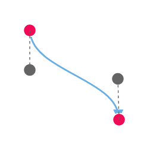

# Interaction in React Diagram component

## Selection

Selector provides a visual representation of selected elements. It behaves like a container and allows to update the size, position, and rotation angle of the selected elements through interaction and by using program. Single or multiple elements can be selected at a time.

## Single selection

An element can be selected by clicking that element. During single click, all previously selected items are cleared. The following image shows how the selected elements are visually represented.


While selecting the diagram elements,  the [`selectionChange`](https://ej2.syncfusion.com/react/documentation/api/diagram/#selectionchange) event and [`click`](https://ej2.syncfusion.com/react/documentation/api/diagram/#click) gets triggered. 
These events enable you to customize the selected elements as needed.

## Selecting a group

When a child element of any group is clicked, its contained group is selected instead of the child element. With consecutive clicks on the selected element, selection is changed from top to bottom in the hierarchy of parent group to its children.

## Multiple selection

Multiple elements can be selected with the following ways:

#### Ctrl+Click

During single click, any existing item in the selection list be cleared, and only the item clicked recently is there in the selection list. To avoid cleaning the old selected item, Ctrl key must be on hold when clicking.

#### Rubber band selection

Clicking and dragging in the diagram area allows you to create a rectangular region. The elements covered within this rectangular region will be selected when you release the mouse button.

In rubber band selection, you can set the selection of items by region using the following modes:

- CompleteIntersect: Selects items that are fully covered within the rectangular selection region.
- PartialIntersect: Selects items that are partially covered within the rectangular selection region.

This can be configured with the [`rubberBandSelectionMode`](https://ej2.syncfusion.com/react/documentation/api/diagram/rubberBandSelectionMode/).


## Select/Unselect elements using API

The [`select`](https://ej2.syncfusion.com/react/documentation/api/diagram#select) and [`clearSelection`](https://ej2.syncfusion.com/react/documentation/api/diagram#clearselection) methods are used to dynamically select or clear the selection of elements at runtime. The following code example demonstrates how these methods can be utilized to select or clear the selection of elements.

```ts
let diagramInstance: DiagramComponent;
let nodes = [
  {
    id: 'node1',
    width: 90,
    height: 60,
    offsetX: 100,
    offsetY: 100,
    style: {
        fill:   '#6BA5D7',
        strokeColor: 'white',
        strokeWidth: 1
    },
    }
]
// initialize Diagram component
function App() {
  return (
    <DiagramComponent
      id="container"
      ref={(diagram) => (diagramInstance = diagram)}
      width={'100%'}
      height={'600px'}
      nodes={nodes}
      created={() => {
            //Select a specified collection of nodes and connectors in the diagram
            diagramInstance.select([diagramInstance.nodes[0]]);
            //Removes all elements from the selection list, clearing the current selection.
            diagramInstance.clearSelection();
      }}
    />
  );
}
const root = ReactDOM.createRoot(document.getElementById('diagram'));
root.render(<App />);

```
### Get selected items

You can get the current selected items from the [`nodes`](https://ej2.syncfusion.com/react/documentation/api/diagram/selectorModel#nodes-nodemodel[]) and [`connectors`](https://ej2.syncfusion.com/react/documentation/api/diagram/selectorModel#connectors-connectormodel[]) collection of the [`selectedItems`](https://ej2.syncfusion.com/react/documentation/api/diagram/#selecteditems) property of the diagram model.

```ts
let diagramInstance: DiagramComponent;
let selectedNodes: NodeModel[] = diagramInstance.selectedItems.nodes;
let selectedConnector: ConnectorModel[] = diagramInstance.selectedItems.connectors;
// initialize Diagram component
function App() {
  return (
    <DiagramComponent
      id="container"
      ref={(diagram) => (diagramInstance = diagram)}
      width={'100%'}
      height={'600px'}
    />
  );
}
const root = ReactDOM.createRoot(document.getElementById('diagram'));
root.render(<App />);

```

### Toggle selection

The [`canToggleSelection`](https://ej2.syncfusion.com/react/documentation/api/diagram/selectorModel/#cantoggleselection) property determines whether the selection state of a diagram element should toggle with a mouse click at runtime. By default, this property is set to false. In the following example, the node can be selected with the first click and unselected with the second click.










 

## Select entire elements in diagram programmatically

The client-side method [`selectAll`](https://ej2.syncfusion.com/react/documentation/api/diagram#selectall) used to select all the elements such as nodes/connectors in the diagram. Refer to the following link which shows how to use [`selectAll`](https://ej2.syncfusion.com/react/documentation/api/diagram#selectall) method on the diagram.

```ts
let diagramInstance: DiagramComponent;
let nodes: NodeModel[] = [
  {
    id: 'node1',
    width: 90,
    height: 60,
    offsetX: 100,
    offsetY: 100,
    style: {
      fill: '#6BA5D7',
      strokeColor: 'white',
      strokeWidth: 1,
    },
  },
  {
    id: 'node2',
    width: 90,
    height: 60,
    offsetX: 300,
    offsetY: 100,
    style: {
      fill: '#6BA5D7',
      strokeColor: 'white',
      strokeWidth: 1,
    },
  },
];
// initialize Diagram component
function App() {
  return (
    <DiagramComponent
      id="container"
      ref={(diagram) => (diagramInstance = diagram)}
      width={'100%'}
      height={'600px'}
      nodes={nodes}
      created={() => {
        //Select a specified collection of nodes and connectors in the diagram
        diagramInstance.selectAll();
      }}
    />
  );
}
const root = createRoot(document.getElementById('diagram'));
root.render(<App />);

```

You can also use the CTRL+A keys to select all nodes and connectors in the diagram.

## Drag

* An object can be dragged by clicking and dragging it. When multiple elements are selected, dragging any one of the selected elements move every selected element.
* When you drag the elements in the diagram, the [`positionChange`](https://ej2.syncfusion.com/react/documentation/api/diagram/#positionchange) event gets triggered and to do customization in this event.


## Resize

* Selector is surrounded by eight thumbs. When dragging these thumbs, selected items can be resized.
* When one corner of the selector is dragged, opposite corner is in a static position.
* When a node is resized, the [`sizeChange`](https://ej2.syncfusion.com/react/documentation/api/diagram/#sizechange) event gets triggered.


N>  While dragging and resizing, the objects are snapped towards the nearest objects to make better alignments.

### Aspect ratio

Maintaining aspect ratio in diagram means that when you resize a node, by dragging its corner, both its width and height adjust proportionally. This ensures that the node retains its original shape and proportions. Aspect ratio constraints can be applied by configuring the [`NodeConstraints`](https://ej2.syncfusion.com/react/documentation/api/diagram/nodeconstraints/) property.










 

## Customize the resize-thumb size

You can change the size of the node resize thumb and the connector end point handle by using the `handleSize` property. The appearance such as fill, stroke, and stroke width of the node resize thumb and connector end point handle can be customized by overriding the e-diagram-resize-handle and e-diagram-endpoint-handle classes respectively.










 

The appearance such as fill, stroke, and stroke width of the node resize thumb and connector end point handle can be customized by overriding the e-diagram-resize-handle and e-diagram-endpoint-handle classes respectively.

## Rotate

* A rotate handler is placed above the selector. Clicking and dragging the handler in a circular direction lead to rotate the node.
* The node is rotated with reference to the static pivot point.
* Pivot thumb (thumb at the middle of the node) appears while rotating the node to represent the static point.


### Customize rotate handle position

The position of the rotate handle can be adjusted by modifying the pivot point of the node using the [`pivot`](https://ej2.syncfusion.com/react/documentation/api/diagram/nodeModel/#pivot) property. By default, the pivot point is set to (0.5, 0.5). The following example shows how to render the rotate handle at the left top corner of the node.










 


## Connection editing

Each segment of a selected connector is editable with some specific handles/thumbs.

>Note: For connector editing, you have to inject the [`ConnectorEditing`](https://ej2.syncfusion.com/react/documentation/api/diagram/connectorEditing/) module.

### Drag connector end points

Source and target points of the selected connectors are represented with two handles. Clicking and dragging those handles help you to adjust the source and target points.


Dragging the connector end points triggers the following events for customization:

When the connector source point is changed, the [`sourcePointChange`](https://ej2.syncfusion.com/react/documentation/api/diagram/#sourcepointchange) event gets triggered.
When the connector target point is changed, the [`targetPointChange`](https://ej2.syncfusion.com/react/documentation/api/diagram/#targetpointchange) event gets triggered.
When you connect connector with ports/node or disconnect from it, the [`connectionChange`](https://ej2.syncfusion.com/react/documentation/api/diagram/#connectionchange) event gets triggered.

## Straight segment editing

The end point of each straight segment is represented by a thumb that allows you to edit the segment. You can insert any number of new segments into a straight line by clicking while holding the Shift and Ctrl keys (Ctrl+Shift+Click).


Straight segments can be removed by clicking the segment end point while holding the Ctrl and Shift keys (Ctrl+Shift+Click).


### Orthogonal segment editing

* Orthogonal thumbs allow you to adjust the length of adjacent segments by clicking and dragging it.
* When necessary, some segments are added or removed automatically, when dragging the segment. This is to maintain proper routing of orthogonality between segments.


### Bezier segment editing

Bezier segment thumbs allow you to adjust the segments by clicking and dragging them.

#### Bezier Control Points

Bezier segments are annotated with two thumbs representing the control points. These control points can be adjusted by clicking and dragging the control thumbs. Dragging the control point changes the angle and distance of the points from the segment point, modifying the curve.



## User handles

User handles are used to add some frequently used commands around the selector. To create user handles, define and add them to the [`userHandles`](https://ej2.syncfusion.com/react/documentation/api/diagram/selectorModel/#userhandles) collection of the [`selectedItems`](https://ej2.syncfusion.com/react/documentation/api/diagram/#selecteditems) property. The name property of user handle is used to define the name of the user handle and its further used to find the user handle at runtime and do any customization.

The following events are triggered when interacting with a user handle:

[`click`](https://ej2.syncfusion.com/react/documentation/api/diagram/#click) - Triggered when the user handle is clicked.
[`onUserHandleMouseEnter`](https://ej2.syncfusion.com/react/documentation/api/diagram/#onuserhandlemouseenter) - Triggered when the mouse enters the user handle region.
[`onUserHandleMouseDown`](https://ej2.syncfusion.com/react/documentation/api/diagram/#onuserhandlemousedown) - Triggered when the mouse is pressed down on the user handle.
[`onUserHandleMouseUp`](https://ej2.syncfusion.com/react/documentation/api/diagram/#onuserhandlemouseup) - Triggered when the mouse is released on the user handle.
[`onUserHandleMouseLeave`](https://ej2.syncfusion.com/react/documentation/api/diagram/#onuserhandlemouseleave) - Triggered when the mouse leaves the user handle region.

For more information, refer to the [`user handle events`](./user-handle#user-handle-events).

## Fixed user handle

Fixed user handles are used to perform specific actions when interacted with. Unlike regular user handles, [`fixedUserHandles`](https://ej2.syncfusion.com/react/documentation/api/diagram/fixedUserHandleClickEventArgs/#fixeduserhandle) are defined within the node/connector object, allowing different fixed user handles to be added to different nodes.

The following events are triggered when interacting with a fixed user handle:

* [`click`](https://ej2.syncfusion.com/react/documentation/api/diagram/#click) - Triggered when the fixed user handle is clicked.
* [`onFixedUserHandleMouseEnter`](https://ej2.syncfusion.com/react/documentation/api/diagram/#onfixeduserhandlemouseenter) - Triggered when the mouse enters the fixed user handle region.
* [`onFixedUserHandleMouseDown`](https://ej2.syncfusion.com/react/documentation/api/diagram/#onfixeduserhandlemousedown) - Triggered when the mouse is pressed down on the fixed user handle.
* [`onFixedUserHandleMouseUp`](https://ej2.syncfusion.com/react/documentation/api/diagram/#onfixeduserhandlemouseup) - Triggered when the mouse is released on the fixed user handle.
* [`onFixedUserHandleMouseLeave`](https://ej2.syncfusion.com/react/documentation/api/diagram/#onfixeduserhandlemouseleave) - Triggered when the mouse leaves the fixed user handle region.
* [`fixedUserHandleClick`](https://ej2.syncfusion.com/react/documentation/api/diagram/#fixeduserhandleclick) - Triggered when the fixed user handle is clicked.

For more information, refer to the [`fixed user handle events`](./user-handle#fixed-user-handle-events).

## Determining Mouse Button Clicks

The diagram component can determine which mouse button was clicked. For example, when the right mouse button is clicked, the click event will specify that the right button was clicked. This is handled through the mouse [`click`](https://ej2.syncfusion.com/react/documentation/api/diagram/#click) event, which provides details about whether the left or right button was clicked.

| Notification | Description |
|----------------|--------------|
| Left | When the left mouse button is clicked, left is notified  |
| Middle | When the mouse wheel is clicked, middle is notified |
| Right | When the right mouse button is clicked, right is notified |

```ts
let diagramInstance: DiagramComponent;
// initialize Diagram component
function App() {
  return (
    <DiagramComponent
      id="container"
      ref={(diagram) => (diagramInstance = diagram)}
      width={'100%'}
      height={'600px'}
      click={(args: : IClickEventArgs) => {
        //Obtains the button clicked
        let button = args.button;
      }}
    />
  );
}
const root = ReactDOM.createRoot(document.getElementById('diagram'));
root.render(<App />);

```


## Allow drop

The diagram supports dropping a node or connector onto another node or connector. To determine the target where the node or connector is dropped, you need to enable the [`allowDrop`](https://ej2.syncfusion.com/react/documentation/api/diagram/nodeConstraints/) constraint in the node's or connector's constraints property. This setting enables a highlighter to indicate potential drop targets when dragging any node or connector over another one. Upon dropping the node or connector, the [`drop`](https://ej2.syncfusion.com/react/documentation/api/diagram/iDropEventArgs/) event is triggered to indicate which element was dropped over which other element.

## Zoom pan

When a large diagram is loaded, only certain portion of the diagram is visible. The remaining portions are clipped. Clipped portions can be explored by scrolling the scrollbars or panning the diagram. You can zoom in or out on the diagram by using Ctrl + mouse wheel. When the diagram is zoomed or panned, the [`scrollChange`](https://ej2.syncfusion.com/react/documentation/api/diagram/#scrollchange) event gets triggered.

|  Pan Status  | Description|
|--------------|---------|
| Start | When the mouse is clicked and dragged the status is notified as start.|
| Progress | When the mouse is in motion the status is notified as progress.|
| Completed | When panning is stopped the status is notified with completed.|


## Keyboard

Diagram provides support to interact with the elements with key gestures. By default, some in-built commands are bound with a relevant set of key combinations.

The following table illustrates those commands with the associated key values.

| Shortcut Key | Command | Description|
|--------------|---------|------------|
| Ctrl + A | `selectAll` | Select all nodes/connectors in the diagram.|
| Ctrl + C | copy | Copy the diagram selected elements.|
| Ctrl + V | paste | Pastes the copied elements.|
| Ctrl + X | cut | Cuts the selected elements.|
| Ctrl + Z | undo | Reverses the last editing action performed on the diagram.|
| Ctrl + Y | redo | Restores the last editing action when no other actions have occurred since the last undo on the diagram.|
| Delete | delete | Deletes the selected elements.|
| Ctrl/Shift + Click on object |  | Multiple selection (Selector binds all selected nodes/connectors).|
| Up Arrow | nudge(“up”) | `nudgeUp`: Moves the selected elements towards up by one pixel.|
| Down Arrow | nudge(“down”) | `nudgeDown`: Moves the selected elements towards down by one pixel.|
| Left Arrow | nudge(“left”) | `nudgeLeft`: Moves the selected elements towards left by one pixel.|
| Right Arrow | nudge(“right”) | `nudgeRight`: Moves the selected elements towards right by one pixel.|
| Ctrl + MouseWheel | zoom | Zoom (Zoom in/Zoom out the diagram).|
| F2 | `startLabelEditing` | Starts to edit the label of selected element.|
| Esc | `endLabelEditing` | Sets the label mode as view and stops editing.|
| Tab | Tab to Focus | Select the diagram element based on the rendering order when using the "Tab" key.|
| Shift + Tab | Go to Previous Object | This command is employed to shift the selection to the preceding object based on the z-order.|
| Control + B | Bold | Toggle bold formatting for the selected text.|
| Control + I | Italic | Toggle italic formatting for the selected text.|
| Control + U | Underline | Toggle underline formatting for the selected text.|
| Control + D | Duplicate | Duplicate a selected shape.|
| Control + G | Group | Group together multiple selected shapes, allowing them to be treated as a single shape.|
| Control + Shift + U | UnGroup | Ungroup shapes within a previously grouped selection.|
| Control + R | Rotate clockwise | Rotate the selected nodes in clockwise.|
| Control + L | Rotate anti-clockwise | Rotate the selected nodes in counterclockwise.|
| Control + H | Flip Horizontal | Flip the selected elements horizontally.|
| Control + J | Flip Vertical | Flip the selected elements vertically.|
| Control + 1 | Pointer tool | Activate the pointer tool.|
| Control + 2 | Text tool | Activate the text  tool.|
| Control + 3 | Connector tool | Activate the connector tool.|
| Control + 5 | Freeform  tool | Activate the freeform tool.|
| Control + 6 | Line tool | Activate the polyline tool.|
| Control + + | Zoom In | Zoom in the diagram.|
| Control + - | Zoom Out | Zoom out the diagram.|
| Shift + Up Arrow | Up | Moves the selected elements towards up by 5 pixel.|
| Shift + Down Arrow | Down | Moves the selected elements towards down by 5 pixel.|
| Shift + Left Arrow | Left | Moves the selected elements towards left by 5 pixel.|
| Shift + Right Arrow | Right | Moves the selected elements towards right by 5 pixel.|
| Control + Shift + L | Align Text Left | Align the selected text to the left.|
| Control + Shift + C | Center Text Horizontally | Center the selected text horizontally.|
| Control + Shift + R | Align Text Right | Align the selected text to the right.|
| Control + Shift + J | Justify Text Horizontally | Justify the selected text, aligning it to both the left and right margins.|
| Control + Shift + E | Top-align Text Vertically | Align the selected text to the top vertically.|
| Control + Shift + M | Center Text Vertically | Center the selected text vertically.|
| Control + Shift + V | Bottom-align Text Vertically | Align the selected text to the bottom vertically.|
| Control + Shift + B | Send To Back | Send the selected shape backward in the stacking order, making it appear behind other shapes.|
| Control + Shift + F | Bring To Front | Bring the selected shape forward in the stacking order, making it appear in front of other shapes.|
| Control + [ | Send Backward | Move the selected shape one step backward in the layer order. |
| Control + ] | Bring Forward | Move the selected shape one step forward in the layer order.|

## See Also

* [How to create diagram nodes using drawing tools](./tools#shapes)
* [How to create diagram connectors using drawing tools](./tools#connectors )
* [How to disable the diagram interaction](./tools)
* [How to control the diagram history](./undo-redo)
* [How to create overview control to the diagram](./overview)
