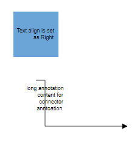
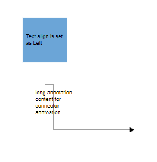
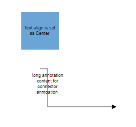
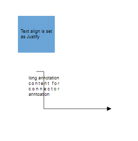
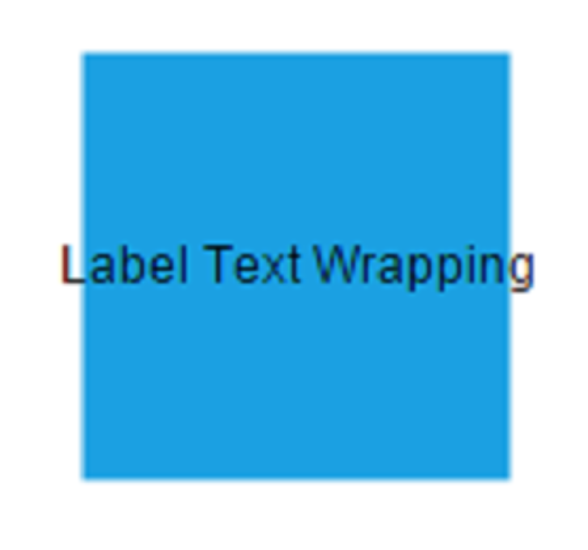
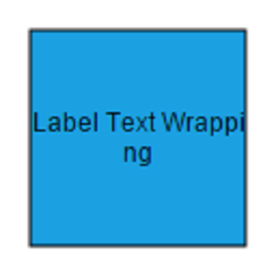
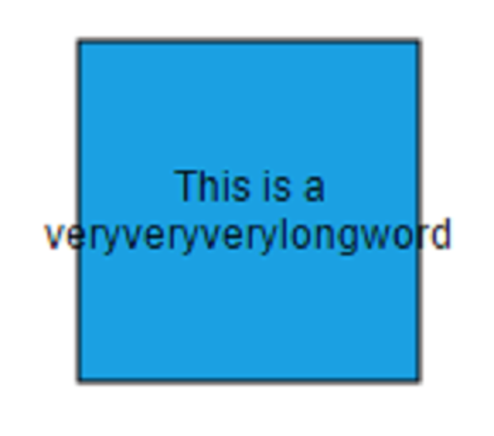
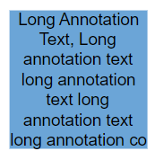
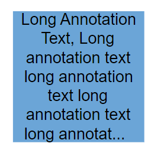
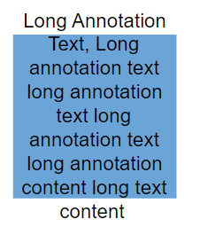

# Customizing Label Appearance in React Diagram Component

## Overview

The React Diagram component provides comprehensive styling options to customize label appearance. Labels can be enhanced with various font properties, colors, decorations, and visual effects to match application requirements.

Font styling properties such as [`fontSize`](https://helpej2.syncfusion.com/react/documentation/api/diagram/textStyleModel#fontsize), [`fontFamily`](https://helpej2.syncfusion.com/react/documentation/api/diagram/textStyleModel#fontfamily), [`color`](https://helpej2.syncfusion.com/react/documentation/api/diagram/textStyleModel#color) control the basic text appearance. Additional text formatting is available through [`bold`](https://helpej2.syncfusion.com/react/documentation/api/diagram/textStyleModel#bold), [`italic`](https://helpej2.syncfusion.com/react/documentation/api/diagram/textStyleModel#italic), and [`textDecoration`](https://helpej2.syncfusion.com/react/documentation/api/diagram/textStyleModel#textdecoration) properties are used to style the label’s text.

Background and border styling can be applied using [`fill`](https://helpej2.syncfusion.com/react/documentation/api/diagram/textStyleModel#fill), [`strokeColor`](https://helpej2.syncfusion.com/react/documentation/api/diagram/textStyleModel#strokecolor), and [`strokeWidth`](https://helpej2.syncfusion.com/react/documentation/api/diagram/textStyleModel#strokewidth) properties are used to define the background color and border color of the annotation and the [`opacity`](https://helpej2.syncfusion.com/react/documentation/api/diagram/textStyleModel#opacity) property controls label transparency.

The [`visible`](https://helpej2.syncfusion.com/react/documentation/api/diagram/annotationModel#visibility) property, which enables or disables label display.

The following code demonstrates comprehensive label appearance customization:










 

## Horizontal and vertical alignment

Label positioning within nodes and connectors can be precisely controlled through horizontal and vertical alignment properties. The following table illustrates all possible alignment combinations with offset (0, 0):

| Horizontal Alignment | Vertical Alignment | Output with Offset(0,0) |
| -------- | -------- | -------- |
| Left | Top |  |
| Center | Top |  |
| Right | Top |   |
| Left | Center |  |
| Center | Center|  |
| Right | Center |  |
| Left | Bottom |  |
| Center | Bottom |  |
| Right |Bottom | |

The following code example shows how to configure label alignment:










 

## Annotation Margin

The [`Margin`](https://helpej2.syncfusion.com/react/documentation/api/diagram/annotationModel#margin) property adds spacing around labels by specifying absolute values for any or all four sides. This property works in conjunction with offset, horizontal alignment, and vertical alignment to achieve precise label positioning.

The following example demonstrates label positioning using [`margin`](https://helpej2.syncfusion.com/react/documentation/api/diagram/marginModel) values.










 

## Hyperlink

Labels can include interactive [`hyperlink`](https://helpej2.syncfusion.com/react/documentation/api/diagram/annotationModel#hyperlink) for both nodes and connectors. Hyperlink behavior and appearance can be customized with several properties.

The [`hyperlinkOpenState`](https://helpej2.syncfusion.com/react/documentation/api/diagram/hyperlinkModel#hyperlinkopenstate) property controls how the hyperlink opens - in a new window, the same tab, or a new tab.

Hyperlink appearance is controlled through the [`content`](https://helpej2.syncfusion.com/react/documentation/api/diagram/hyperlinkModel#content) property for display text, [`color`](https://helpej2.syncfusion.com/react/documentation/api/diagram/hyperlinkModel#color) for text color, and [`textDecoration`](https://helpej2.syncfusion.com/react/documentation/api/diagram/hyperlinkModel#textdecoration ) for styling effects like **Underline**, **LineThrough**, **Overline**.

The following example shows hyperlink implementation and customization:










 

## Rotate Annotation

Labels can be rotated to any angle using the [`rotateAngle`](https://helpej2.syncfusion.com/react/documentation/api/diagram/shapeAnnotationModel#rotateangle) property. This feature is useful for creating dynamic label orientations that match specific design requirements.

The following example demonstrates label rotation:









 

## Template support for annotation

Diagram provides template support for annotation. You can either define a string template and assign it to [`template`](https://helpej2.syncfusion.com/react/documentation/api/diagram/annotationModel#template) property of annotation or define a annotation template in html file and assign it to the [`annotationTemplate`](https://helpej2.syncfusion.com/react/documentation/api/diagram#annotationtemplate) property of the diagram.

### String template

 For string template you should define a SVG/HTML content as string in the annotation's `template` property.

The following code illustrates how to define a template in annotation.










 

N> Specify width and height for labels when using templates to ensure proper alignment and rendering.

### Annotation template

HTML-based templates provide more complex content structures by defining templates in separate HTML files. Assign the template to the `annotationTemplate` property of the diagram. This template system works with both nodes and connectors.

The following code demonstrates HTML template usage for labels:










 

### Functional template

We can define a function which would return a string template and assign that method to the `annotationTemplate` property of diagram. Inside that function we can do customizations based on the id of the annotation.

The following code illustrates how to define a functional template.










 

## Text align

The [`textAlign`](https://helpej2.syncfusion.com/react/documentation/api/diagram/textStyleModel#textalign) property controls text alignment within the label boundaries. Available alignment options include left, right, center, and justify, providing flexibility for various content layouts.

The following code demonstrates text alignment configuration:










 

The following table shows the different text alignment.

|Text Align|Output image|
|-----|-----|
|Right||
|Left||
|Center||
|Justify||

## Text Wrapping

When label text exceeds node or connector boundaries, the [`text wrapping`](https://helpej2.syncfusion.com/react/documentation/api/diagram/textStyleModel#textwrapping)property controls how content is handled. Text can be wrapped into multiple lines based on the specified wrapping behavior.

The following code shows text wrapping implementation:










 

| Value | Description | Image |
| -------- | -------- | -------- |
| No Wrap | Text will not be wrapped. |  |
| Wrap | Text-wrapping occurs, when the text overflows beyond the available node width. |  |
| WrapWithOverflow (Default) | Text wrapping occurs with overflow allowed for very long words that cannot be broken. |  |

## Text overflow

The label’s [`TextOverflow`](https://helpej2.syncfusion.com/react/documentation/api/diagram/textStyleModel#textoverflow) property manages content display when text exceeds the available label space. This property works in conjunction with text wrapping to provide comprehensive text handling.

Available overflow options include:

- **Clip** - Overflowing content beyond node boundaries is removed.
- **Ellipsis** - Overflowing content is replaced with three dots (...).
- **Wrap** - Content renders with vertical overflow and horizontal wrapping.

Types of text overflow are shown in below table.

|TextOverflow|output image|
|-----|-----|
|Clip||
|Ellipsis||
|Wrap(Default)||










 
 