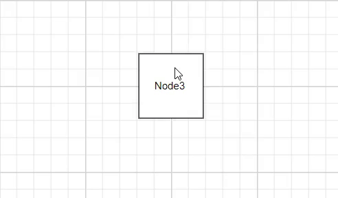

# Interactive Label Features

The Diagram component allows labels to be interactive through selecting, dragging, rotating, and resizing operations. Label interaction is disabled by default. Enable label interaction using the `constraints` property of the label. You can also control specific interaction types by enabling individual constraints for selecting, dragging, rotating, or resizing. The following code demonstrates how to enable interactive mode.










 

## Constraints

The [`constraints`](https://ej2.syncfusion.com/react/documentation/diagram/constraints#annotation-constraints) property of labels allows enabling or disabling specific label behaviors. Use these constraints to control which interaction types are available for each label.

## Label Editing

The Diagram component supports editing labels at runtime, both programmatically and interactively. By default, labels are in view mode. Labels can be switched to edit mode using two approaches:

### Programmatic Editing
By using [`startTextEdit`](https://helpej2.syncfusion.com/react/documentation/api/diagram/#starttextedit) method to programmatically enter edit mode for a specific label.










 

### Interactive Editing
Labels can be edited interactively through user actions:
1. Double-clicking the label.
2. Selecting the item and pressing the F2 key.

Double-clicking any label enables editing mode. When the editor loses focus, the label content is updated. The  [`doubleClick`](https://helpej2.syncfusion.com/react/documentation/api/diagram/#doubleclick) event triggers when double-clicking on nodes, connectors, or the diagram canvas.

## Label Rotation

The [`rotationReference`](https://helpej2.syncfusion.com/react/documentation/api/diagram/shapeAnnotationModel/#rotationreference) property controls whether labels rotate relative to their parent node or remain fixed relative to the page. The following code examples demonstrate how to configure rotationReference for labels.










 

| Value | Description | Image |
| -------- | -------- | -------- |
| Page | When this option is set, the annotation remains fixed in its original orientation even if its parent node is rotated. |  |
| Parent | In this case, the annotation rotates along with its parent node. | |

## Read-only Labels

The Diagram component supports creating read-only labels that cannot be edited by users. Set the read-only constraint in the label's [`constraints`](https://helpej2.syncfusion.com/react/documentation/api/diagram/annotationModel/#constraints) property. The following code demonstrates how to enable read-only mode.










 

## Drag Limits

The diagram control supports defining  [`dragLimit`](https://helpej2.syncfusion.com/react/documentation/api/diagram/annotationModel/#draglimit) properties for connector labels to restrict dragging within specified boundaries. The drag limit automatically updates the label position to the nearest segment offset when dragging.

Configure drag limit boundaries using the [`left`](https://helpej2.syncfusion.com/react/documentation/api/diagram/marginModel/#left), [`right`](https://helpej2.syncfusion.com/react/documentation/api/diagram/marginModel/#right), [`top`](https://helpej2.syncfusion.com/react/documentation/api/diagram/marginModel/#top), and [`bottom`](https://helpej2.syncfusion.com/react/documentation/api/diagram/marginModel/#bottom) properties. These properties limit connector label dragging based on user-defined values.

Drag limits are disabled by default for connectors. Enable drag limits by setting the connector constraints to include drag functionality.

The following code demonstrates how to configure dragLimit for connector labels:










 

## Multiple Labels

Nodes and connectors support multiple labels. Each label can have independent properties and constraints. The following code demonstrates how to add multiple labels to nodes and connectors.










 
