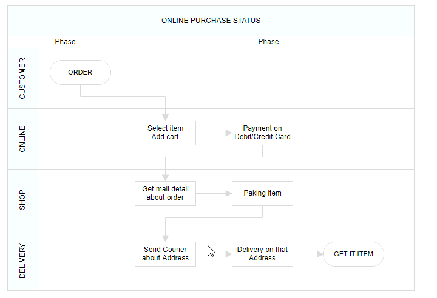
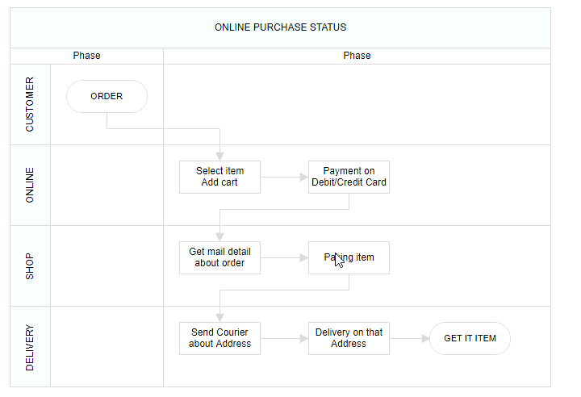

# Lane Management in React Diagram Component

## Overview

A lane is a functional unit or responsible department of a business process that helps to map a process within the functional unit or between other functional units. In swimlane diagrams, lanes represent different actors, departments, or systems that participate in the process workflow.

The number of [`lanes`](https://ej2.syncfusion.com/react/documentation/api/diagram/laneModel) can be added to a swimlane. The lanes are automatically stacked inside the swimlane based on the order they are added.

### Create an Empty Lane

* The lane `id` is used to define the name of the lane and its further used to find the lane at runtime and do any customization.

The following code example illustrates how to define a swimlane with lane.










 

### Create Lane Header

* The [`header`](https://ej2.syncfusion.com/react/documentation/api/diagram/laneModel#header) property of lane allows you to textually describe the lane and to customize the appearance of the description.

The following code example illustrates how to define a lane header.










 

### Customizing Lane and Lane Header

* The size of lane can be controlled by using [`width`](https://ej2.syncfusion.com/react/documentation/api/diagram/headerModel#width) and [`height`](https://ej2.syncfusion.com/react/documentation/api/diagram/headerModel#height) properties of lane.

* The appearance of lane can be set by using the [`style`](https://ej2.syncfusion.com/react/documentation/api/diagram/headerModel#style) properties.

* The appearance of header annotation can be customized by using the `style` property of header annotation.

The following code example illustrates how to customize the lane header.










 

#### Dynamic Customization of Lane Header

Lane header style and text properties can be customized dynamically. The following code illustrates how to dynamically customize the lane header.










 

### Add and Remove Lanes at Runtime

Lanes can be added at runtime by using the [`addLanes`](https://ej2.syncfusion.com/react/documentation/api/diagram/#addlanes) method and remove lane at runtime using the [`removeLane`](https://ej2.syncfusion.com/react/documentation/api/diagram/#removelane) method. The following code illustrates how to dynamically add and remove lane in swimlane.










 

### Add Children to Lane

To add nodes to a lane, you should add them to the [`children`](https://ej2.syncfusion.com/react/documentation/api/diagram/laneModel#children) collection of the lane.

The following code example illustrates how to add nodes to lane.










 

#### Add Child Dynamically into the Lane.

The child node can be inserted into the lane at runtime by using the [`addNodetoLane`](https://ej2.syncfusion.com/react/documentation/api/diagram/#addnodetolane) method.










 

Nodes can also be dragged from the palette or diagram and dropped inside the lane.

### Prevent Child Movement Outside Lane

To prevent child nodes from moving outside their designated lanes, specific constraints can be used. By default, nodes are allowed to move freely. To restrict their movement, the constraints need to be set accordingly.

Here is an example of how to apply these constraints:










 

### Additional Information Storage

Additional information storage for lanes is similar to nodes. Additional information about a specific lane can be stored by using the [`addInfo`](https://ej2.syncfusion.com/react/documentation/api/diagram/#addinfo) property.










 

### Lane Interaction

#### Resizing Lane

* Lanes can be resized in the bottom and left directions.
* Lanes can be resized by using the resize selector of the lane.
* Once a lane is resized, the swimlane will be resized automatically.
* The lane can be resized either by using the resize selector or the tight bounds of the child object. If the child node moves to the edge of the lane,it can be automatically resized. The following image illustrates how to resize the lane.

#### Lane Swapping

* Lanes can be swapped by dragging the lanes over another lane.
* A helper should indicate the insertion point while lane swapping. The following image illustrates how to swap lanes. 

#### Disable Swimlane Lane Swapping

Swimlane lane swapping can be disabled by using the property called `canMove`.

The following code illustrates how to disable swimlane lane swapping.










 

#### Resize Helper

* A special resize helper will be used to resize the lanes.
* The resize cursor will be available on the left and bottom directions only.
* Once the lane is resized, the swimlane will be resized automatically.

#### Children Interaction in Lanes

* Child nodes can be resized within swimlanes.
* Child nodes can be dragged within lanes.
* Child nodes can be interchanged from one lane to another lane.
* Child nodes can be dragged and dropped from lanes to the diagram.
* Child nodes can be dragged and dropped from the diagram to lanes.
* Based on the child node interactions, the lane size should be updated.

The following image illustrates children interaction in lanes.

  
#### Lane Header Editing

The diagram provides support to edit lane headers at runtime. Header editing is achieved by double-click events. Double-clicking the header label will enable the editing of that header.

The following image illustrates how to edit the lane header.

