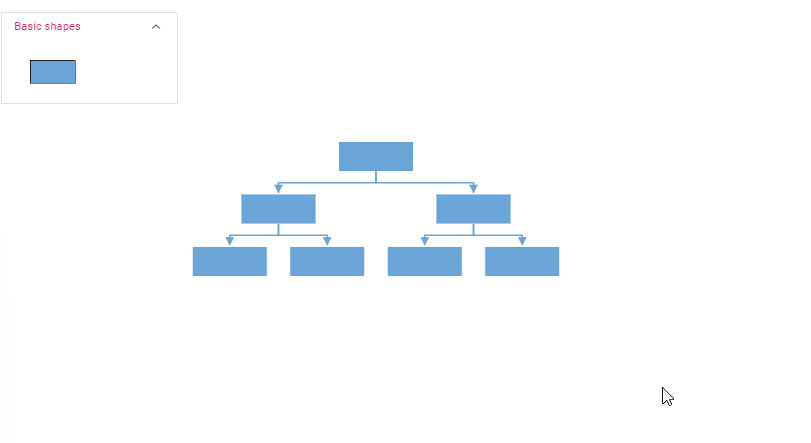

# Customizing layout in React Diagram Component

The React Diagram component provides extensive customization options for automatic layouts, allowing developers to control orientation, spacing, alignment, bounds, and visual behavior. These properties enable fine-tuned positioning and appearance of nodes within hierarchical, organizational, and tree-based diagrams.

To explore all available layout properties, refer to[`Layout Properties`](https://ej2.syncfusion.com/react/documentation/api/diagram/layout#properties).

## Layout Bounds

The diagram supports aligning layouts within custom rectangular areas using layout bounds. This feature constrains the layout to a specific region of the canvas, providing precise control over where the layout appears.

Layout bounds define a rectangular area where the entire layout will be positioned. This is particularly useful when integrating diagrams into dashboards or when multiple layouts need to coexist on the same canvas.

The following example shows how to align the layout within specified layout bounds:











 


For more information about bounds, refer to [`bounds`](https://ej2.syncfusion.com/react/documentation/api/diagram/layoutModel#bounds).


## Layout Alignment

The layout can be positioned anywhere within the layout bounds using [`horizontalAlignment`](https://ej2.syncfusion.com/react/documentation/api/diagram/layoutModel#horizontalalignment) and [`verticalAlignment`](https://ej2.syncfusion.com/react/documentation/api/diagram/layoutModel#verticalalignment) properties. These properties determine how the layout is positioned relative to its container.

Available alignment options include Left, Right, Center for horizontal alignment, and Top, Bottom, Center for vertical alignment. These settings work independently, allowing for precise positioning control.

The following code illustrates how to configure layout alignment and modify alignment properties at runtime:











 


## Layout Spacing

Layout spacing controls the distance between nodes in the layout. The[`horizontalSpacing`](https://ej2.syncfusion.com/react/documentation/api/diagram/layoutModel#horizontalspacing) and [`verticalSpacing`](https://ej2.syncfusion.com/react/documentation/api/diagram/layoutModel#verticalspacing) properties define the gaps between nodes horizontally and vertically respectively.

Proper spacing ensures visual clarity and prevents node overlap. Spacing values are measured in pixels and can be adjusted based on node sizes and content density requirements.

The following code illustrates how to set initial horizontal and vertical spacing for the layout and modify these values at runtime:











 

## Layout Margin

Layout margin creates blank space between the layout bounds and the actual layout content. The [`margin`](https://ej2.syncfusion.com/react/documentation/api/diagram/layout#margin) property adds padding around the entire layout, ensuring adequate separation from container edges.

Margins are particularly useful when layouts are displayed within panels, cards, or other UI containers where visual separation is important for clarity and aesthetics.

The following code demonstrates how to set initial layout margin and modify margin values dynamically at runtime:











 


## Layout Orientation

The layout orientation determines the primary direction in which the layout flows. Different orientations are suitable for various organizational structures and display requirements.

|Orientation|Description|
| -------- | ----------- |
|TopToBottom|Aligns the layout from top to bottom. All root nodes are placed at the top of the diagram.|
|LeftToRight|Aligns the layout from left to right. All root nodes are placed at the left of the diagram.|
|BottomToTop|Aligns the layout from bottom to top. All root nodes are placed at the bottom of the diagram.|
|RightToLeft|Aligns the layout from right to left. All root nodes are placed at the right of the diagram.|

Diagram provides support to customize the  [`orientation`](https://ej2.syncfusion.com/react/documentation/api/diagram/layout#orientation) property can be customized to match specific design requirements or cultural reading patterns.

>Note: In the diagram the default orientation is **TopToBottom**.

The following code demonstrates how to set the initial orientation for the layout and how to change it dynamically at runtime.












 


## Exclude From Layout

In certain scenarios, specific nodes may need manual positioning rather than automatic arrangement by the layout algorithm. These nodes can be excluded from layout calculations by setting the[`excludeFromLayout`](https://ej2.syncfusion.com/react/documentation/api/diagram/nodeModel#excludefromlayout) property to **true**.

This feature is useful for annotation nodes, floating panels, or special elements that require fixed positioning regardless of the overall layout structure.

The following code example demonstrates how to exclude a node from the layout and position it manually:











 

## Fixed Node

Layout provides support to arrange the nodes with reference to the position of a fixed node and set it to the [`fixedNode`](https://ej2.syncfusion.com/react/documentation/api/diagram/layoutModel#fixednode) property. This ensures that the specified node maintains its position while other nodes are arranged around it.

This feature is particularly beneficial during expand/collapse operations, where maintaining the position of the interacted node provides better user experience and visual stability.











 

## Expand and Collapse

The diagram supports expanding and collapsing subtrees within layouts. The node's isExpanded property controls the visibility of child nodes, allowing users to focus on specific portions of large hierarchical structures.

This functionality is essential for managing complex organizational charts, decision trees, and other hierarchical data where progressive disclosure improves usability.

The following code example shows how to expand/collapse the children of a node:











 


For more details about customizing the expand and collapse icon refer [`expand Collapse`](./nodes-expandAndCollapse).

## Layout Animation

Expand and collapse operations can be animated by applying transitions during layout changes. The[`enableAnimation`](https://ej2.syncfusion.com/react/documentation/api/diagram/layoutModel#enableanimation)  property controls this behavior, enhancing the visual experience during structural changes.

Animation provides visual continuity and helps users track changes in the layout structure. By default, `enableAnimation` is set to **true**.

The following example demonstrates how layout animation enhances the visual experience during expand and collapse operations:











 


>Note: To enable layout animation, inject the LayoutAnimation module in the diagram.

## Parent - Child Relation with Dropped Nodes from Symbol Palette

Layouts can be dynamically extended by creating parent-child relationships between existing nodes and items dropped from the symbol palette. The [`drop`](https://ej2.syncfusion.com/react/documentation/api/diagram#drop) event provides the mechanism to establish these connections programmatically.

This functionality enables interactive diagram building, where users can expand existing structures by dragging and dropping new elements from a predefined set of symbols.

The following code example creates parent-child relationships between source and target nodes in the drop event:











 




## setNodeTemplate

The [`setNodeTemplate`](https://ej2.syncfusion.com/react/documentation/api/diagram#setnodetemplate) function allows you to customize the visual representation and behavior of nodes within your diagram. It is invoked during the initialization of each node, enabling you to define the node’s style, properties, and bind custom JSON data to it.

Typically, the `setNodeTemplate` function accepts a container element (e.g., StackPanel, Grid) to organize the visual components within the node. In the following example, a [`StackPanel`](https://ej2.syncfusion.com/react/documentation/api/diagram/stackPanel) is used to organize the node's content, with an [`ImageElement`](https://ej2.syncfusion.com/react/documentation/api/diagram/imageElement) displaying an image and a TextBlock showing text bound to the "Name" property of the node’s data. The StackPanel can contain a variety of elements, including [`PathElement`](https://ej2.syncfusion.com/react/documentation/api/diagram/pathElement),[`NativeElement`](https://ej2.syncfusion.com/react/documentation/api/diagram/diagramNativeElement),[`DiagramElement`](https://ej2.syncfusion.com/react/documentation/api/diagram/diagramElement) and [`HtmlElement`](https://ej2.syncfusion.com/react/documentation/api/diagram/diagramHtmlElement).
You can also set the [`cornerRadius`](https://ej2.syncfusion.com/react/documentation/api/diagram/stackPanel#cornerradius) to create a rounded appearance for the node, while [`horizontalAlignment`](https://ej2.syncfusion.com/react/documentation/api/diagram/stackPanel#horizontalalignment) and [`verticalAlignment`](https://ej2.syncfusion.com/react/documentation/api/diagram/stackPanel#verticalalignment) control the positioning of the StackPanel within the node. 

The [`orientation`](https://ej2.syncfusion.com/react/documentation/api/diagram/stackPanel#orientation) property determines whether child elements are arranged horizontally or vertically. By effectively utilizing the setNodeTemplate function, you can create visually appealing and informative nodes that enhance the overall user experience of your diagram.












 


## Refresh Layout

The diagram supports refreshing layouts at runtime to reflect structural or data changes. The [`doLayout`](https://ej2.syncfusion.com/react/documentation/api/diagram#dolayout) method recalculates and redraws the entire layout based on current data and configuration.

This functionality is essential when nodes are added, removed, or modified programmatically, ensuring the layout remains consistent with the updated structure.


```typescript
//To refresh layout
diagramInstance.doLayout();
```