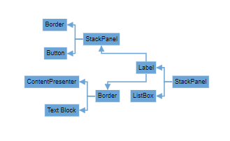

# Mind Map layout in React Diagram Component

A mind map is a powerful visualization technique that organizes information around a central concept, with related topics branching outward in a tree-like structure. This layout is particularly useful for brainstorming, knowledge mapping, and hierarchical data representation. The React Diagram component supports mind map layouts through the [`type`](https://ej2.syncfusion.com/react/documentation/api/diagram/layout/#type) property, which should be set to **MindMap**.

## Mind Map Orientation

An [`Orientation`](https://ej2.syncfusion.com/react/documentation/api/diagram/layout/#orientation)  property determines how the mind map tree structure is arranged spatially. By default, the orientation is set to **Horizontal**, positioning the root node centrally with branches extending left and right.

The following code example demonstrates how to create a mind map layout:











 

The following table outlines the various orientation types available:

|Orientation Type |Description|
| -------- | ----------- |
|Horizontal|Arranges the mind map with the root node centered, branches extending horizontally left and right|
|Vertical|Arranges the mind map with the root node at the top or center, branches extending vertically up and down|

>Note: If you want to use mind map layout in diagram, you need to inject MindMap in the diagram.

## Mind Map Branch

The mind map layout provides flexible branch positioning through the [`getBranch`](https://ej2.syncfusion.com/react/documentation/api/diagram/layoutModel/#getbranch) method. This method allows you to control which side of the root node each branch appears on, enabling customized layouts based on your specific requirements.

The `getBranch` method receives a node object as a parameter and should return a string value indicating the desired branch position: **Left**, **Right**, or **SubLeft**/'**SubRight** for nested branches. The following code example shows how to position all branches on the right side of the mind map:











 

## Common Use Cases

Mind map layouts are ideal for:
- **Brainstorming sessions**: Visualizing ideas and their relationships.
- **Knowledge mapping**: Organizing complex information hierarchically.
- **Decision trees**: Mapping out decision processes and outcomes.
- **Organizational charts**: Displaying reporting structures with a central focus.
- **Project planning**: Breaking down projects into manageable components.

## Best Practices

- Keep the root node content concise and descriptive.
- Use consistent styling for nodes at the same hierarchical level.
- Limit branch depth to maintain readability.
- Consider color coding to differentiate branch categories.
- Ensure adequate spacing between branches to prevent overlap.