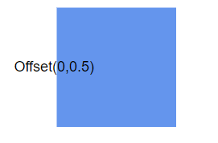
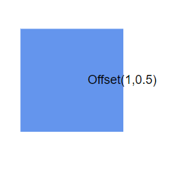

# Node Annotations in React Diagram Component

The React Diagram component allows precise customization of node annotations (also called labels) for positioning and appearance. Node annotations can be aligned relative to node boundaries using four key positioning properties that work together to provide comprehensive control over annotation placement.

## Annotation positioning properties

Node annotations support the following positioning properties through the ShapeAnnotation class:

* **Offset** - Controls fractional positioning within the node bounds.
* **HorizontalAlignment** - Sets horizontal alignment at the calculated position.
* **VerticalAlignment** - Sets vertical alignment at the calculated position.
* **Margin** - Adds spacing around the annotation.

These properties can be combined to achieve precise annotation positioning for various design requirements.

## Set annotation offset and size

The [`offset`](https://ej2.syncfusion.com/react/documentation/api/diagram/pointModel/) property positions annotations using fractional values between 0 and 1. The offset represents the relative position within the node boundaries, where (0,0) is the top-left corner and (1,1) is the bottom-right corner. The default offset is (0.5, 0.5), which centers the annotation.

The annotation size is automatically calculated based on its content. To specify custom dimensions, use the [`width`](https://ej2.syncfusion.com/react/documentation/api/diagram/annotationModel/#width) and [`height`](https://ej2.syncfusion.com/react/documentation/api/diagram/annotationModel/#height) properties.

The following example demonstrates how to configure offset, width, and height for node annotations:










 

### Update annotation offset at runtime

Annotation offset values can be modified dynamically during application execution. To update the offset, access the target annotation and modify its offset properties, then call the `dataBind()` method to apply changes immediately.










 

N> Call `dataBind()` after property changes to reflect updates instantly.

### Annotation offset positions

The following table demonstrates annotation positioning with different offset values:

offset|image|
|-----|-----|
|Top Left {x:0,y:0} ||
|Middle left {x:0,y:0.5}||
|Bootom left {x:0,y:1}||
|Middle Top {x:0.5,y:0}||
|Center {x:0.5,y:0.5}||
|Middle Bottom {x:0.5,y:1}||
|Top right {x:1,y:0}||
|Middle right {x:1,y:0.5}||
|Bottom right {x:1,y:1}||

## Annotation alignment

After determining the annotation position using offset values, the [`horizontalAlignment`](https://helpej2.syncfusion.com/react/documentation/api/diagram/annotationModel/#horizontalalignment) property of annotation is used to set how the annotation is horizontally aligned at the annotation position determined from the fraction values. The [`verticalAlignment`](https://helpej2.syncfusion.com/react/documentation/api/diagram/annotationModel/#verticalalignment) properties control how the annotation aligns at that calculated position.

The horizontal alignment determines the annotation's horizontal positioning relative to the calculated point, while vertical alignment controls the vertical positioning. This two-step positioning system (offset calculation followed by alignment) provides precise control over annotation placement.

The following example shows how to configure annotation alignment properties:










 

### Alignment combinations

The following table shows all possible alignment combinations with offset (0,0) to demonstrate the alignment behavior:

| Horizontal Alignment | Vertical Alignment | Output with Offset(0,0) |
| -------- | -------- | -------- |
| Left | Top |  |
| Center | Top |  |
| Right | Top |   |
| Left | Center |  |
| Center | Center|  |
| Right | Center |  |
| Left | Bottom |  |
| Center | Bottom |  |
| Right |Bottom | |

### Update annotation alignment at runtime

Annotation alignment properties can be modified dynamically during application execution. The following example demonstrates updating alignment properties at runtime:










 