# Node Interaction in React Diagram Component

The React Diagram component provides comprehensive support for interactive node operations, enabling users to select, drag, resize, rotate, and flip nodes through both mouse interactions and programmatic methods. These interactions form the foundation of dynamic diagram editing capabilities.

## Select

Node selection is fundamental to diagram interaction. Users can select nodes by clicking on them and deselect by clicking on the diagram canvas.

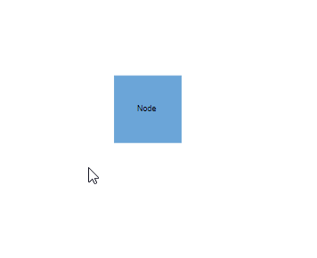

### Programmatic Node Selection

Nodes can be selected at runtime by using the [`select`](https://ej2.syncfusion.com/react/documentation/api/diagram/#select) method and the selection can be cleared in the diagram by using the [`clearSelection`](https://ej2.syncfusion.com/react/documentation/api/diagram/#clearselection) or [`unSelect`](https://ej2.syncfusion.com/react/documentation/api/diagram/#unselect) method to remove specific objects from selection.
 The following code explains how to select and clear selection in the diagram.










 
### Selection Methods Reference

|Method | Parameter | Description|
|----|----|----|
|[`unSelect`](https://ej2.syncfusion.com/react/documentation/api/diagram/#unselect)| NodeModel/ConnectorModel | The object to remove from the selection.|
|[`clearSelection`](https://ej2.syncfusion.com/react/documentation/api/diagram/#clearselection)| - | Clears all the selection in the diagram.|

## Drag

Node dragging allows users to reposition nodes within the diagram canvas. Users can click and hold a node, then drag it to any location on the canvas.

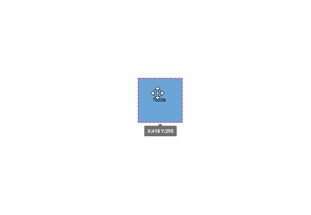

### Programmatic Node Dragging

Nodes can be moved programmatically using the [`drag`](https://ej2.syncfusion.com/react/documentation/api/diagram/#drag) method, which accepts the target object and new position coordinates.










 

## Resize

When a node is selected, resize handles appear on all sides, allowing users to modify the node's dimensions by clicking and dragging these handles.

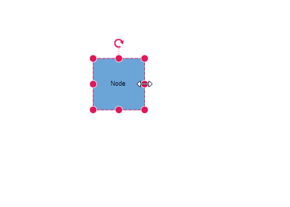

### Programmatic Node Resizing

Node dimensions can be modified at runtime using the  [`scale`](https://ej2.syncfusion.com/react/documentation/api/diagram/#scale) method, which applies scaling factors to adjust the node size proportionally.










 

## Rotate

Node rotation is performed interactively by clicking and dragging the rotate handle that appears when a node is selected.

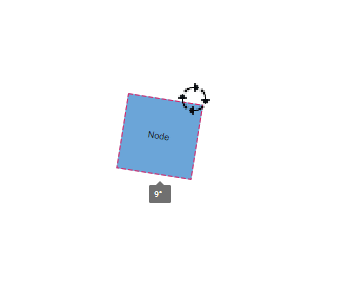

### Programmatic Node Rotation

Nodes can be rotated at runtime using the [`rotate`](https://ej2.syncfusion.com/react/documentation/api/diagram/#rotate) method, which accepts the target object and rotation angle in degrees.










 

## Flip

The diagram component supports node flipping operations to create mirrored images of nodes. The [`flip`](https://ej2.syncfusion.com/react/documentation/api/diagram/node/#flip) property controls the flip direction and behavior.

### Flip Directions
give the mirrored image of the original element.
The flip types are as follows:

* HorizontalFlip
 [`Horizontal`](https://ej2.syncfusion.com/react/documentation/api/diagram/flipDirection/) is used to change the element in horizontal direction.

* VerticalFlip
[`Vertical`](https://ej2.syncfusion.com/react/documentation/api/diagram/flipDirection/) is used to change the element in vertical direction

* Both
[`Both`](https://ej2.syncfusion.com/react/documentation/api/diagram/flipDirection/) which involves both vertical and horizontal changes of the element.

The following example demonstrates how to apply flip transformations to nodes:










 

>Note: The flip is also applicable for group and BPMN shapes.

### Runtime Flip Updates

Node flip properties can be updated dynamically at runtime using the `^` operator, which allows toggling flip states by applying the same flip direction multiple times.

The following example demonstrates how to update the flip for a node dynamically:










 

### Flip Modes

The [`flipMode`](https://ej2.syncfusion.com/react/documentation/api/diagram/flipMode/) property controls which elements are affected during flip operations, determining whether ports, labels, and label text are flipped along with the node.

| FlipMode | Description | 
| -------- | -------- |
|Label| It flips the label along with the object while keeping the text readable.|
|Port| It flips the port along with the object.|
|All| It flips the port, label, and label text along with the object.|
|None| It flips only the object.|
|LabelText| It flips the object and inverts the label without changing its position.|
|PortAndLabel| It flips the port and label along with the object while keeping the text readable.|
|PortAndLabelText| It flips the port and label text along with the object.|
|LabelAndLabelText| It flips the label and label text along with the Object.|

### Flip Mode Visual Examples

The following table demonstrates how different flip modes affect node appearance across various flip directions:

| Flip Direction | Flip Mode | Default Node | Flipped Node |
| -------- | -------- | -------- | -------- |
| Horizontal | All |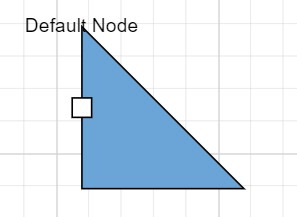|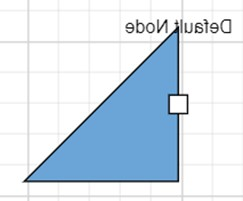| 
| Horizontal | Label ||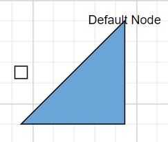|
| Horizontal | LabelText ||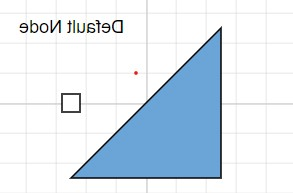|
| Horizontal | Port ||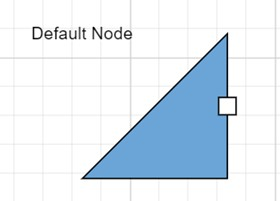|
| Horizontal | None ||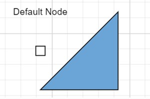|
| Horizontal | PortAndLabel ||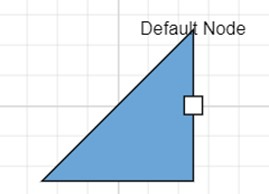|
| Horizontal | PortAndLabelText ||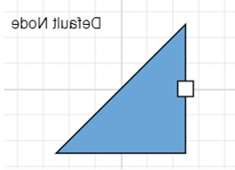|
| Horizontal | LabelAndLabelText |||
| Vertical | All |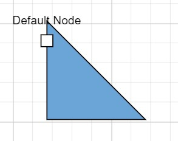|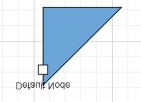| 
| Vertical | Label ||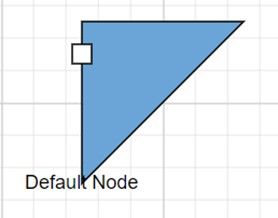|  
| Vertical | LabelText ||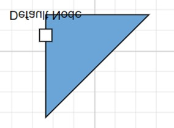| 
| Vertical | Port ||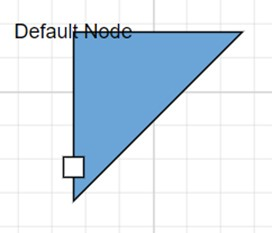| 
| Vertical | None ||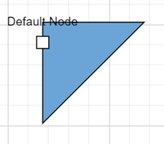|  
| Vertical | PortAndLabel ||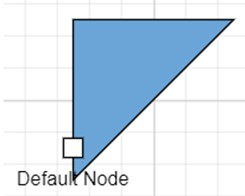|  
| Vertical | PortAndLabelText ||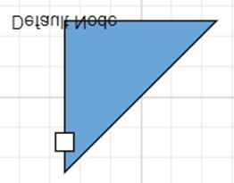|  
| Vertical | LabelAndLabelText ||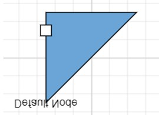|  
| Both | All ||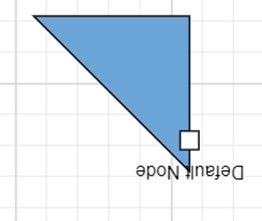|  
| Both | Label ||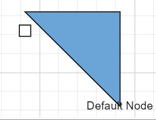|
| Both | LabelText ||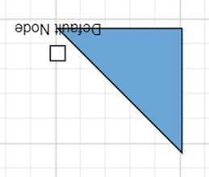| 
| Both | Port ||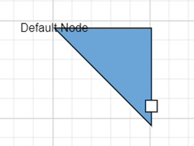| 
| Both | None ||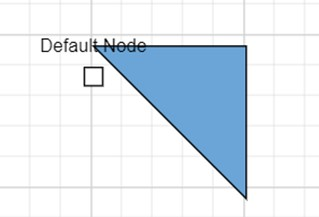|
| Both | PortAndLabel ||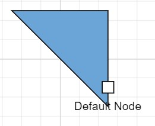| 
| Both | PortAndLabelText ||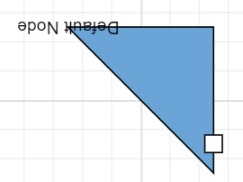| 
| Both | LabelAndLabelText ||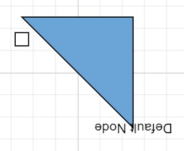| 










 