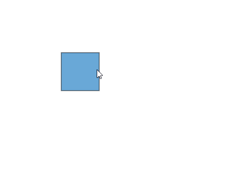

# Positioning a Node in in React Diagram Component

To customize the position of nodes in the React Diagram component, refer to the video link below.



Node positioning in the React Diagram component allows precise control over where nodes appear on the diagram canvas. Understanding positioning fundamentals enables developers to create well-organized diagrams with nodes placed exactly where needed.

## Position

* Position of a node is controlled by using its [`offsetX`](https://ej2.syncfusion.com/react/documentation/api/diagram/node/#offsetx) and [`offsetY`](https://ej2.syncfusion.com/react/documentation/api/diagram/node/#offsety) properties. By default, these offset properties represent the distance between the origin of the diagram’s page and node’s center point.

* You may expect this offset values to represent the distance between page origin and node’s top-left corner instead of center. The Pivot property helps to solve this problem. Default value of node’s [`pivot`](https://ej2.syncfusion.com/react/documentation/api/diagram/node/#pivot) point is (0.5, 0.5), that means center of the node.

* The size of the node can be controlled by using its [`width`](https://ej2.syncfusion.com/react/documentation/api/diagram/node/#width) and
[`height`](https://ej2.syncfusion.com/react/documentation/api/diagram/node#height) properties.

* Rotation of a node is controlled by using its [`rotateAngle`](https://ej2.syncfusion.com/react/documentation/api/diagram/node/#rotateangle) property.

### Understanding Pivot Points

The pivot point determines which part of the node the offset coordinates reference. The following table illustrates how different pivot values affect node positioning:

| Pivot | Offset Behavior |
|-------- | -------- |
| (0.5,0.5)| offsetX and offsetY values are considered as the node’s center point. |
| (0,0) | offsetX and offsetY values position the node's top-left corner |
| (1,1) | offsetX and offsetY values position the node's bottom-right corner |

The following code illustrates how to change the `pivot` value.










 

## Minimum and Maximum size for nodes.

The size constraints ensure nodes maintain appropriate dimensions during resizing operations. The [`minWidth`](https://ej2.syncfusion.com/react/documentation/api/diagram/node/#minwidth) and [`minHeight`](https://ej2.syncfusion.com/react/documentation/api/diagram/node/#minheight) properties define the smallest allowable size for a node during resize operations. Similarly, the `maxWidth` and `maxHeight` properties define the largest allowable size.

These constraints are particularly useful when creating diagrams where nodes need to maintain specific size ranges for visual consistency or functional requirements.










 

